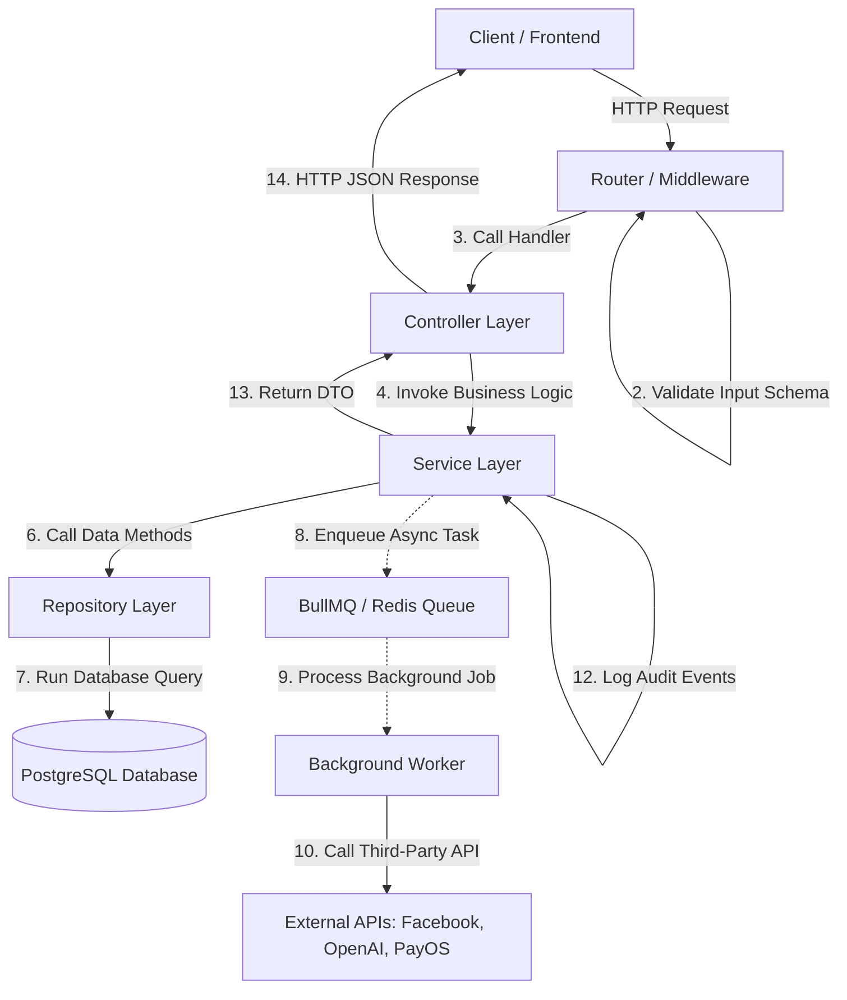

# Tài liệu Kiến trúc Hệ thống — Marka

Tài liệu này mô tả chi tiết kiến trúc phần mềm, mô hình phân lớp và các cơ chế xử lý cốt lõi của nền tảng Marka. Thiết kế tuân thủ các nguyên lý của **Clean Architecture** và **Domain-Driven Design (DDD)** nhằm đảm bảo tính dễ bảo trì, dễ viết test và độc lập về công nghệ.

---

## 1. Mô hình Phân lớp Kiến trúc (Layered Architecture)

Hệ thống được tổ chức thành 5 lớp chức năng chính. Luồng đi của dữ liệu luôn tuân thủ nguyên tắc một chiều từ ngoài vào trong:



### 1.1. Lớp Router & Middleware (Tầng Giao Tiếp)
* **Nhiệm vụ**: Định tuyến các request, thực hiện các bộ lọc tiền xử lý.
* **Các Middleware cốt lõi**:
  - `verifyAccessToken`: Xác thực Access Token (JWT) trong Authorization header để nhận diện `userId`.
  - `requireWorkspaceRole([roles])`: Phân quyền dựa trên vai trò của user trong Workspace đang hoạt động (Owner/Creator).
  - `validate({ body, params, query })`: Sử dụng thư viện validation (Zod/Joi) để kiểm tra định dạng và kiểu dữ liệu đầu vào trước khi vào Controller.
  - `rateLimiter`: Giới hạn tần suất request (chống spam đăng nhập, sinh AI).

### 1.2. Lớp Controller (Tầng Điều Hướng)
* **Nhiệm vụ**: Nhận request đã được xác thực từ Router, bóc tách các tham số (`req.params`, `req.body`, `req.query`), chuyển tiếp tới lớp Service tương ứng và định dạng kết quả trả về (`res.status().json()`).
* **Quy tắc**: Lớp Controller phải **siêu mỏng** (Thin Controller). Tuyệt đối không chứa logic nghiệp vụ hay các câu lệnh gọi trực tiếp đến database.

### 1.3. Lớp Service (Tầng Nghiệp Vụ)
* **Nhiệm vụ**: Trọng tâm xử lý logic của toàn bộ hệ thống.
  - Thực thi quy trình nghiệp vụ (Business Logic).
  - Quản lý điều phối giao dịch database (Prisma Transaction).
  - Gọi các API bên thứ 3 (OpenAI, Facebook Graph API, cổng thanh toán PayOS) qua các helper/client.
  - Tạo thông báo in-app (Notification) và ghi nhật ký hoạt động hệ thống (Audit Log).
* **Quy tắc**: Lớp Service hoàn toàn độc lập với các thư viện HTTP (không được truy cập `req` hay `res`). Điều này giúp Service dễ dàng được tái sử dụng trong các môi trường khác (như CLI, Cron Job, Test runner).

### 1.4. Lớp Repository (Tầng Truy Cập Dữ Liệu)
* **Nhiệm vụ**: Thực hiện các câu lệnh thao tác trực tiếp với cơ sở dữ liệu (thông qua Prisma Client).
* **Quy tắc**:
  - Mỗi thực thể database lớn sẽ có một Repository tương ứng (ví dụ: `postRepository`, `userRepository`).
  - Lớp Service bắt buộc phải tương tác với database thông qua các hàm của Repository thay vì gọi trực tiếp Prisma. Điều này giúp dễ dàng mocking lớp dữ liệu khi viết Unit Test cho lớp Service.

### 1.5. Database & External Services (Tầng Hạ Tầng)
* **Hệ quản trị CSDL**: PostgreSQL.
* **Dịch vụ tích hợp**:
  - OpenAI GPT-4o & DALL-E 3 (Sinh nội dung văn bản và hình ảnh).
  - Facebook Graph API (Xuất bản bài đăng lên Facebook Page và đồng bộ chỉ số tương tác).
  - PayOS API (Thanh toán nạp credit trực tuyến qua mã QR).

---

## 2. Các Cơ Chế Kiến Trúc Đặc Thù

### 2.1. Quản lý Giao dịch (Prisma Transactions)
Để tránh tình trạng bất nhất dữ liệu, các luồng nghiệp vụ phức tạp liên quan đến tài chính (Credit) hoặc mối quan hệ nhiều bảng bắt buộc phải sử dụng Transaction.
* **Cách triển khai (D17)**:
  - Với luồng nhiều bước/tài chính, giao dịch do lớp **Service** sở hữu: dùng `prisma.$transaction`, rồi truyền instance transaction client (ký hiệu `tx` hoặc `prismaTransaction`) vào các phương thức của **Repository**.
  - **Repository được phép** tự mở transaction cho thao tác **atomic tự chứa** (ví dụ `createUser` tạo user + workspace + member trong 1 transaction) — cả hai pattern đều hợp lệ.
  - Ví dụ:
    ```typescript
    await prisma.$transaction(async (tx) => {
      await workspaceRepository.deductCredit(workspaceId, cost, tx);
      await creditTransactionRepository.createTransactionRecord(data, tx);
    });
    ```

### 2.2. Xử lý tác vụ nền bất đồng bộ (BullMQ + Redis)
Các hành động tiêu tốn nhiều thời gian (gọi LLM OpenAI mất 5-15 giây, transcode/tải ảnh về cloud mất 3-5 giây, xuất bản bài viết lên các mạng xã hội) không được xử lý trong luồng request-response chính để tránh nghẽn API.
* **Cách hoạt động**:
  - Lớp Service đẩy payload công việc vào hàng đợi BullMQ tương ứng (ví dụ: `content-generation-queue`, `publishing-queue`).
  - Request trả về mã trạng thái ngay lập tức cho Client kèm theo `jobId`.
  - Một process độc lập (Background Worker) lắng nghe Redis và lấy job ra xử lý. Sau khi hoàn tất, Worker cập nhật trạng thái vào DB và tạo thông báo in-app (`Notification`); ở **MVP client nhận kết quả qua polling**. **WebSocket/SSE là Phase sau (tùy chọn)** (D20).

### 2.3. Xử lý lỗi tập trung (Global Error Handling Middleware)
Hệ thống sử dụng cơ chế ném lỗi hướng đối tượng (Object-oriented exception throwing) và bắt lỗi tập trung:
* Các lỗi nghiệp vụ được định nghĩa thành các class kế thừa từ lớp `AppError` chuẩn (ví dụ: `NotFoundError`, `UnauthorizedError`, `ConflictError`, `ValidationError`).
* Lớp Service khi phát hiện vi phạm nghiệp vụ sẽ ném lỗi: `throw new ConflictError("Thông báo lỗi")`.
* Một Error Handling Middleware nằm ở cuối chuỗi route của Express sẽ bắt toàn bộ lỗi này, ghi nhận log lỗi (cho System Admin) và trả về định dạng JSON thống nhất cho Client:
  ```json
  {
    "status": "fail",
    "message": "Thông báo lỗi chi tiết dành cho người dùng"
  }
  ```

### 2.4. Session & Revocation (Access/Refresh Token với `tokenVersion`)
Để ngăn chặn tấn công replay và bảo mật phiên làm việc tối đa:
* Khi Login thành công, hệ thống cấp Access Token (JWT lưu ở Client Memory, hạn ngắn 15 phút) và Refresh Token (JWT **stateless**, trả về trình duyệt dưới dạng HTTP-Only, Secure, SameSite Cookie, hạn 7 ngày). **Không** có bảng `refresh_tokens` lưu trong DB.
* Cả hai token đều chứa trường `tokenVersion` của user tại thời điểm cấp.
* Mỗi khi Access Token hết hạn, client gọi `POST /auth/refresh-token` kèm Refresh Token (trong cookie) để nhận cặp token mới.
* Cơ chế thu hồi dựa trên trường `tokenVersion` ở bảng `User`: khi người dùng Đăng xuất (UC03), Đổi mật khẩu (UC04) hoặc bị System Admin khóa tài khoản, hệ thống tăng `tokenVersion` lên 1. Mọi access/refresh token cũ mang `tokenVersion` cũ lập tức bị từ chối ở middleware, đăng xuất tài khoản khỏi tất cả thiết bị (dù token chưa hết hạn).

### 2.5. Xóa mềm (Soft Delete) bằng Prisma Client Extension (D18)
* Áp dụng xóa mềm (`deletedAt`) cho `Workspace`, `Post`, `CreditPackage`, `MediaAsset` — không xóa cứng.
* Cơ chế **cưỡng chế** là một **Prisma Client Extension**: mọi truy vấn mặc định tự thêm điều kiện `deletedAt: null`, tránh việc lập trình viên quên lọc ở từng Repository/Service.
* Muốn truy xuất bản ghi đã xóa (audit/khôi phục) phải gọi API chuyên biệt (`includeDeleted`), không bật mặc định.

### 2.6. Quy ước thời gian UTC (D19)
* Toàn hệ thống dùng **UTC**: DB lưu `DateTime` UTC, API trao đổi chuỗi **ISO-8601 UTC**; đặt biến môi trường `TZ=UTC` cho server và worker.
* Frontend tự chuyển đổi sang múi giờ địa phương khi hiển thị; mọi so sánh lịch đăng (`scheduledAt`, `nextResetAt`, cron) đều thực hiện trên UTC.
