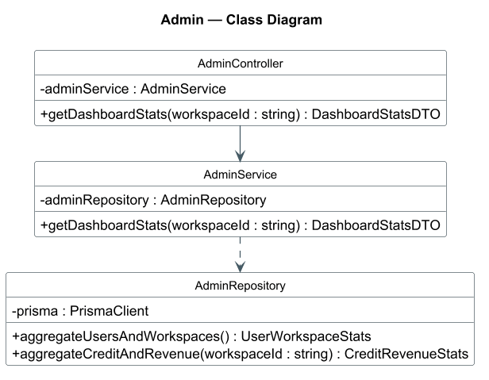
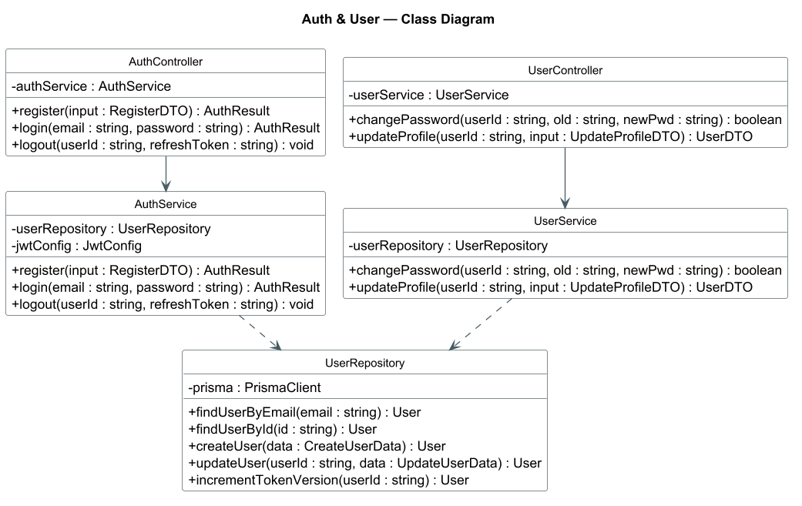
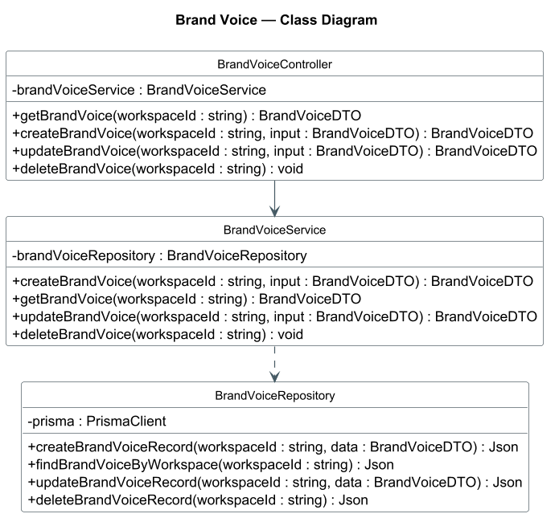
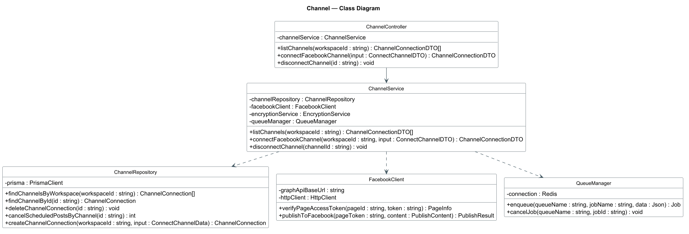
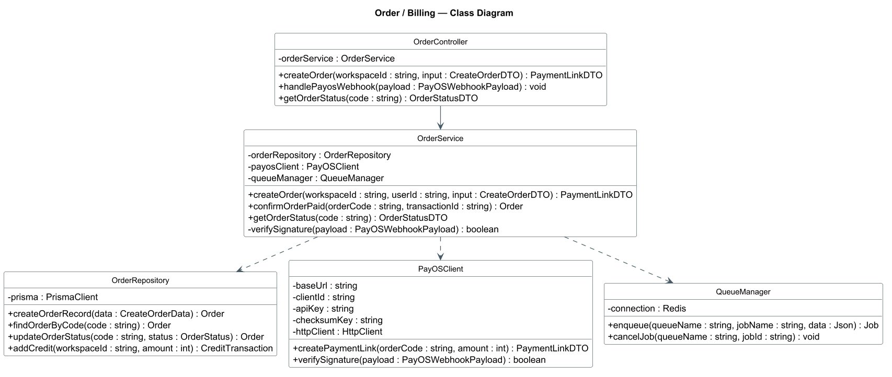
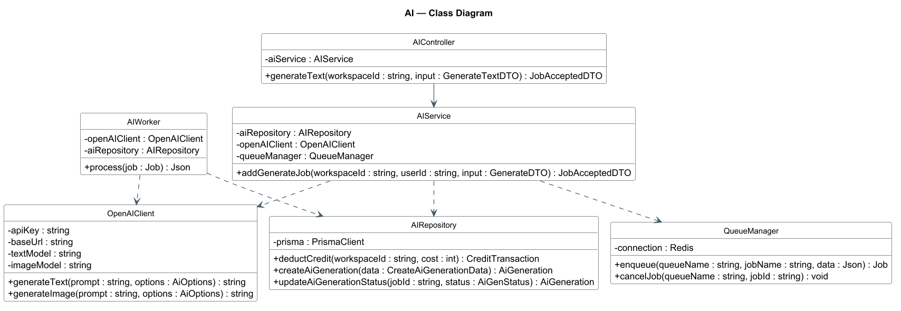
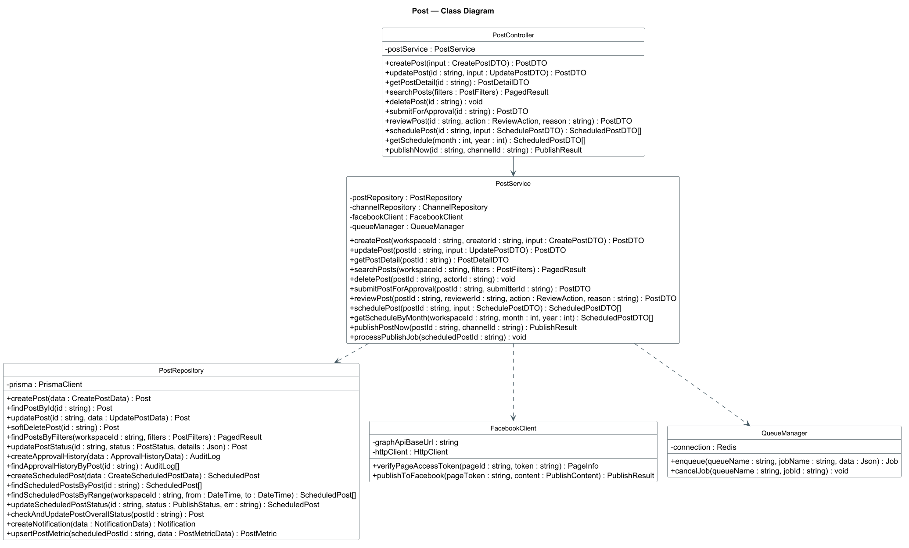
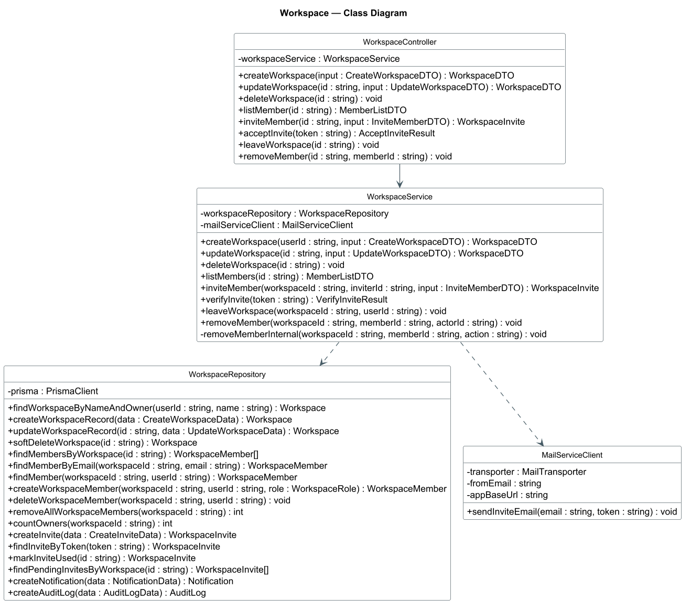
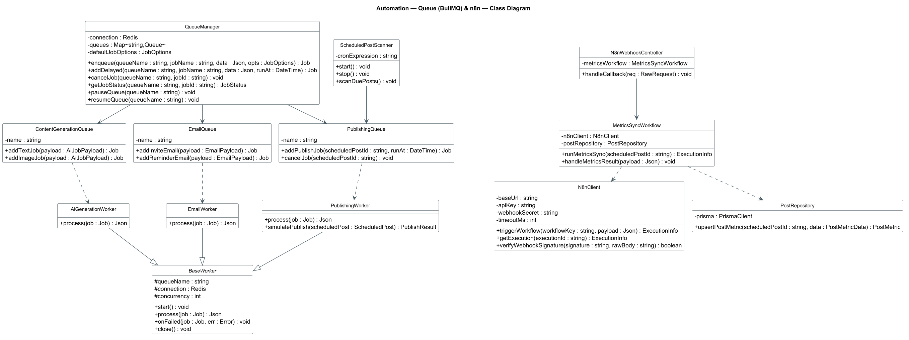

# Sơ đồ lớp (Class Diagram) — Marka

> Đồng bộ theo `docs/design-decisions.md`.

Tài liệu này khắc phục phản hồi của giảng viên: **các class business trong sơ đồ chỉ có method, thiếu attribute**; đồng thời bổ sung **lớp Queue (BullMQ)** cho xử lý bất đồng bộ và **lớp tích hợp n8n** cho đồng bộ metrics Facebook (Post Analytics — D21).

- Sơ đồ nguồn (PlantUML): [`docs/class-diagram.puml`](./class-diagram.puml)
- Nguồn dữ liệu để suy ra attribute:
  - `backend/prisma/schema.prisma` — 14 bảng (User, Workspace, Post, Order, ...).
  - `docs/specs/*.md` — đặc tả từng phân hệ (UC01–UC43).
  - `docs/api_documentation.md` — danh sách endpoint + controller/service/repository.
  - `backend/src/workers/queues.ts`, `backend/src/workers/index.ts`, `backend/src/config/redis.ts` — queue/worker đã có trong code.

---

## 1. Vì sao sơ đồ bị "thiếu thuộc tính"?

Sơ đồ gốc (7 ảnh) là mô hình **Controller → Service → Repository** theo Clean Architecture, nhưng mỗi box chỉ ghi **operation** (method), không có **attribute** (thuộc tính). Trong UML, một class chuẩn phải có 3 ngăn: `ClassName / attributes / operations`.

Đã bổ sung theo 2 nhóm:

### 1.1. Attribute của lớp xử lý (Controller / Service / Repository)
Vì đây là các lớp hành vi (behavioral), attribute của chúng là **dependency được inject** — đúng với cách code thật đang viết:

| Lớp | Attribute bổ sung | Ý nghĩa |
| :--- | :--- | :--- |
| `XxxController` | `- xxxService : XxxService` | Controller giữ tham chiếu tới Service (thin controller) |
| `XxxService` | `- xxxRepository : XxxRepository` | Service truy cập DB qua Repository |
| `XxxService` (có gọi ngoài) | `- facebookClient`, `- payosClient`, `- openAIClient`, `- mailServiceClient`, `- queueManager` | Các phụ thuộc hạ tầng |
| `XxxRepository` | `- prisma : PrismaClient` | Mọi Repository dùng chung Prisma Client |
| Client ngoài | `- baseUrl`, `- apiKey`, `- httpClient`, ... | Cấu hình kết nối dịch vụ |

### 1.2. Attribute dữ liệu (Domain / Entity)
Bổ sung gói **`domain — Entity/Model`** với đầy đủ field lấy 1:1 từ `schema.prisma`. Đây chính là phần "thuộc tính" mà hội đồng thường hỏi (ví dụ `Post.status`, `Workspace.remainingCredit`, `Order.payosTransId`).

Ngoài ra bổ sung các **DTO** cho input/output (ví dụ `BrandVoiceDTO` gồm `industry`, `targetAudience`, `writingStyle`, `keywordsShouldUse[]`, `keywordsAvoid[]`, `fewShotExamples[]`).

---

## 2. Danh sách module và class sau khi bổ sung

| Module | Controller | Service | Repository | Client ngoài |
| :--- | :--- | :--- | :--- | :--- |
| Auth | `AuthController` | `AuthService` | dùng chung `UserRepository` | `GoogleOAuthClient` |
| User | `UserController` | `UserService` | `UserRepository` | — |
| Workspace | `WorkspaceController` | `WorkspaceService` | `WorkspaceRepository` | `MailServiceClient` |
| BrandVoice | `BrandVoiceController` | `BrandVoiceService` | `BrandVoiceRepository` | — |
| Channel | `ChannelController` | `ChannelService` | `ChannelRepository` | `FacebookClient` |
| Order/Billing | `OrderController` | `OrderService` | `OrderRepository` | `PayOSClient` |
| AI | `AIController` | `AIService` | `AIRepository` | `OpenAIClient` |
| Post | `PostController` | `PostService` | `PostRepository` | `FacebookClient` |
| Admin | `AdminController` | `AdminService` | `AdminRepository` | — |

> Ghi chú: ngoài 7 ảnh gốc, hệ thống còn có **Media**, **Notification**, **CreditPackage** (xem `api_documentation.md`). Ba phân hệ này có thể vẽ thêm cùng cấu trúc 3 lớp nếu cần — chưa đưa vào `.puml` để tránh rối sơ đồ chính.

---

## 3. Bổ sung lớp Queue (BullMQ) và n8n

Yêu cầu của bạn: *module nào cần thì thêm queue hoặc n8n, viết như một class có thuộc tính và hàm*. Dưới đây là quyết định cho từng module.

### 3.1. Nguyên tắc chọn

| Tiêu chí | Dùng **BullMQ (Queue)** | Dùng **n8n** |
| :--- | :--- | :--- |
| Bản chất | 1 job đơn, chạy nền, độ trễ thấp, cần retry | Workflow nhiều bước, phối hợp nhiều dịch vụ/API |
| Ai cấu hình | Lập trình viên (code) | Có thể chỉnh bằng giao diện n8n, không cần deploy lại |
| Thời gian | Job ngắn (giây) | Quy trình dài, chạy theo cron/định kỳ |
| Ví dụ | Sinh AI text/ảnh, đăng 1 bài, gửi 1 email | Đồng bộ metrics bài Facebook định kỳ (Post Analytics) |

Kết luận thiết kế: **giữ BullMQ làm cơ chế job chính (đã có trong code); n8n chỉ dùng để đồng bộ metrics Facebook (Post Analytics)** — đăng bài dùng BullMQ, n8n không tham gia (D21).

### 3.2. Bảng quyết định theo module

| Module | BullMQ Queue | n8n Workflow | Lý do |
| :--- | :--- | :--- | :--- |
| **AI** | ✅ `content-generation-queue` | ❌ | Sinh text/ảnh mất 5–15s → chỉ cần queue + `AiGenerationWorker` |
| **Post (đăng bài)** | ✅ `publishing-queue` | ❌ | Đăng theo lịch + retry; **publishing dùng BullMQ**, n8n không tham gia (D21) |
| **Post Analytics** | ❌ | ✅ `metrics-sync` | Phân hệ 8: n8n đồng bộ metrics Facebook định kỳ rồi ghi `PostMetric` (D21) |
| **Workspace / Email** | ✅ `email-queue` | ❌ | Gửi email mời/nhắc bất đồng bộ; nhắc định kỳ dùng BullMQ repeatable job |
| **Order / Billing** | ⚪ (dùng `email-queue` để báo) | ❌ | Webhook phải xử lý **đồng bộ + verify chữ ký**; chu kỳ tháng chỉ là cron |
| **Admin** | ❌ | ❌ | Thuần **query DB đồng bộ** (`aggregate*`), phải trả về ngay — thêm n8n là vô nghĩa |
| **Channel** | ⚪ (dùng `publishing-queue`) | ❌ | Chỉ CRUD kết nối; hủy job qua `QueueManager` |
| **BrandVoice** | ❌ | ❌ | Đồng bộ, xử lý ngay trong request |
| **User / Auth** | ❌ | ❌ | Đồng bộ, phản hồi nhanh |

**Kết luận:** n8n **chỉ dùng duy nhất ở Post Analytics** để **đồng bộ metrics Facebook** (D21). **Đăng bài dùng BullMQ** (`publishing-queue` + `PublishingWorker`) và **không** đi qua n8n; các module còn lại — đặc biệt **Admin** và **Order** — không dùng n8n.

### 3.3. Các class Queue/Worker đã thêm

| Class | Stereotype | Vai trò | Attribute chính | Method chính |
| :--- | :--- | :--- | :--- | :--- |
| `QueueManager` | `<<Queue>>` | Quản lý tập trung các queue | `connection`, `queues`, `defaultJobOptions` | `enqueue`, `addDelayed`, `cancelJob`, `getJobStatus`, `pause/resume` |
| `ContentGenerationQueue` | `<<Queue>>` | Hàng đợi sinh nội dung AI | `name = "content-generation-queue"` | `addTextJob`, `addImageJob` |
| `PublishingQueue` | `<<Queue>>` | Hàng đợi đăng bài theo lịch | `name = "publishing-queue"` | `addPublishJob`, `cancelJob` |
| `EmailQueue` | `<<Queue>>` | Hàng đợi gửi email | `name = "email-queue"` | `addInviteEmail`, `addReminderEmail` |
| `BaseWorker` | `<<Worker>>` (abstract) | Khung worker chung | `queueName`, `connection`, `concurrency` | `start`, `process`, `onFailed`, `close` |
| `AiGenerationWorker` | `<<Worker>>` | Xử lý job AI | `openAIClient`, `aiRepository`, `aiService` | `process` |
| `PublishingWorker` | `<<Worker>>` | Đăng bài thật/giả lập | `postService`, `facebookClient`, `postRepository` | `process`, `simulatePublish` |
| `EmailWorker` | `<<Worker>>` | Gửi email | `mailServiceClient` | `process` |
| `ScheduledPostScanner` | `<<Cron>>` | Quét bài tới giờ đăng | `cronExpression`, `publishingQueue`, `postRepository` | `scanDuePosts`, `start`, `stop` |

### 3.4. Các class n8n đã thêm

| Class | Stereotype | Attribute chính | Method chính |
| :--- | :--- | :--- | :--- |
| `N8nClient` | `<<Client>>` | `baseUrl`, `apiKey`, `webhookSecret`, `timeoutMs`, `httpClient` | `triggerWorkflow`, `getExecution`, `cancelExecution`, `registerWebhook`, `verifyWebhookSignature` |
| `MetricsSyncWorkflow` | `<<Service>>` | `n8nClient`, `postRepository` | `runMetricsSync`, `handleMetricsResult` |
| `N8nWebhookController` | `<<Controller>>` | `metricsWorkflow` | `handleCallback` |

> Vì sao chỉ có 3 class n8n: n8n **chỉ dùng để đồng bộ metrics Facebook (Post Analytics)** theo D21 — **không tham gia đăng bài**. Đăng bài đã đủ bằng `PublishingQueue` + `PublishingWorker`; nếu không cần analytics qua n8n có thể **xóa hẳn package này**.

---

## 4. Điểm chỉnh sửa so với sơ đồ gốc (ngoài việc thêm attribute)

1. **Bỏ `revokeRefreshToken` / `revokeAllRefreshTokens`** trong `UserRepository`.
   Theo `docs/architecture.md` (mục 2.4), refresh token là **stateless**, **không có bảng `refresh_tokens`**. Thu hồi phiên dựa trên `User.tokenVersion` → dùng `incrementTokenVersion(userId)`. Sơ đồ gốc ngụ ý có bảng refresh token, trái với thiết kế hiện tại.
2. **Thêm** `findUserByGoogleId` (phục vụ Google OAuth), `findWorkspacesByUserId`, `updateMemberRole`, `changeMemberRole`, `refreshTokens` — các hàm đã có trong đặc tả nhưng thiếu ở sơ đồ.
3. **Thêm `assertTransition(from, to)`** trong `PostService` để thể hiện state machine `Draft → Pending → Approved/Rejected → Scheduled → Published/Failed`.
4. **`BrandVoiceRepository` thao tác trên `Workspace.brandVoice` (Json)** — không có bảng riêng, phản ánh đúng `schema.prisma`.

---

## 5. Cách sử dụng / render sơ đồ

**Cách 1 — VS Code (khuyến nghị):**
1. Cài extension **PlantUML** (`jebbs.plantuml`).
2. Mở `docs/class-diagram.puml`, nhấn `Alt + D` để xem preview, `Ctrl + Shift + P → PlantUML: Export Current Diagram` để xuất PNG/SVG.

**Cách 2 — Online:** dán nội dung file `.puml` vào <https://www.plantuml.com/plantuml>.

**Cách 3 — Visual Paradigm:**
- Xem trước sơ đồ dạng ảnh, rồi vẽ lại trong Visual Paradigm theo đúng tên class / attribute / method.
- Hoặc dùng tính năng **Import → XMI/PlantUML** nếu bản Visual Paradigm hỗ trợ.
- Nếu giữ đúng hệ thống màu/ký hiệu: `Controller` = xanh dương nhạt, `Service` = xanh dương, `Repository` = xanh đậm, `Entity` = xanh lá, `Queue/Worker` = tím, `n8n` = hồng.

> Nếu bạn muốn tôi **sinh luôn code TypeScript** cho các module còn thiếu (interfaces/DTO + class khung) để khớp 1:1 với sơ đồ này, chỉ cần nói — tôi sẽ tạo theo đúng cấu trúc thư mục `backend/src/modules/...`.

---

## 6. Bộ biểu đồ class theo từng module (đã render sẵn)

Tương ứng với 7 ảnh gốc, đã vẽ lại **đầy đủ attribute + method** và bổ sung lớp Queue/n8n. Mỗi module có 1 file `.puml` (nguồn) + 1 file `.png` (ảnh) trong `docs/diagrams/`:

| # | Biểu đồ | Nguồn | Ảnh |
| :-: | :--- | :--- | :--- |
| 0 | Tổng quan toàn hệ thống | `docs/class-diagram.puml` | `docs/class-diagram-overview.png` |
| 1 | Admin | `docs/diagrams/01-admin.puml` | `docs/diagrams/01-admin.png` |
| 2 | Auth & User | `docs/diagrams/02-auth-user.puml` | `docs/diagrams/02-auth-user.png` |
| 3 | Brand Voice | `docs/diagrams/03-brandvoice.puml` | `docs/diagrams/03-brandvoice.png` |
| 4 | Channel (+ FacebookClient) | `docs/diagrams/04-channel.puml` | `docs/diagrams/04-channel.png` |
| 5 | Order / Billing (+ PayOSClient) | `docs/diagrams/05-order.puml` | `docs/diagrams/05-order.png` |
| 6 | AI (+ OpenAIClient, AIWorker) | `docs/diagrams/06-ai.puml` | `docs/diagrams/06-ai.png` |
| 7 | Post (+ FacebookClient) | `docs/diagrams/07-post.puml` | `docs/diagrams/07-post.png` |
| 8 | Workspace (+ MailServiceClient) | `docs/diagrams/08-workspace.puml` | `docs/diagrams/08-workspace.png` |
| 9 | Automation: Queue (BullMQ) & n8n | `docs/diagrams/09-automation-queue-n8n.puml` | `docs/diagrams/09-automation-queue-n8n.png` |

### 6.1. Admin



### 6.2. Auth & User



### 6.3. Brand Voice



### 6.4. Channel



### 6.5. Order / Billing



### 6.6. AI



### 6.7. Post



### 6.8. Workspace



### 6.9. Automation — Queue & n8n



### 6.10. Lệnh render lại toàn bộ ảnh

```powershell
java -jar plantuml.jar -tpng -charset UTF-8 -Playout=smetana docs/class-diagram.puml
java -jar plantuml.jar -tpng -charset UTF-8 -Playout=smetana docs/diagrams
```

> `-Playout=smetana` để PlantUML dùng engine dựng hình tích hợp, **không cần cài Graphviz**.
