# Toàn bộ Sequence Diagram — Marka (theo từng UC)

## Phân hệ 1 — Auth & Workspace

### UC01 — Register

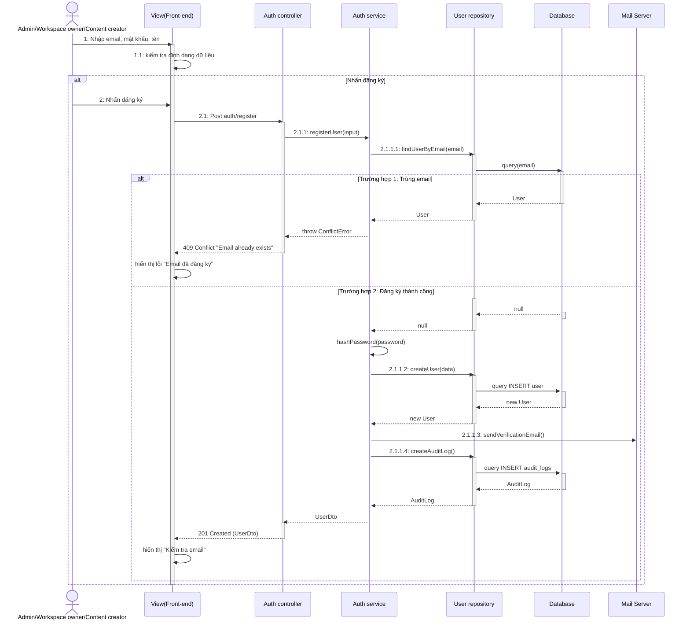
```mermaid
sequenceDiagram
    actor User as Admin/Workspace owner/Content creator
    participant View as View(Front-end)
    participant Controller as Auth controller
    participant Service as Auth service
    participant Repository as User repository
    participant DB as Database
    participant Mail as Mail Server

    User->>View: 1: Nhập email, mật khẩu, tên
    activate View
    View->>View: 1.1: kiểm tra định dạng dữ liệu

    alt Nhấn đăng ký
        User->>View: 2: Nhấn đăng ký
        View->>Controller: 2.1: Post:auth/register
        activate Controller
        Controller->>Service: 2.1.1: registerUser(input)
        activate Service
        Service->>Repository: 2.1.1.1: findUserByEmail(email)
        activate Repository
        Repository->>DB: query(email)
        activate DB

        alt Trường hợp 1: Trùng email
            DB-->>Repository: User
            deactivate DB
            Repository-->>Service: User
            deactivate Repository
            Service-->>Controller: throw ConflictError
            Controller-->>View: 409 Conflict "Email already exists"
            deactivate Controller
            View->>View: hiển thị lỗi "Email đã đăng ký"
        else Trường hợp 2: Đăng ký thành công
            activate Repository
            activate DB
            DB-->>Repository: null
            activate DB
            deactivate DB
            Repository-->>Service: null
            deactivate Repository
            Service->>Service: hashPassword(password)
            Service->>Repository: 2.1.1.2: createUser(data)
            activate Repository
            Repository->>DB: query INSERT user
            activate DB
            DB-->>Repository: new User
            deactivate DB
            Repository-->>Service: new User
            deactivate Repository
            Service->>Mail: 2.1.1.3: sendVerificationEmail()
            Service->>Repository: 2.1.1.4: createAuditLog()
            activate Repository
            Repository->>DB: query INSERT audit_logs
            activate DB
            DB-->>Repository: AuditLog
            deactivate DB
            Repository-->>Service: AuditLog
            deactivate Repository
            Service-->>Controller: UserDto
            activate Controller
            Controller-->>View: 201 Created (UserDto)
            deactivate Controller
            View->>View: hiển thị "Kiểm tra email"
        end
    end
    deactivate View
```

### UC02 — Login

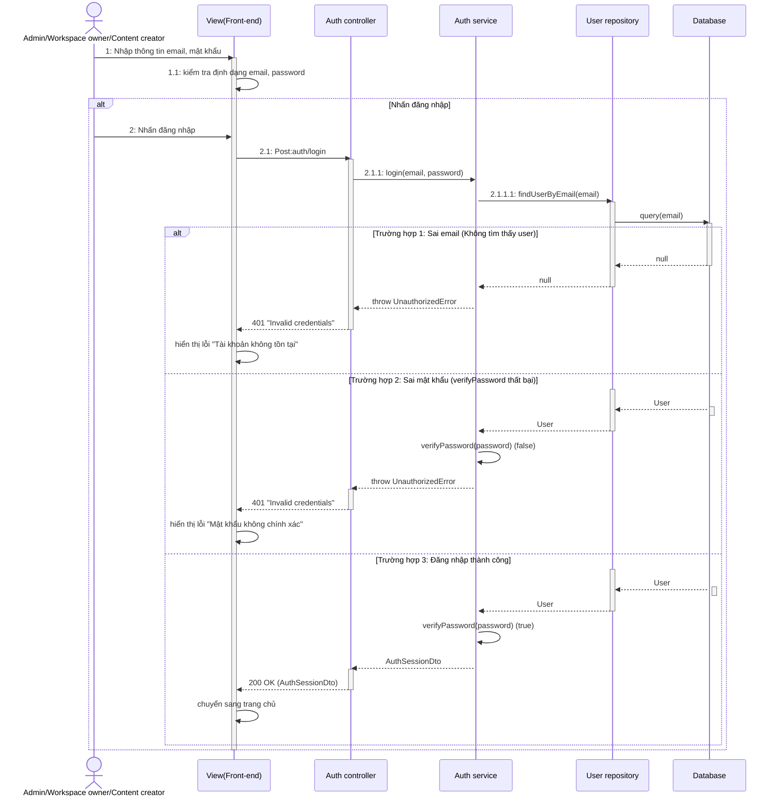
```mermaid
sequenceDiagram
    actor User as Admin/Workspace owner/Content creator
    participant View as View(Front-end)
    participant Controller as Auth controller
    participant Service as Auth service
    participant Repository as User repository
    participant DB as Database

    User->>View: 1: Nhập thông tin email, mật khẩu
    activate View
    View->>View: 1.1: kiểm tra định dạng email, password

    alt Nhấn đăng nhập
        User->>View: 2: Nhấn đăng nhập
        View->>Controller: 2.1: Post:auth/login
        activate Controller
        Controller->>Service: 2.1.1: login(email, password)
        activate Service
        Service->>Repository: 2.1.1.1: findUserByEmail(email)
        activate Repository
        Repository->>DB: query(email)
        activate DB

        alt Trường hợp 1: Sai email (Không tìm thấy user)
            DB-->>Repository: null
            deactivate DB
            Repository-->>Service: null
            deactivate Repository
            Service-->>Controller: throw UnauthorizedError
            Controller-->>View: 401 "Invalid credentials"
            deactivate Controller
            View->>View: hiển thị lỗi "Tài khoản không tồn tại"
        else Trường hợp 2: Sai mật khẩu (verifyPassword thất bại)
            activate Repository
            activate DB
            DB-->>Repository: User
            activate DB
            deactivate DB
            Repository-->>Service: User
            deactivate Repository
            Service->>Service: verifyPassword(password) (false)
            Service-->>Controller: throw UnauthorizedError
            activate Controller
            Controller-->>View: 401 "Invalid credentials"
            deactivate Controller
            View->>View: hiển thị lỗi "Mật khẩu không chính xác"
        else Trường hợp 3: Đăng nhập thành công
            activate Repository
            activate DB
            DB-->>Repository: User
            activate DB
            deactivate DB
            Repository-->>Service: User
            deactivate Repository
            Service->>Service: verifyPassword(password) (true)
            Service-->>Controller: AuthSessionDto
            activate Controller
            Controller-->>View: 200 OK (AuthSessionDto)
            deactivate Controller
            View->>View: chuyển sang trang chủ
        end
    end
    deactivate View
```

### UC03 — Logout

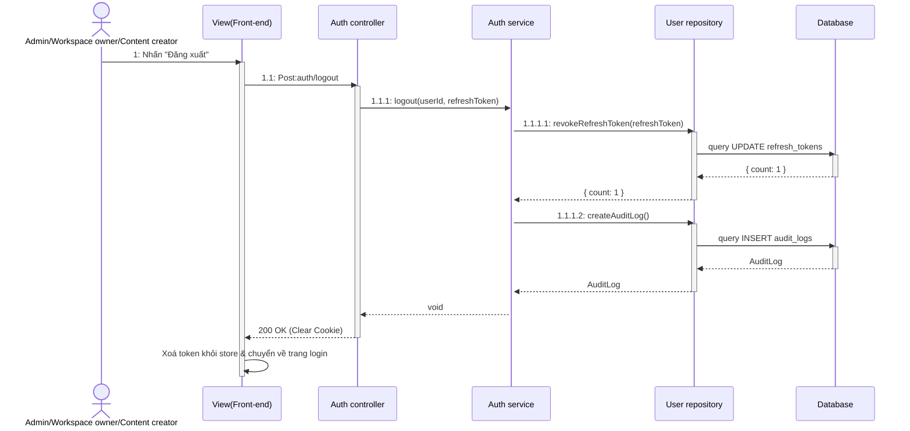
```mermaid
sequenceDiagram
    actor User as Admin/Workspace owner/Content creator
    participant View as View(Front-end)
    participant Controller as Auth controller
    participant Service as Auth service
    participant Repository as User repository
    participant DB as Database

    User->>View: 1: Nhấn "Đăng xuất"
    activate View
    View->>Controller: 1.1: Post:auth/logout
    activate Controller
    Controller->>Service: 1.1.1: logout(userId, refreshToken)
    activate Service
    Service->>Repository: 1.1.1.1: revokeRefreshToken(refreshToken)
    activate Repository
    Repository->>DB: query UPDATE refresh_tokens
    activate DB
    DB-->>Repository: { count: 1 }
    deactivate DB
    Repository-->>Service: { count: 1 }
    deactivate Repository
    Service->>Repository: 1.1.1.2: createAuditLog()
    activate Repository
    Repository->>DB: query INSERT audit_logs
    activate DB
    DB-->>Repository: AuditLog
    deactivate DB
    Repository-->>Service: AuditLog
    deactivate Repository
    Service-->>Controller: void
    Controller-->>View: 200 OK (Clear Cookie)
    deactivate Controller
    View->>View: Xoá token khỏi store & chuyển về trang login
    deactivate View
```

### UC04 — Change Password

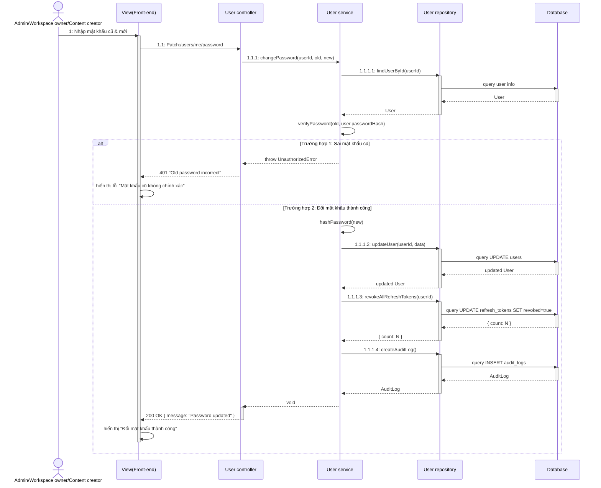
```mermaid
sequenceDiagram
    actor User as Admin/Workspace owner/Content creator
    participant View as View(Front-end)
    participant Controller as User controller
    participant Service as User service
    participant Repository as User repository
    participant DB as Database

    User->>View: 1: Nhập mật khẩu cũ & mới
    activate View
    View->>Controller: 1.1: Patch:/users/me/password
    activate Controller
    Controller->>Service: 1.1.1: changePassword(userId, old, new)
    activate Service
    Service->>Repository: 1.1.1.1: findUserById(userId)
    activate Repository
    Repository->>DB: query user info
    activate DB
    DB-->>Repository: User
    deactivate DB
    Repository-->>Service: User
    deactivate Repository
    Service->>Service: verifyPassword(old, user.passwordHash)

    alt Trường hợp 1: Sai mật khẩu cũ
        Service-->>Controller: throw UnauthorizedError
        Controller-->>View: 401 "Old password incorrect"
        View->>View: hiển thị lỗi "Mật khẩu cũ không chính xác"
    else Trường hợp 2: Đổi mật khẩu thành công
        Service->>Service: hashPassword(new)
        Service->>Repository: 1.1.1.2: updateUser(userId, data)
        activate Repository
        Repository->>DB: query UPDATE users
        activate DB
        DB-->>Repository: updated User
        deactivate DB
        Repository-->>Service: updated User
        deactivate Repository

        Service->>Repository: 1.1.1.3: revokeAllRefreshTokens(userId)
        activate Repository
        Repository->>DB: query UPDATE refresh_tokens SET revoked=true
        activate DB
        DB-->>Repository: { count: N }
        deactivate DB
        Repository-->>Service: { count: N }
        deactivate Repository

        Service->>Repository: 1.1.1.4: createAuditLog()
        activate Repository
        Repository->>DB: query INSERT audit_logs
        activate DB
        DB-->>Repository: AuditLog
        deactivate DB
        Repository-->>Service: AuditLog
        deactivate Repository

        Service-->>Controller: void
        activate Controller
        Controller-->>View: 200 OK { message: "Password updated" }
        deactivate Controller
        View->>View: hiển thị "Đổi mật khẩu thành công"
        deactivate View
    end
```

### UC16 — Create Workspace

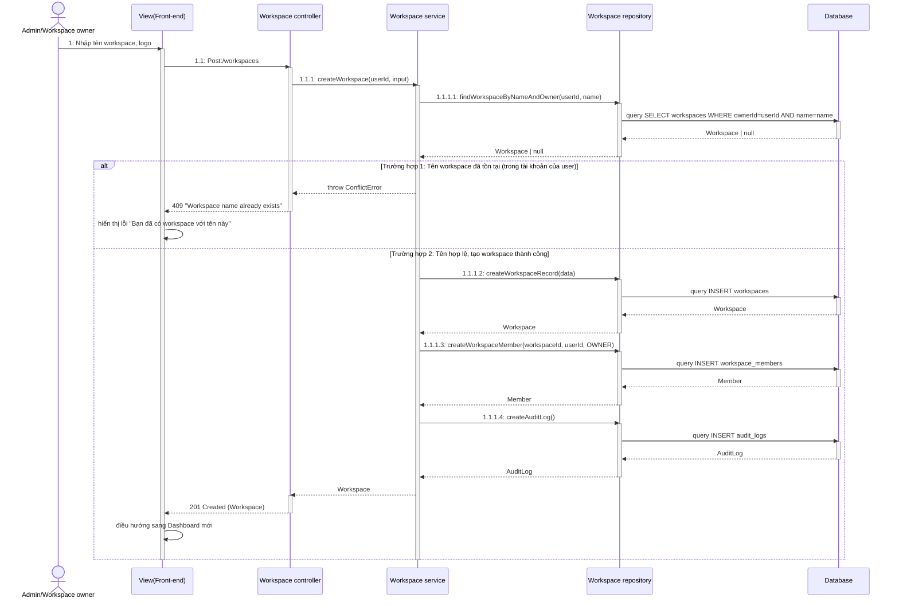
```mermaid
sequenceDiagram
    actor User as Admin/Workspace owner
    participant View as View(Front-end)
    participant Controller as Workspace controller
    participant Service as Workspace service
    participant Repository as Workspace repository
    participant DB as Database

    User->>View: 1: Nhập tên workspace, logo
    activate View
    View->>Controller: 1.1: Post:/workspaces
    activate Controller
    Controller->>Service: 1.1.1: createWorkspace(userId, input)
    activate Service

    Service->>Repository: 1.1.1.1: findWorkspaceByNameAndOwner(userId, name)
    activate Repository
    Repository->>DB: query SELECT workspaces WHERE ownerId=userId AND name=name
    activate DB
    DB-->>Repository: Workspace | null
    deactivate DB
    Repository-->>Service: Workspace | null
    deactivate Repository

    alt Trường hợp 1: Tên workspace đã tồn tại (trong tài khoản của user)
        Service-->>Controller: throw ConflictError
        Controller-->>View: 409 "Workspace name already exists"
        deactivate Controller
        View->>View: hiển thị lỗi "Bạn đã có workspace với tên này"
    else Trường hợp 2: Tên hợp lệ, tạo workspace thành công
        Service->>Repository: 1.1.1.2: createWorkspaceRecord(data)
        activate Repository
        Repository->>DB: query INSERT workspaces
        activate DB
        DB-->>Repository: Workspace
        deactivate DB
        Repository-->>Service: Workspace
        deactivate Repository

        Service->>Repository: 1.1.1.3: createWorkspaceMember(workspaceId, userId, OWNER)
        activate Repository
        Repository->>DB: query INSERT workspace_members
        activate DB
        DB-->>Repository: Member
        deactivate DB
        Repository-->>Service: Member
        deactivate Repository

        Service->>Repository: 1.1.1.4: createAuditLog()
        activate Repository
        Repository->>DB: query INSERT audit_logs
        activate DB
        DB-->>Repository: AuditLog
        deactivate DB
        Repository-->>Service: AuditLog
        deactivate Repository

        Service-->>Controller: Workspace
        activate Controller
        Controller-->>View: 201 Created (Workspace)
        deactivate Controller
        View->>View: điều hướng sang Dashboard mới
    end
    deactivate Service
    deactivate View
```

### UC17 — Update Workspace

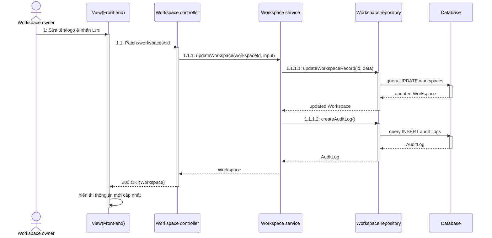
```mermaid
sequenceDiagram
    actor User as Workspace owner
    participant View as View(Front-end)
    participant Controller as Workspace controller
    participant Service as Workspace service
    participant Repository as Workspace repository
    participant DB as Database

    User->>View: 1: Sửa tên/logo & nhấn Lưu
    activate View
    View->>Controller: 1.1: Patch:/workspaces/:id
    activate Controller
    Controller->>Service: 1.1.1: updateWorkspace(workspaceId, input)
    activate Service

    Service->>Repository: 1.1.1.1: updateWorkspaceRecord(id, data)
    activate Repository
    Repository->>DB: query UPDATE workspaces
    activate DB
    DB-->>Repository: updated Workspace
    deactivate DB
    Repository-->>Service: updated Workspace
    deactivate Repository

    Service->>Repository: 1.1.1.2: createAuditLog()
    activate Repository
    Repository->>DB: query INSERT audit_logs
    activate DB
    DB-->>Repository: AuditLog
    deactivate DB
    Repository-->>Service: AuditLog
    deactivate Repository

    Service-->>Controller: Workspace
    Controller-->>View: 200 OK (Workspace)
    deactivate Controller
    View->>View: hiển thị thông tin mới cập nhật
    deactivate View
```

### UC18 — Delete Workspace

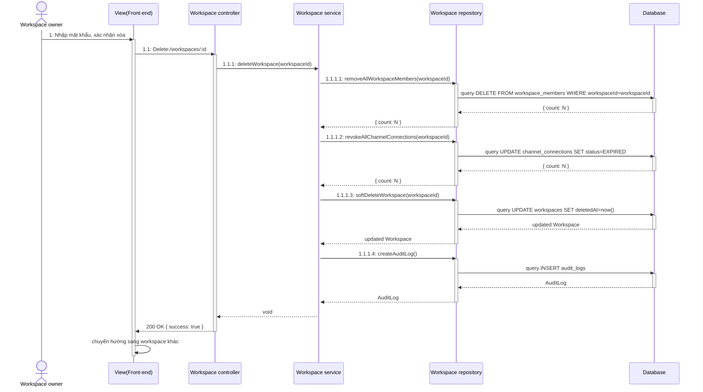
```mermaid
sequenceDiagram
    actor User as Workspace owner
    participant View as View(Front-end)
    participant Controller as Workspace controller
    participant Service as Workspace service
    participant Repository as Workspace repository
    participant DB as Database

    User->>View: 1: Nhập mật khẩu, xác nhận xóa
    activate View
    View->>Controller: 1.1: Delete:/workspaces/:id
    activate Controller
    Controller->>Service: 1.1.1: deleteWorkspace(workspaceId)
    activate Service

    Service->>Repository: 1.1.1.1: removeAllWorkspaceMembers(workspaceId)
    activate Repository
    Repository->>DB: query DELETE FROM workspace_members WHERE workspaceId=workspaceId
    activate DB
    DB-->>Repository: { count: N }
    deactivate DB
    Repository-->>Service: { count: N }
    deactivate Repository

    Service->>Repository: 1.1.1.2: revokeAllChannelConnections(workspaceId)
    activate Repository
    Repository->>DB: query UPDATE channel_connections SET status=EXPIRED
    activate DB
    DB-->>Repository: { count: N }
    deactivate DB
    Repository-->>Service: { count: N }
    deactivate Repository

    Service->>Repository: 1.1.1.3: softDeleteWorkspace(workspaceId)
    activate Repository
    Repository->>DB: query UPDATE workspaces SET deletedAt=now()
    activate DB
    DB-->>Repository: updated Workspace
    deactivate DB
    Repository-->>Service: updated Workspace
    deactivate Repository

    Service->>Repository: 1.1.1.4: createAuditLog()
    activate Repository
    Repository->>DB: query INSERT audit_logs
    activate DB
    DB-->>Repository: AuditLog
    deactivate DB
    Repository-->>Service: AuditLog
    deactivate Repository

    Service-->>Controller: void
    Controller-->>View: 200 OK { success: true }
    deactivate Controller
    View->>View: chuyển hướng sang workspace khác
    deactivate View
```

### UC19 — View member in workspace

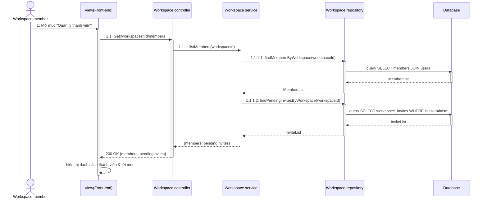
```mermaid
sequenceDiagram
    actor User as Workspace member
    participant View as View(Front-end)
    participant Controller as Workspace controller
    participant Service as Workspace service
    participant Repository as Workspace repository
    participant DB as Database

    User->>View: 1: Mở mục "Quản lý thành viên"
    activate View
    View->>Controller: 1.1: Get:/workspaces/:id/members
    activate Controller
    Controller->>Service: 1.1.1: listMembers(workspaceId)
    activate Service

    Service->>Repository: 1.1.1.1: findMembersByWorkspace(workspaceId)
    activate Repository
    Repository->>DB: query SELECT members JOIN users
    activate DB
    DB-->>Repository: MemberList
    deactivate DB
    Repository-->>Service: MemberList
    deactivate Repository

    Service->>Repository: 1.1.1.2: findPendingInvitesByWorkspace(workspaceId)
    activate Repository
    Repository->>DB: query SELECT workspace_invites WHERE isUsed=false
    activate DB
    DB-->>Repository: InviteList
    deactivate DB
    Repository-->>Service: InviteList
    deactivate Repository

    Service-->>Controller: {members, pendingInvites}
    Controller-->>View: 200 OK {members, pendingInvites}
    deactivate Controller
    View->>View: hiển thị danh sách thành viên & lời mời
    deactivate View
```

### UC20 — Invite member

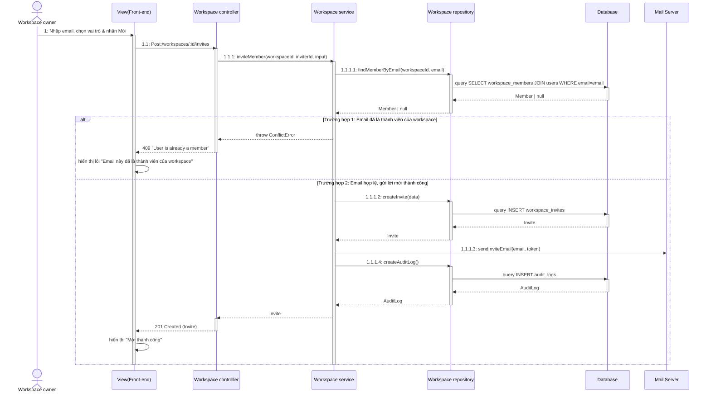
```mermaid
sequenceDiagram
    actor User as Workspace owner
    participant View as View(Front-end)
    participant Controller as Workspace controller
    participant Service as Workspace service
    participant Repository as Workspace repository
    participant DB as Database
    participant Mail as Mail Server

    User->>View: 1: Nhập email, chọn vai trò & nhấn Mời
    activate View
    View->>Controller: 1.1: Post:/workspaces/:id/invites
    activate Controller
    Controller->>Service: 1.1.1: inviteMember(workspaceId, inviterId, input)
    activate Service

    Service->>Repository: 1.1.1.1: findMemberByEmail(workspaceId, email)
    activate Repository
    Repository->>DB: query SELECT workspace_members JOIN users WHERE email=email
    activate DB
    DB-->>Repository: Member | null
    deactivate DB
    Repository-->>Service: Member | null
    deactivate Repository

    alt Trường hợp 1: Email đã là thành viên của workspace
        Service-->>Controller: throw ConflictError
        Controller-->>View: 409 "User is already a member"
        deactivate Controller
        View->>View: hiển thị lỗi "Email này đã là thành viên của workspace"
    else Trường hợp 2: Email hợp lệ, gửi lời mời thành công
        Service->>Repository: 1.1.1.2: createInvite(data)
        activate Repository
        Repository->>DB: query INSERT workspace_invites
        activate DB
        DB-->>Repository: Invite
        deactivate DB
        Repository-->>Service: Invite
        deactivate Repository

        Service->>Mail: 1.1.1.3: sendInviteEmail(email, token)

        Service->>Repository: 1.1.1.4: createAuditLog()
        activate Repository
        Repository->>DB: query INSERT audit_logs
        activate DB
        DB-->>Repository: AuditLog
        deactivate DB
        Repository-->>Service: AuditLog
        deactivate Repository

        Service-->>Controller: Invite
        activate Controller
        Controller-->>View: 201 Created (Invite)
        deactivate Controller
        View->>View: hiển thị "Mời thành công"
    end
    deactivate Service
    deactivate View
```

### UC21 — Accept invitation

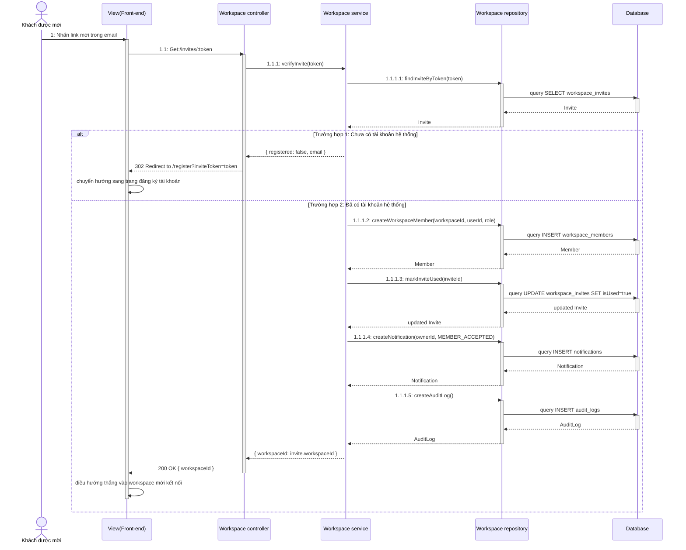
```mermaid
sequenceDiagram
    actor Guest as Khách được mời
    participant View as View(Front-end)
    participant Controller as Workspace controller
    participant Service as Workspace service
    participant Repository as Workspace repository
    participant DB as Database

    Guest->>View: 1: Nhấn link mời trong email
    activate View
    View->>Controller: 1.1: Get:/invites/:token
    activate Controller
    Controller->>Service: 1.1.1: verifyInvite(token)
    activate Service
    Service->>Repository: 1.1.1.1: findInviteByToken(token)
    activate Repository
    Repository->>DB: query SELECT workspace_invites
    activate DB
    DB-->>Repository: Invite
    deactivate DB
    Repository-->>Service: Invite
    deactivate Repository

    alt Trường hợp 1: Chưa có tài khoản hệ thống
        Service-->>Controller: { registered: false, email }
        Controller-->>View: 302 Redirect to /register?inviteToken=token
        View->>View: chuyển hướng sang trang đăng ký tài khoản
    else Trường hợp 2: Đã có tài khoản hệ thống
        Service->>Repository: 1.1.1.2: createWorkspaceMember(workspaceId, userId, role)
        activate Repository
        Repository->>DB: query INSERT workspace_members
        activate DB
        DB-->>Repository: Member
        deactivate DB
        Repository-->>Service: Member
        deactivate Repository

        Service->>Repository: 1.1.1.3: markInviteUsed(inviteId)
        activate Repository
        Repository->>DB: query UPDATE workspace_invites SET isUsed=true
        activate DB
        DB-->>Repository: updated Invite
        deactivate DB
        Repository-->>Service: updated Invite
        deactivate Repository

        Service->>Repository: 1.1.1.4: createNotification(ownerId, MEMBER_ACCEPTED)
        activate Repository
        Repository->>DB: query INSERT notifications
        activate DB
        DB-->>Repository: Notification
        deactivate DB
        Repository-->>Service: Notification
        deactivate Repository

        Service->>Repository: 1.1.1.5: createAuditLog()
        activate Repository
        Repository->>DB: query INSERT audit_logs
        activate DB
        DB-->>Repository: AuditLog
        deactivate DB
        Repository-->>Service: AuditLog
        deactivate Repository

        Service-->>Controller: { workspaceId: invite.workspaceId }
        Controller-->>View: 200 OK { workspaceId }
        deactivate Controller
        View->>View: điều hướng thẳng vào workspace mới kết nối
        deactivate View
    end
```

### UC22 — Leave workspace

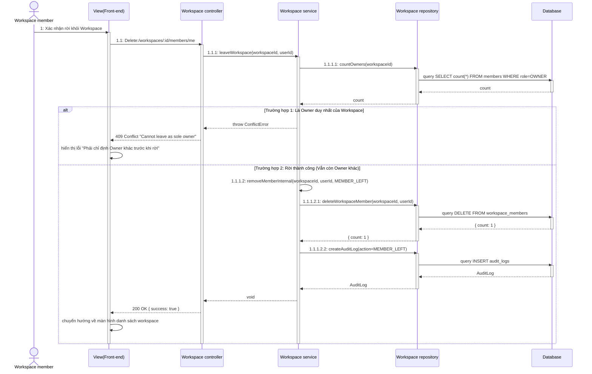
```mermaid
sequenceDiagram
    actor User as Workspace member
    participant View as View(Front-end)
    participant Controller as Workspace controller
    participant Service as Workspace service
    participant Repository as Workspace repository
    participant DB as Database

    User->>View: 1: Xác nhận rời khỏi Workspace
    activate View
    View->>Controller: 1.1: Delete:/workspaces/:id/members/me
    activate Controller
    Controller->>Service: 1.1.1: leaveWorkspace(workspaceId, userId)
    activate Service

    Service->>Repository: 1.1.1.1: countOwners(workspaceId)
    activate Repository
    Repository->>DB: query SELECT count(*) FROM members WHERE role=OWNER
    activate DB
    DB-->>Repository: count
    deactivate DB
    Repository-->>Service: count
    deactivate Repository

    alt Trường hợp 1: Là Owner duy nhất của Workspace
        Service-->>Controller: throw ConflictError
        Controller-->>View: 409 Conflict "Cannot leave as sole owner"
        View->>View: hiển thị lỗi "Phải chỉ định Owner khác trước khi rời"
    else Trường hợp 2: Rời thành công (Vẫn còn Owner khác)
        Service->>Service: 1.1.1.2: removeMemberInternal(workspaceId, userId, MEMBER_LEFT)

        Service->>Repository: 1.1.1.2.1: deleteWorkspaceMember(workspaceId, userId)
        activate Repository
        Repository->>DB: query DELETE FROM workspace_members
        activate DB
        DB-->>Repository: { count: 1 }
        deactivate DB
        Repository-->>Service: { count: 1 }
        deactivate Repository

        Service->>Repository: 1.1.1.2.2: createAuditLog(action=MEMBER_LEFT)
        activate Repository
        Repository->>DB: query INSERT audit_logs
        activate DB
        DB-->>Repository: AuditLog
        deactivate DB
        Repository-->>Service: AuditLog
        deactivate Repository

        Service-->>Controller: void
        Controller-->>View: 200 OK { success: true }
        View->>View: chuyển hướng về màn hình danh sách workspace
    end
    deactivate Controller
    deactivate Service
    deactivate View
```

> Ghi chú: bước 1.1.1.2 (`removeMemberInternal`) là hàm **private dùng chung** với UC23, chỉ thực hiện thao tác xoá + ghi log, khác nhau ở `action` truyền vào và ở bước kiểm tra điều kiện trước đó (1.1.1.1).

### UC23 — Remove member

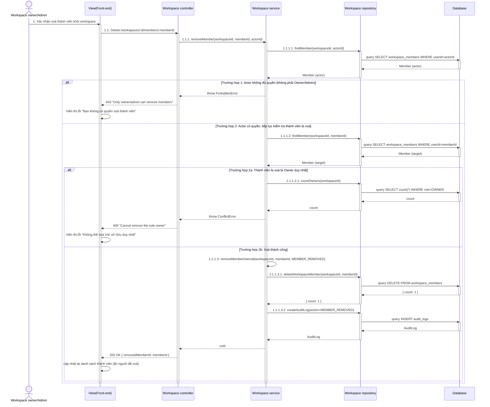
```mermaid
sequenceDiagram
    actor User as Workspace owner/Admin
    participant View as View(Front-end)
    participant Controller as Workspace controller
    participant Service as Workspace service
    participant Repository as Workspace repository
    participant DB as Database

    User->>View: 1: Xác nhận xoá thành viên khỏi workspace
    activate View
    View->>Controller: 1.1: Delete:/workspaces/:id/members/:memberId
    activate Controller
    Controller->>Service: 1.1.1: removeMember(workspaceId, memberId, actorId)
    activate Service

    Service->>Repository: 1.1.1.1: findMember(workspaceId, actorId)
    activate Repository
    Repository->>DB: query SELECT workspace_members WHERE userId=actorId
    activate DB
    DB-->>Repository: Member (actor)
    deactivate DB
    Repository-->>Service: Member (actor)
    deactivate Repository

    alt Trường hợp 1: Actor không đủ quyền (không phải Owner/Admin)
        Service-->>Controller: throw ForbiddenError
        Controller-->>View: 403 "Only owner/admin can remove members"
        View->>View: hiển thị lỗi "Bạn không có quyền xoá thành viên"
    else Trường hợp 2: Actor có quyền, tiếp tục kiểm tra thành viên bị xoá
        Service->>Repository: 1.1.1.2: findMember(workspaceId, memberId)
        activate Repository
        Repository->>DB: query SELECT workspace_members WHERE userId=memberId
        activate DB
        DB-->>Repository: Member (target)
        deactivate DB
        Repository-->>Service: Member (target)
        deactivate Repository

        alt Trường hợp 2a: Thành viên bị xoá là Owner duy nhất
            Service->>Repository: 1.1.1.2.1: countOwners(workspaceId)
            activate Repository
            Repository->>DB: query SELECT count(*) WHERE role=OWNER
            activate DB
            DB-->>Repository: count
            deactivate DB
            Repository-->>Service: count
            deactivate Repository
            Service-->>Controller: throw ConflictError
            Controller-->>View: 409 "Cannot remove the sole owner"
            View->>View: hiển thị lỗi "Không thể xoá chủ sở hữu duy nhất"
        else Trường hợp 2b: Xoá thành công
            Service->>Service: 1.1.1.3: removeMemberInternal(workspaceId, memberId, MEMBER_REMOVED)

            Service->>Repository: 1.1.1.3.1: deleteWorkspaceMember(workspaceId, memberId)
            activate Repository
            Repository->>DB: query DELETE FROM workspace_members
            activate DB
            DB-->>Repository: { count: 1 }
            deactivate DB
            Repository-->>Service: { count: 1 }
            deactivate Repository

            Service->>Repository: 1.1.1.3.2: createAuditLog(action=MEMBER_REMOVED)
            activate Repository
            Repository->>DB: query INSERT audit_logs
            activate DB
            DB-->>Repository: AuditLog
            deactivate DB
            Repository-->>Service: AuditLog
            deactivate Repository

            Service-->>Controller: void
            Controller-->>View: 200 OK { removedMemberId: memberId }
            View->>View: cập nhật lại danh sách thành viên (ẩn người đã xoá)
        end
    end
    deactivate Controller
    deactivate Service
    deactivate View
```

> Ghi chú: bước 1.1.1.3 (`removeMemberInternal`) dùng chung logic với UC22 — chỉ khác `action` audit log truyền vào.

### UC32 — Update Profile

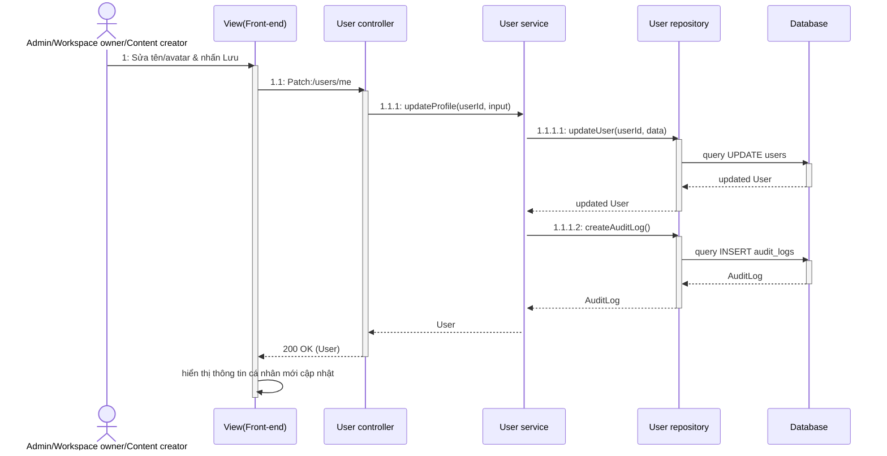
```mermaid
sequenceDiagram
    actor User as Admin/Workspace owner/Content creator
    participant View as View(Front-end)
    participant Controller as User controller
    participant Service as User service
    participant Repository as User repository
    participant DB as Database

    User->>View: 1: Sửa tên/avatar & nhấn Lưu
    activate View
    View->>Controller: 1.1: Patch:/users/me
    activate Controller
    Controller->>Service: 1.1.1: updateProfile(userId, input)
    activate Service

    Service->>Repository: 1.1.1.1: updateUser(userId, data)
    activate Repository
    Repository->>DB: query UPDATE users
    activate DB
    DB-->>Repository: updated User
    deactivate DB
    Repository-->>Service: updated User
    deactivate Repository

    Service->>Repository: 1.1.1.2: createAuditLog()
    activate Repository
    Repository->>DB: query INSERT audit_logs
    activate DB
    DB-->>Repository: AuditLog
    deactivate DB
    Repository-->>Service: AuditLog
    deactivate Repository

    Service-->>Controller: User
    Controller-->>View: 200 OK (User)
    deactivate Controller
    View->>View: hiển thị thông tin cá nhân mới cập nhật
    deactivate View
```

## Phân hệ 2 — Nội dung & Media

### UC05 — Create Content

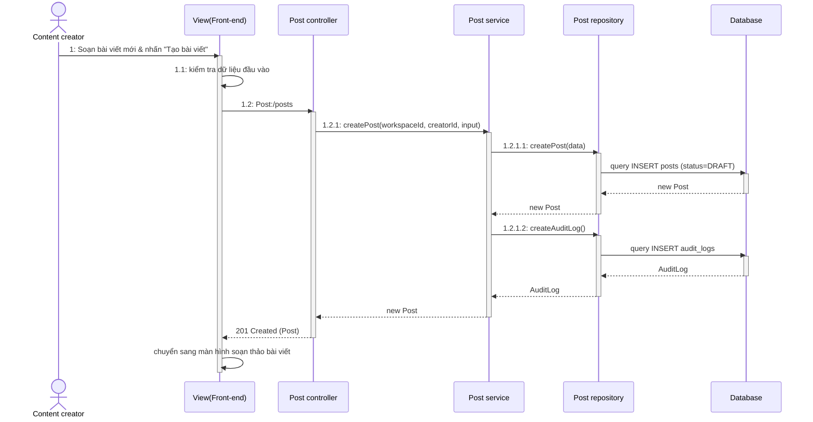
```mermaid
sequenceDiagram
    actor User as Content creator
    participant View as View(Front-end)
    participant Controller as Post controller
    participant Service as Post service
    participant Repository as Post repository
    participant DB as Database

    User->>View: 1: Soạn bài viết mới & nhấn "Tạo bài viết"
    activate View
    View->>View: 1.1: kiểm tra dữ liệu đầu vào
    View->>Controller: 1.2: Post:/posts
    activate Controller
    Controller->>Service: 1.2.1: createPost(workspaceId, creatorId, input)
    activate Service

    Service->>Repository: 1.2.1.1: createPost(data)
    activate Repository
    Repository->>DB: query INSERT posts (status=DRAFT)
    activate DB
    DB-->>Repository: new Post
    deactivate DB
    Repository-->>Service: new Post
    deactivate Repository

    Service->>Repository: 1.2.1.2: createAuditLog()
    activate Repository
    Repository->>DB: query INSERT audit_logs
    activate DB
    DB-->>Repository: AuditLog
    deactivate DB
    Repository-->>Service: AuditLog
    deactivate Repository

    Service-->>Controller: new Post
    deactivate Service
    Controller-->>View: 201 Created (Post)
    deactivate Controller
    View->>View: chuyển sang màn hình soạn thảo bài viết
    deactivate View
```

### UC07 — Update Content

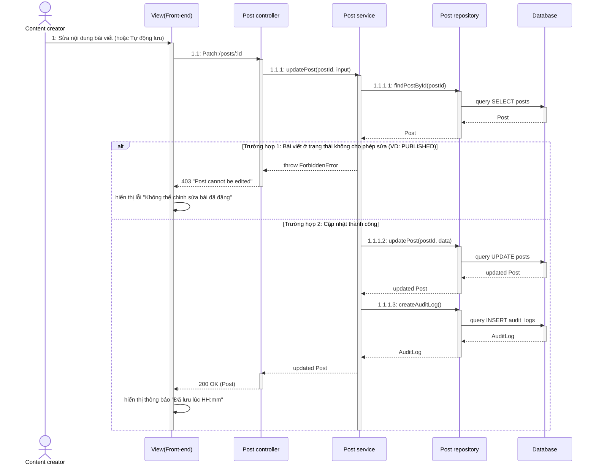
```mermaid
sequenceDiagram
    actor User as Content creator
    participant View as View(Front-end)
    participant Controller as Post controller
    participant Service as Post service
    participant Repository as Post repository
    participant DB as Database

    User->>View: 1: Sửa nội dung bài viết (hoặc Tự động lưu)
    activate View
    View->>Controller: 1.1: Patch:/posts/:id
    activate Controller
    Controller->>Service: 1.1.1: updatePost(postId, input)
    activate Service

    Service->>Repository: 1.1.1.1: findPostById(postId)
    activate Repository
    Repository->>DB: query SELECT posts
    activate DB
    DB-->>Repository: Post
    deactivate DB
    Repository-->>Service: Post
    deactivate Repository

    alt Trường hợp 1: Bài viết ở trạng thái không cho phép sửa (VD: PUBLISHED)
        Service-->>Controller: throw ForbiddenError
        Controller-->>View: 403 "Post cannot be edited"
        deactivate Controller
        View->>View: hiển thị lỗi "Không thể chỉnh sửa bài đã đăng"
    else Trường hợp 2: Cập nhật thành công
        Service->>Repository: 1.1.1.2: updatePost(postId, data)
        activate Repository
        Repository->>DB: query UPDATE posts
        activate DB
        DB-->>Repository: updated Post
        deactivate DB
        Repository-->>Service: updated Post
        deactivate Repository

        Service->>Repository: 1.1.1.3: createAuditLog()
        activate Repository
        Repository->>DB: query INSERT audit_logs
        activate DB
        DB-->>Repository: AuditLog
        deactivate DB
        Repository-->>Service: AuditLog
        deactivate Repository

        Service-->>Controller: updated Post
        activate Controller
        Controller-->>View: 200 OK (Post)
        deactivate Controller
        View->>View: hiển thị thông báo "Đã lưu lúc HH:mm"
    end
    deactivate Service
    deactivate View
```

### UC08 — View Content

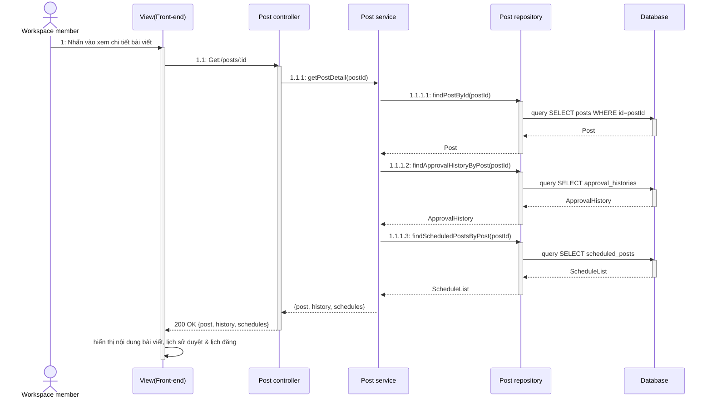
```mermaid
sequenceDiagram
    actor User as Workspace member
    participant View as View(Front-end)
    participant Controller as Post controller
    participant Service as Post service
    participant Repository as Post repository
    participant DB as Database

    User->>View: 1: Nhấn vào xem chi tiết bài viết
    activate View
    View->>Controller: 1.1: Get:/posts/:id
    activate Controller
    Controller->>Service: 1.1.1: getPostDetail(postId)
    activate Service

    Service->>Repository: 1.1.1.1: findPostById(postId)
    activate Repository
    Repository->>DB: query SELECT posts WHERE id=postId
    activate DB
    DB-->>Repository: Post
    deactivate DB
    Repository-->>Service: Post
    deactivate Repository

    Service->>Repository: 1.1.1.2: findApprovalHistoryByPost(postId)
    activate Repository
    Repository->>DB: query SELECT approval_histories
    activate DB
    DB-->>Repository: ApprovalHistory
    deactivate DB
    Repository-->>Service: ApprovalHistory
    deactivate Repository

    Service->>Repository: 1.1.1.3: findScheduledPostsByPost(postId)
    activate Repository
    Repository->>DB: query SELECT scheduled_posts
    activate DB
    DB-->>Repository: ScheduleList
    deactivate DB
    Repository-->>Service: ScheduleList
    deactivate Repository

    Service-->>Controller: {post, history, schedules}
    Controller-->>View: 200 OK {post, history, schedules}
    deactivate Controller
    View->>View: hiển thị nội dung bài viết, lịch sử duyệt & lịch đăng
    deactivate View
```

### UC09 — Search content

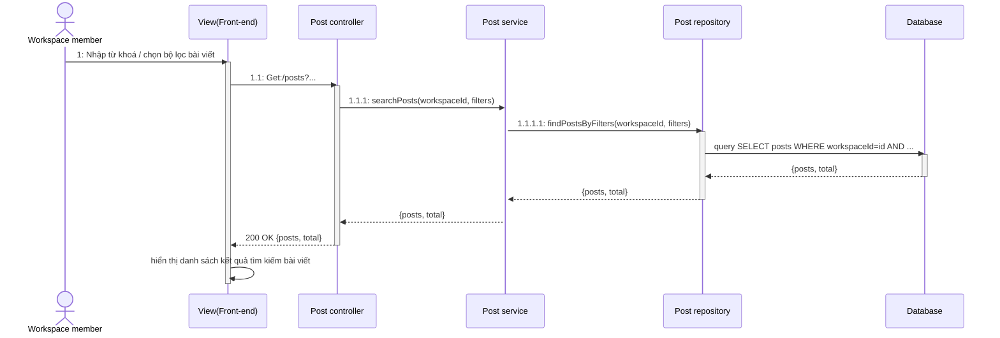
```mermaid
sequenceDiagram
    actor User as Workspace member
    participant View as View(Front-end)
    participant Controller as Post controller
    participant Service as Post service
    participant Repository as Post repository
    participant DB as Database

    User->>View: 1: Nhập từ khoá / chọn bộ lọc bài viết
    activate View
    View->>Controller: 1.1: Get:/posts?...
    activate Controller
    Controller->>Service: 1.1.1: searchPosts(workspaceId, filters)
    activate Service

    Service->>Repository: 1.1.1.1: findPostsByFilters(workspaceId, filters)
    activate Repository
    Repository->>DB: query SELECT posts WHERE workspaceId=id AND ...
    activate DB
    DB-->>Repository: {posts, total}
    deactivate DB
    Repository-->>Service: {posts, total}
    deactivate Repository

    Service-->>Controller: {posts, total}
    Controller-->>View: 200 OK {posts, total}
    deactivate Controller
    View->>View: hiển thị danh sách kết quả tìm kiếm bài viết
    deactivate View
```

### UC10 — Delete Content

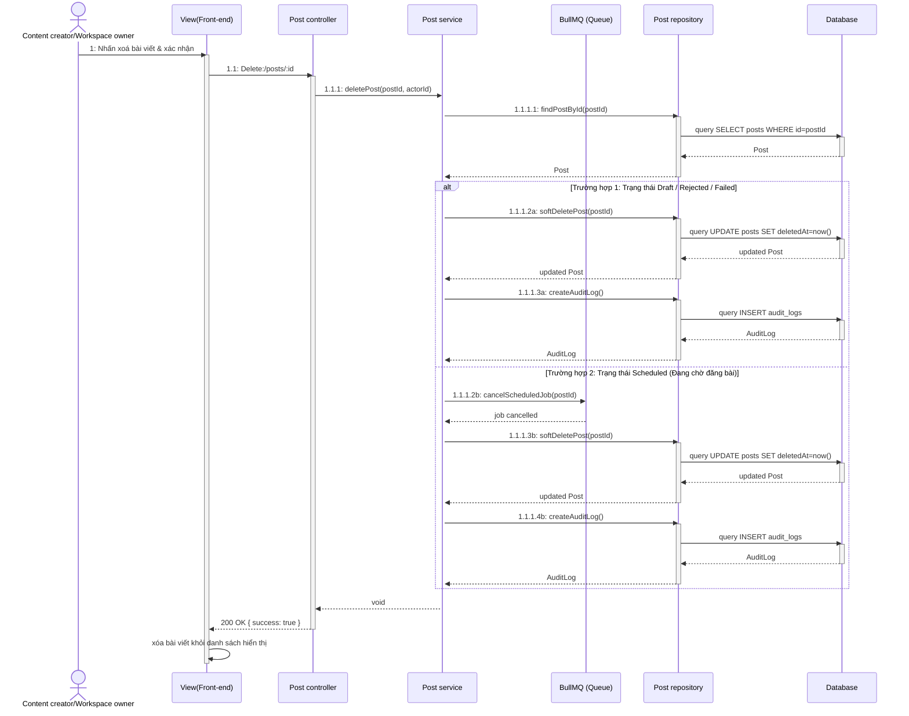
```mermaid
sequenceDiagram
    actor User as Content creator/Workspace owner
    participant View as View(Front-end)
    participant Controller as Post controller
    participant Service as Post service
    participant Queue as BullMQ (Queue)
    participant Repository as Post repository
    participant DB as Database

    User->>View: 1: Nhấn xoá bài viết & xác nhận
    activate View
    View->>Controller: 1.1: Delete:/posts/:id
    activate Controller
    Controller->>Service: 1.1.1: deletePost(postId, actorId)
    activate Service

    Service->>Repository: 1.1.1.1: findPostById(postId)
    activate Repository
    Repository->>DB: query SELECT posts WHERE id=postId
    activate DB
    DB-->>Repository: Post
    deactivate DB
    Repository-->>Service: Post
    deactivate Repository

    alt Trường hợp 1: Trạng thái Draft / Rejected / Failed
        Service->>Repository: 1.1.1.2a: softDeletePost(postId)
        activate Repository
        Repository->>DB: query UPDATE posts SET deletedAt=now()
        activate DB
        DB-->>Repository: updated Post
        deactivate DB
        Repository-->>Service: updated Post
        deactivate Repository

        Service->>Repository: 1.1.1.3a: createAuditLog()
        activate Repository
        Repository->>DB: query INSERT audit_logs
        activate DB
        DB-->>Repository: AuditLog
        deactivate DB
        Repository-->>Service: AuditLog
        deactivate Repository
    else Trường hợp 2: Trạng thái Scheduled (Đang chờ đăng bài)
        Service->>Queue: 1.1.1.2b: cancelScheduledJob(postId)
        Queue-->>Service: job cancelled

        Service->>Repository: 1.1.1.3b: softDeletePost(postId)
        activate Repository
        Repository->>DB: query UPDATE posts SET deletedAt=now()
        activate DB
        DB-->>Repository: updated Post
        deactivate DB
        Repository-->>Service: updated Post
        deactivate Repository

        Service->>Repository: 1.1.1.4b: createAuditLog()
        activate Repository
        Repository->>DB: query INSERT audit_logs
        activate DB
        DB-->>Repository: AuditLog
        deactivate DB
        Repository-->>Service: AuditLog
        deactivate Repository
    end

    Service-->>Controller: void
    Controller-->>View: 200 OK { success: true }
    deactivate Controller
    View->>View: xóa bài viết khỏi danh sách hiển thị
    deactivate View
```

## Phân hệ 2.3 — Duyệt bài

### UC11 — Submit Content for Approval

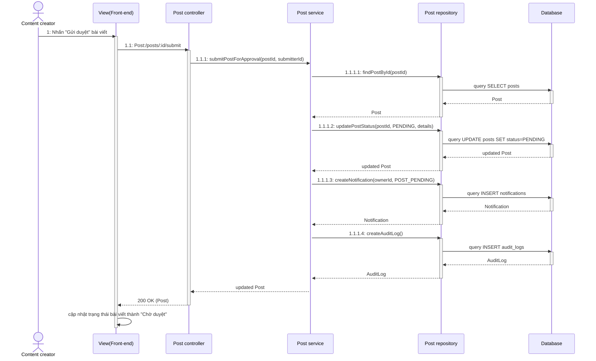
```mermaid
sequenceDiagram
    actor User as Content creator
    participant View as View(Front-end)
    participant Controller as Post controller
    participant Service as Post service
    participant Repository as Post repository
    participant DB as Database

    User->>View: 1: Nhấn "Gửi duyệt" bài viết
    activate View
    View->>Controller: 1.1: Post:/posts/:id/submit
    activate Controller
    Controller->>Service: 1.1.1: submitPostForApproval(postId, submitterId)
    activate Service

    Service->>Repository: 1.1.1.1: findPostById(postId)
    activate Repository
    Repository->>DB: query SELECT posts
    activate DB
    DB-->>Repository: Post
    deactivate DB
    Repository-->>Service: Post
    deactivate Repository

    Service->>Repository: 1.1.1.2: updatePostStatus(postId, PENDING, details)
    activate Repository
    Repository->>DB: query UPDATE posts SET status=PENDING
    activate DB
    DB-->>Repository: updated Post
    deactivate DB
    Repository-->>Service: updated Post
    deactivate Repository

    Service->>Repository: 1.1.1.3: createNotification(ownerId, POST_PENDING)
    activate Repository
    Repository->>DB: query INSERT notifications
    activate DB
    DB-->>Repository: Notification
    deactivate DB
    Repository-->>Service: Notification
    deactivate Repository

    Service->>Repository: 1.1.1.4: createAuditLog()
    activate Repository
    Repository->>DB: query INSERT audit_logs
    activate DB
    DB-->>Repository: AuditLog
    deactivate DB
    Repository-->>Service: AuditLog
    deactivate Repository

    Service-->>Controller: updated Post
    Controller-->>View: 200 OK (Post)
    deactivate Controller
    View->>View: cập nhật trạng thái bài viết thành "Chờ duyệt"
    deactivate View
```

### UC14 — Review Content

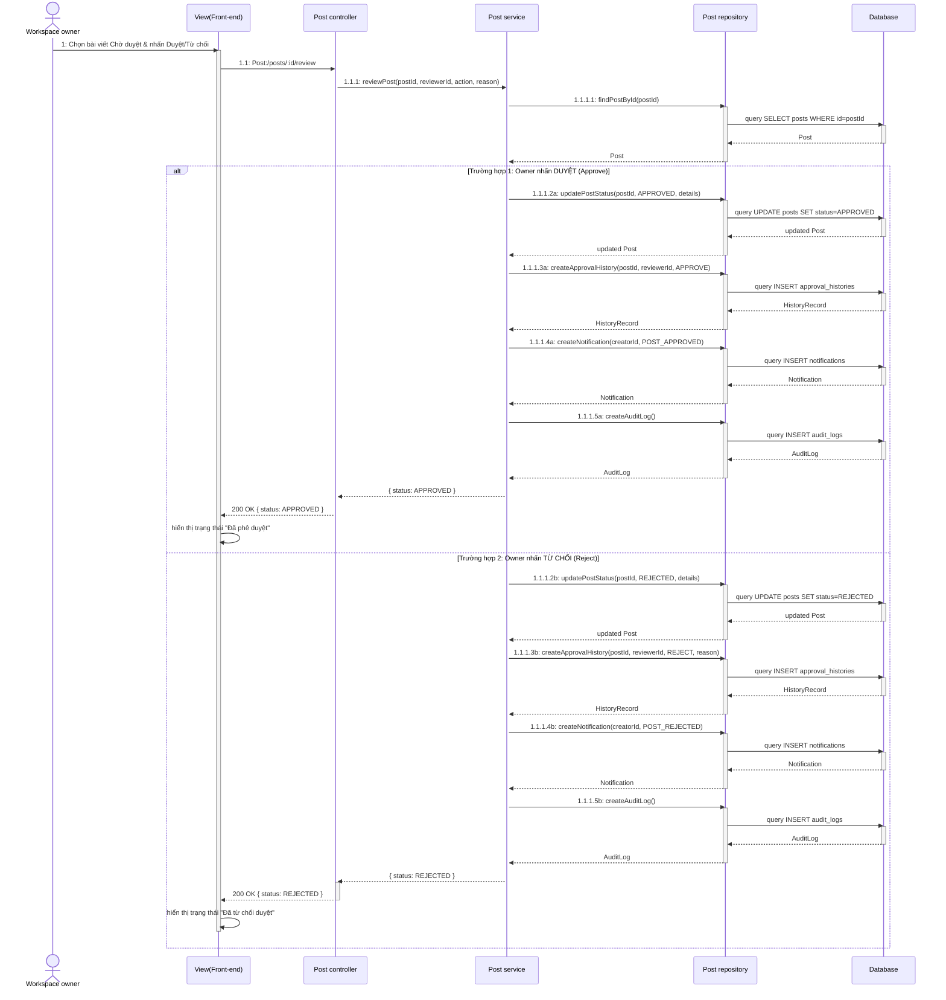
```mermaid
sequenceDiagram
    actor Owner as Workspace owner
    participant View as View(Front-end)
    participant Controller as Post controller
    participant Service as Post service
    participant Repository as Post repository
    participant DB as Database

    Owner->>View: 1: Chọn bài viết Chờ duyệt & nhấn Duyệt/Từ chối
    activate View
    View->>Controller: 1.1: Post:/posts/:id/review
    activate Controller
    Controller->>Service: 1.1.1: reviewPost(postId, reviewerId, action, reason)
    activate Service

    Service->>Repository: 1.1.1.1: findPostById(postId)
    activate Repository
    Repository->>DB: query SELECT posts WHERE id=postId
    activate DB
    DB-->>Repository: Post
    deactivate DB
    Repository-->>Service: Post
    deactivate Repository

    alt Trường hợp 1: Owner nhấn DUYỆT (Approve)
        Service->>Repository: 1.1.1.2a: updatePostStatus(postId, APPROVED, details)
        activate Repository
        Repository->>DB: query UPDATE posts SET status=APPROVED
        activate DB
        DB-->>Repository: updated Post
        deactivate DB
        Repository-->>Service: updated Post
        deactivate Repository

        Service->>Repository: 1.1.1.3a: createApprovalHistory(postId, reviewerId, APPROVE)
        activate Repository
        Repository->>DB: query INSERT approval_histories
        activate DB
        DB-->>Repository: HistoryRecord
        deactivate DB
        Repository-->>Service: HistoryRecord
        deactivate Repository

        Service->>Repository: 1.1.1.4a: createNotification(creatorId, POST_APPROVED)
        activate Repository
        Repository->>DB: query INSERT notifications
        activate DB
        DB-->>Repository: Notification
        deactivate DB
        Repository-->>Service: Notification
        deactivate Repository

        Service->>Repository: 1.1.1.5a: createAuditLog()
        activate Repository
        Repository->>DB: query INSERT audit_logs
        activate DB
        DB-->>Repository: AuditLog
        deactivate DB
        Repository-->>Service: AuditLog
        deactivate Repository

        Service-->>Controller: { status: APPROVED }
        Controller-->>View: 200 OK { status: APPROVED }
        View->>View: hiển thị trạng thái "Đã phê duyệt"
    else Trường hợp 2: Owner nhấn TỪ CHỐI (Reject)
        Service->>Repository: 1.1.1.2b: updatePostStatus(postId, REJECTED, details)
        activate Repository
        Repository->>DB: query UPDATE posts SET status=REJECTED
        activate DB
        DB-->>Repository: updated Post
        deactivate DB
        Repository-->>Service: updated Post
        deactivate Repository

        Service->>Repository: 1.1.1.3b: createApprovalHistory(postId, reviewerId, REJECT, reason)
        activate Repository
        Repository->>DB: query INSERT approval_histories
        activate DB
        DB-->>Repository: HistoryRecord
        deactivate DB
        Repository-->>Service: HistoryRecord
        deactivate Repository

        Service->>Repository: 1.1.1.4b: createNotification(creatorId, POST_REJECTED)
        activate Repository
        Repository->>DB: query INSERT notifications
        activate DB
        DB-->>Repository: Notification
        deactivate DB
        Repository-->>Service: Notification
        deactivate Repository

        Service->>Repository: 1.1.1.5b: createAuditLog()
        activate Repository
        Repository->>DB: query INSERT audit_logs
        activate DB
        DB-->>Repository: AuditLog
        deactivate DB
        Repository-->>Service: AuditLog
        deactivate Repository

        Service-->>Controller: { status: REJECTED }
        activate Controller
        Controller-->>View: 200 OK { status: REJECTED }
        deactivate Controller
        View->>View: hiển thị trạng thái "Đã từ chối duyệt"
        deactivate View
    end
```

## Phân hệ 3 — AI Content

### UC06 — Generate AI Content

```mermaid
sequenceDiagram
    actor User as Content creator/Workspace member
    participant View as View(Front-end)
    participant Controller as AI controller
    participant Service as AI service
    participant Repository as AI repository
    participant DB as Database
    participant OpenAI as OpenAI API (External)

    User->>View: 1: Nhập ý tưởng & nhấn Sinh nội dung
    activate View
    View->>Controller: 1.1: Post:/workspaces/:id/ai/generate-text
    activate Controller
    Controller->>Service: 1.1.1: generateAiText(workspaceId, userId, input)
    activate Service

    Service->>Repository: 1.1.1.1: findWorkspaceById(workspaceId)
    activate Repository
    Repository->>DB: query SELECT workspace credit
    activate DB
    DB-->>Repository: Workspace
    deactivate DB
    Repository-->>Service: Workspace
    deactivate Repository

    Service->>Repository: 1.1.1.2: findBrandVoiceByWorkspace(workspaceId)
    activate Repository
    Repository->>DB: query SELECT brand_voices
    activate DB
    DB-->>Repository: BrandVoice
    deactivate DB
    Repository-->>Service: BrandVoice
    deactivate Repository

    Service->>OpenAI: 1.1.1.3: generateText(prompt)
    activate OpenAI

    alt Trường hợp 1: Sinh nội dung thành công
        OpenAI-->>Service: Generated Content
        deactivate OpenAI

        Service->>Repository: 1.1.1.4a: deductCredit(workspaceId, cost)
        activate Repository
        Repository->>DB: query UPDATE workspaces SET credit = credit - cost
        activate DB
        DB-->>Repository: updated Workspace
        deactivate DB
        Repository-->>Service: updated Workspace
        deactivate Repository

        Service->>Repository: 1.1.1.5a: createAiGeneration({status: SUCCESS, ...})
        activate Repository
        Repository->>DB: query INSERT ai_generations
        activate DB
        DB-->>Repository: GenerationRecord
        deactivate DB
        Repository-->>Service: GenerationRecord
        deactivate Repository

        Service->>Repository: 1.1.1.6a: createAuditLog()
        activate Repository
        Repository->>DB: query INSERT audit_logs
        activate DB
        DB-->>Repository: AuditLog
        deactivate DB
        Repository-->>Service: AuditLog
        deactivate Repository

        Service-->>Controller: { generationId, content }
        Controller-->>View: 200 OK { content }
        View->>View: hiển thị nội dung văn bản sinh ra từ AI
    else Trường hợp 2: Lỗi từ phía OpenAI
        activate OpenAI
        OpenAI-->>Service: Error / Fail
        deactivate OpenAI

        Service->>Repository: 1.1.1.4b: createAiGeneration({status: FAILED, ...})
        activate Repository
        Repository->>DB: query INSERT ai_generations
        activate DB
        DB-->>Repository: GenerationRecord
        deactivate DB
        Repository-->>Service: GenerationRecord
        deactivate Repository

        Service-->>Controller: throw AppError ("AI generation failed")
        activate Controller
        Controller-->>View: 502 Bad Gateway
        deactivate Controller
        View->>View: hiển thị lỗi "Không thể sinh nội dung bằng AI"
        deactivate View
    end
```

## Phân hệ 4 — Kết nối & Đăng bài

### UC27 — View connected channels

```mermaid
sequenceDiagram
    actor User as Workspace member
    participant View as View(Front-end)
    participant Controller as Channel controller
    participant Service as Channel service
    participant Repository as Channel repository
    participant DB as Database

    User->>View: 1: Mở trang "Kênh liên kết"
    activate View
    View->>Controller: 1.1: Get:/workspaces/:id/channels
    activate Controller
    Controller->>Service: 1.1.1: listChannels(workspaceId)
    activate Service

    Service->>Repository: 1.1.1.1: findChannelsByWorkspace(workspaceId)
    activate Repository
    Repository->>DB: query SELECT channel_connections WHERE workspaceId=id
    activate DB
    DB-->>Repository: ChannelList
    deactivate DB
    Repository-->>Service: ChannelList
    deactivate Repository

    Service-->>Controller: ChannelList
    Controller-->>View: 200 OK {channels}
    deactivate Controller
    View->>View: hiển thị các tài khoản MXH đã kết nối
    deactivate View
```

### UC28 — Connect social channels

```mermaid
sequenceDiagram
    actor Owner as Workspace owner
    participant View as View(Front-end)
    participant Controller as Channel controller
    participant Service as Channel service
    participant Repository as Channel repository
    participant DB as Database
    participant FB as Facebook API (External)

    alt Kịch bản 1: Kết nối Kênh Facebook thật (Nhập key thủ công)
        Owner->>View: 1: Nhập Page ID, Page Access Token, App ID, App Secret & nhấn "Kết nối"
        activate View
        View->>View: 1.1: kiểm tra định dạng dữ liệu đầu vào
        View->>Controller: 1.2: Post:/channels/facebook/connect
        activate Controller
        Controller->>Service: 1.2.1: connectFacebookChannel(workspaceId, input)
        activate Service

        Service->>FB: 1.2.1.1: verifyPageAccessToken(pageId, accessToken)
        activate FB
        FB-->>Service: Response (Page info hoặc Error)
        deactivate FB

        alt Trường hợp 1: Key/Token không hợp lệ hoặc hết hạn
            Service->>Repository: 1.2.1.2a: createAuditLog(CONNECT_FAILED)
            activate Repository
            Repository->>DB: query INSERT audit_logs
            activate DB
            DB-->>Repository: AuditLog
            deactivate DB
            Repository-->>Service: AuditLog
            deactivate Repository
            Service-->>Controller: throw BadRequestError
            Controller-->>View: 400 "Invalid page access token"
            deactivate Controller
            View->>View: hiển thị lỗi "Key không hợp lệ, vui lòng kiểm tra lại"
        else Trường hợp 2: Key hợp lệ, kết nối thành công
            Service->>Service: encryptToken(accessToken), encryptSecret(appSecret)

            Service->>Repository: 1.2.1.2b: upsertChannelConnection({platform: FB, encryptedToken, appId, ...})
            activate Repository
            Repository->>DB: query INSERT/UPDATE channel_connections
            activate DB
            DB-->>Repository: ConnectionRecord
            deactivate DB
            Repository-->>Service: ConnectionRecord
            deactivate Repository

            Service->>Repository: 1.2.1.3b: createAuditLog(CONNECT_SUCCESS)
            activate Repository
            Repository->>DB: query INSERT audit_logs
            activate DB
            DB-->>Repository: AuditLog
            deactivate DB
            Repository-->>Service: AuditLog
            deactivate Repository

            Service-->>Controller: ConnectionRecord
            activate Controller
            Controller-->>View: 201 Created (Connection)
            deactivate Controller
            View->>View: thêm kênh Facebook vào danh sách hiển thị
        end
        deactivate Service
        deactivate View

    else Kịch bản 2: Kết nối Kênh Giả lập (Simulation)
        Owner->>View: 1: Nhấn "Kết nối (Giả lập)"
        activate View
        View->>Controller: 1.2: Post:/channels/simulate
        activate Controller
        Controller->>Service: 1.2.1: connectSimulatedChannel(workspaceId, input)
        activate Service

        Service->>Repository: 1.2.1.1: upsertChannelConnection({type: SIMULATED, ...})
        activate Repository
        Repository->>DB: query INSERT channel_connections
        activate DB
        DB-->>Repository: ConnectionRecord
        deactivate DB
        Repository-->>Service: ConnectionRecord
        deactivate Repository

        Service->>Repository: 1.2.1.2: createAuditLog()
        activate Repository
        Repository->>DB: query INSERT audit_logs
        activate DB
        DB-->>Repository: AuditLog
        deactivate DB
        Repository-->>Service: AuditLog
        deactivate Repository

        Service-->>Controller: ConnectionRecord
        deactivate Service
        Controller-->>View: 201 Created (Connection)
        deactivate Controller
        View->>View: thêm kênh giả lập vào danh sách hiển thị
        deactivate View
    end
```

### UC29 — Disconnect social channel

```mermaid
sequenceDiagram
    actor Owner as Workspace owner
    participant View as View(Front-end)
    participant Controller as Channel controller
    participant Service as Channel service
    participant Queue as BullMQ (Queue)
    participant Repository as Channel repository
    participant DB as Database

    Owner->>View: 1: Xác nhận ngắt kết nối tài khoản mạng xã hội
    activate View
    View->>Controller: 1.1: Delete:/channels/:id
    activate Controller
    Controller->>Service: 1.1.1: disconnectChannel(channelId)
    activate Service

    Service->>Repository: 1.1.1.1: cancelScheduledPostsByChannel(channelId)
    activate Repository
    Repository->>DB: query UPDATE/DELETE scheduled_posts SET status=CANCELLED
    activate DB
    DB-->>Repository: { count: N }
    deactivate DB
    Repository-->>Service: { count: N }
    deactivate Repository

    Service->>Queue: 1.1.1.2: Hủy các Job đăng bài tương ứng trong hàng đợi
    Queue-->>Service: Job cancelled

    Service->>Repository: 1.1.1.3: deleteChannelConnection(channelId)
    activate Repository
    Repository->>DB: query DELETE FROM channel_connections
    activate DB
    DB-->>Repository: { count: 1 }
    deactivate DB
    Repository-->>Service: { count: 1 }
    deactivate Repository

    Service->>Repository: 1.1.1.4: createAuditLog()
    activate Repository
    Repository->>DB: query INSERT audit_logs
    activate DB
    DB-->>Repository: AuditLog
    deactivate DB
    Repository-->>Service: AuditLog
    deactivate Repository

    Service-->>Controller: void
    Controller-->>View: 200 OK { success: true }
    deactivate Controller
    View->>View: xoá tài khoản MXH khỏi giao diện
    deactivate View
```

### UC12 — Schedule content

```mermaid
sequenceDiagram
    actor Owner as Workspace owner/Admin
    participant View as View(Front-end)
    participant Controller as Post controller
    participant Service as Post service
    participant Queue as BullMQ (Queue)
    participant Repository as Post repository
    participant DB as Database

    Owner->>View: 1: Chọn kênh mạng xã hội, thiết lập ngày giờ & nhấn Lên lịch
    activate View
    View->>Controller: 1.1: Post:/posts/:id/schedule
    activate Controller
    Controller->>Service: 1.1.1: schedulePost(postId, input)
    activate Service

    Service->>Repository: 1.1.1.1: findPostById(postId)
    activate Repository
    Repository->>DB: query SELECT posts
    activate DB
    DB-->>Repository: Post (Status: APPROVED)
    deactivate DB
    Repository-->>Service: Post
    deactivate Repository

    loop Lặp qua từng kênh được chọn
        Service->>Repository: 1.1.1.2: createScheduledPost(data)
        activate Repository
        Repository->>DB: query INSERT scheduled_posts
        activate DB
        DB-->>Repository: ScheduledPost
        deactivate DB
        Repository-->>Service: ScheduledPost
        deactivate Repository

        Service->>Queue: 1.1.1.3: enqueuePublishJob(scheduledPostId, runAt)
        Queue-->>Service: Job Enqueued
    end

    Service->>Repository: 1.1.1.4: updatePostStatus(postId, SCHEDULED)
    activate Repository
    Repository->>DB: query UPDATE posts SET status=SCHEDULED
    activate DB
    DB-->>Repository: updated Post
    deactivate DB
    Repository-->>Service: updated Post
    deactivate Repository

    Service->>Repository: 1.1.1.5: createAuditLog()
    activate Repository
    Repository->>DB: query INSERT audit_logs
    activate DB
    DB-->>Repository: AuditLog
    deactivate DB
    Repository-->>Service: AuditLog
    deactivate Repository

    Service-->>Controller: ScheduledPostsList
    Controller-->>View: 201 Created (Schedules)
    deactivate Controller
    View->>View: hiển thị trạng thái "Đã lên lịch đăng bài"
    deactivate View
```

### UC13 — View content schedule (Calendar)

```mermaid
sequenceDiagram
    actor User as Workspace member
    participant View as View(Front-end)
    participant Controller as Post controller
    participant Service as Post service
    participant Repository as Post repository
    participant DB as Database

    User->>View: 1: Mở giao diện Lịch đăng bài (Calendar)
    activate View
    View->>Controller: 1.1: Get:/workspaces/:id/schedule?month=MM&year=YYYY
    activate Controller
    Controller->>Service: 1.1.1: getScheduleByMonth(workspaceId, month, year)
    activate Service

    Service->>Repository: 1.1.1.1: findScheduledPostsByRange(workspaceId, from, to)
    activate Repository
    Repository->>DB: query SELECT scheduled_posts JOIN posts/channels
    activate DB
    DB-->>Repository: ScheduledList
    deactivate DB
    Repository-->>Service: ScheduledList
    deactivate Repository

    Service-->>Controller: ScheduledList
    Controller-->>View: 200 OK { scheduledPosts }
    deactivate Controller
    View->>View: hiển thị các bài viết trên ô lịch tương ứng
    deactivate View
```

### UC15 — Post content to social media (Đăng ngay)

```mermaid
sequenceDiagram
    actor Owner as Workspace owner/Content creator
    participant View as View(Front-end)
    participant Controller as Post controller
    participant Service as Post service
    participant Repository as Post repository
    participant DB as Database
    participant FB as Facebook Graph API (External)

    Owner->>View: 1: Chọn kênh Facebook & nhấn "Đăng ngay"
    activate View
    View->>Controller: 1.1: Post:/posts/:id/publish
    activate Controller
    Controller->>Service: 1.1.1: publishPostNow(postId, channelId)
    activate Service

    Service->>Repository: 1.1.1.1: findPostById(postId)
    activate Repository
    Repository->>DB: query SELECT posts
    activate DB
    DB-->>Repository: Post (Status: APPROVED)
    deactivate DB
    Repository-->>Service: Post
    deactivate Repository

    Service->>Repository: 1.1.1.2: findChannelById(channelId)
    activate Repository
    Repository->>DB: query SELECT channel_connections
    activate DB
    DB-->>Repository: Channel (Facebook)
    deactivate DB
    Repository-->>Service: Channel
    deactivate Repository

    Service->>FB: 1.1.1.3: publishToFacebook(pageToken, content)
    activate FB

    alt Trường hợp 1: Đăng bài thành công
        FB-->>Service: Facebook Post ID / Success Response
        Service->>Repository: 1.1.1.4a: updatePostStatus(postId, PUBLISHED)
        activate Repository
        Repository->>DB: query UPDATE posts SET status=PUBLISHED
        activate DB
        DB-->>Repository: updated Post
        deactivate DB
        Repository-->>Service: updated Post
        deactivate Repository

        Service->>Repository: 1.1.1.5a: createAuditLog()
        activate Repository
        Repository->>DB: query INSERT audit_logs
        activate DB
        DB-->>Repository: AuditLog
        deactivate DB
        Repository-->>Service: AuditLog
        deactivate Repository

        Service-->>Controller: updated Post
        Controller-->>View: 200 OK { post }
        View->>View: hiển thị trạng thái "Đã đăng"
    else Trường hợp 2: Đăng bài thất bại (Lỗi API Facebook)
        FB-->>Service: Error
        Service->>Repository: 1.1.1.4b: updatePostStatus(postId, FAILED, errorMsg)
        activate Repository
        Repository->>DB: query UPDATE posts SET status=FAILED
        activate DB
        DB-->>Repository: updated Post
        deactivate DB
        Repository-->>Service: updated Post
        deactivate Repository

        Service->>Repository: 1.1.1.5b: createAuditLog()
        activate Repository
        Repository->>DB: query INSERT audit_logs
        activate DB
        DB-->>Repository: AuditLog
        deactivate DB
        Repository-->>Service: AuditLog
        deactivate Repository

        Service-->>Controller: throw AppError
        Controller-->>View: 502 "Publish failed"
        View->>View: hiển thị lỗi "Đăng bài thất bại, vui lòng thử lại"
    end
    deactivate FB
    deactivate Controller
    deactivate Service
    deactivate View
```

## Phân hệ 5 — Brand Voice

### UC24 / UC25 — Create / Update Brand Voice

```mermaid
sequenceDiagram
    actor Owner as Workspace owner
    participant View as View(Front-end)
    participant Controller as Brand voice controller
    participant Service as Brand voice service
    participant Repository as Brand voice repository
    participant DB as Database

    Owner->>View: 1: Nhập ngành hàng, đối tượng, từ khoá, mẫu viết & nhấn Lưu
    activate View
    View->>Controller: 1.1: Put:/workspaces/:id/brand-voice
    activate Controller
    Controller->>Service: 1.1.1: upsertBrandVoice(workspaceId, input)
    activate Service

    Service->>Repository: 1.1.1.1: findBrandVoiceByWorkspace(workspaceId)
    activate Repository
    Repository->>DB: query SELECT brand_voices
    activate DB
    DB-->>Repository: BrandVoice (có thể null hoặc đã tồn tại)
    deactivate DB
    Repository-->>Service: BrandVoice
    deactivate Repository

    Service->>Repository: 1.1.1.2: upsertBrandVoiceRecord(workspaceId, data)
    activate Repository
    Repository->>DB: query INSERT or UPDATE brand_voices
    activate DB
    DB-->>Repository: brandVoice
    deactivate DB
    Repository-->>Service: brandVoice
    deactivate Repository

    Service->>Repository: 1.1.1.3: createAuditLog()
    activate Repository
    Repository->>DB: query INSERT audit_logs
    activate DB
    DB-->>Repository: AuditLog
    deactivate DB
    Repository-->>Service: AuditLog
    deactivate Repository

    Service-->>Controller: brandVoice
    Controller-->>View: 200 OK { brandVoice }
    deactivate Controller
    View->>View: hiển thị thông báo lưu Brand Voice thành công
    deactivate View
```

### UC26 — View brand voice

```mermaid
sequenceDiagram
    actor User as Workspace member
    participant View as View(Front-end)
    participant Controller as Brand voice controller
    participant Service as Brand voice service
    participant Repository as Brand voice repository
    participant DB as Database

    User->>View: 1: Mở cài đặt Brand Voice
    activate View
    View->>Controller: 1.1: Get:/workspaces/:id/brand-voice
    activate Controller
    Controller->>Service: 1.1.1: getBrandVoice(workspaceId)
    activate Service

    Service->>Repository: 1.1.1.1: findBrandVoiceByWorkspace(workspaceId)
    activate Repository
    Repository->>DB: query SELECT brand_voices WHERE workspaceId=id
    activate DB
    DB-->>Repository: BrandVoice
    deactivate DB
    Repository-->>Service: BrandVoice
    deactivate Repository

    Service-->>Controller: BrandVoice
    Controller-->>View: 200 OK { brandVoice }
    deactivate Controller
    View->>View: điền thông tin ngành hàng, từ khóa... lên các trường nhập
    deactivate View
```

## Phân hệ 6 — Credit & PayOS

### UC30 — Purchase Credits

```mermaid
sequenceDiagram
    actor Owner as Workspace owner
    participant View as View(Front-end)
    participant Controller as Order controller
    participant Service as Order service
    participant Repository as Order repository
    participant DB as Database
    participant PayOS as PayOS API (External)

    Owner->>View: 1: Chọn gói nạp & bấm "Nạp tiền"
    activate View
    View->>Controller: 1.1: Post:/workspaces/:id/orders
    activate Controller
    Controller->>Service: 1.1.1: createOrder(workspaceId, userId, input)
    activate Service

    Service->>Repository: 1.1.1.1: createOrderRecord(data)
    activate Repository
    Repository->>DB: query INSERT orders (status: PENDING)
    activate DB
    DB-->>Repository: Order
    deactivate DB
    Repository-->>Service: Order
    deactivate Repository

    Service->>PayOS: 1.1.1.2: createPayosPaymentLink(orderCode, amount)
    activate PayOS
    PayOS-->>Service: { payUrl, qrCode }
    deactivate PayOS

    Service->>Repository: 1.1.1.3: createAuditLog()
    activate Repository
    Repository->>DB: query INSERT audit_logs
    activate DB
    DB-->>Repository: AuditLog
    deactivate DB
    Repository-->>Service: AuditLog
    deactivate Repository

    Service-->>Controller: { payUrl, qrCode }
    Controller-->>View: 201 Created { payUrl, qrCode }
    deactivate Controller
    View->>View: hiển thị mã QR thanh toán & bắt đầu polling trạng thái đơn

    note over View, PayOS: Webhook xác nhận thanh toán (Chạy song song khi khách chuyển khoản)
    PayOS->>Controller: 2: Post:/payos/webhook (gửi mã đơn, số tiền...)
    activate Controller
    Controller->>Controller: verifyPayosSignature()
    Controller->>Service: 2.1: confirmOrderPaid(orderCode, transactionId)
    activate Service

    Service->>Repository: 2.1.1: findOrderByCode(orderCode)
    activate Repository
    Repository->>DB: query SELECT orders
    activate DB
    DB-->>Repository: Order
    deactivate DB
    Repository-->>Service: Order
    deactivate Repository

    Service->>Repository: 2.1.2: updateOrderStatus(orderCode, PAID)
    activate Repository
    Repository->>DB: query UPDATE orders SET status=PAID
    activate DB
    DB-->>Repository: updated Order
    deactivate DB
    Repository-->>Service: updated Order
    deactivate Repository

    Service->>Repository: 2.1.3: addCredit(workspaceId, creditAmount)
    activate Repository
    Repository->>DB: query UPDATE workspaces SET credit=credit+amount & INSERT credit_transactions
    activate DB
    DB-->>Repository: updated Workspace
    deactivate DB
    Repository-->>Service: updated Workspace
    deactivate Repository

    Service->>Repository: 2.1.4: createNotification(ownerId, ORDER_COMPLETED)
    activate Repository
    Repository->>DB: query INSERT notifications
    activate DB
    DB-->>Repository: Notification
    deactivate DB
    Repository-->>Service: Notification
    deactivate Repository

    Service->>Repository: 2.1.5: createAuditLog()
    activate Repository
    Repository->>DB: query INSERT audit_logs
    activate DB
    DB-->>Repository: AuditLog
    deactivate DB
    Repository-->>Service: AuditLog
    deactivate Repository

    Service-->>Controller: void
    Controller-->>PayOS: 200 OK (Xác nhận nhận webhook)
    deactivate Controller

    loop Polling trạng thái đơn hàng (Mỗi 5 giây)
        View->>Controller: 3: Get:/orders/:code
        activate Controller
        Controller->>Service: 3.1: getOrderStatus(code)
        Service->>Repository: 3.1.1: findOrderByCode(code)
        Repository-->>Service: Order (Status: PAID)
        Service-->>Controller: OrderStatus (PAID)
        Controller-->>View: 200 OK (PAID)
        deactivate Controller
    end
    View->>View: Dừng polling & hiển thị "Nạp tiền thành công!"
    deactivate View
```

## Phân hệ 7 — Admin

### UC31 — View Dashboard & Audit Log

```mermaid
sequenceDiagram
    actor Admin as System Admin / Workspace Owner
    participant View as View(Front-end)
    participant Controller as Admin controller
    participant Service as Admin service
    participant Repository as Admin/Audit repository
    participant DB as Database

    alt Kịch bản 1: Xem biểu đồ Dashboard (Thống kê doanh thu, người dùng)
        Admin->>View: 1: Mở trang Dashboard
        activate View
        View->>Controller: 1.1: Get:/admin/dashboard (hoặc /workspaces/:id/dashboard)
        activate Controller
        Controller->>Service: 1.1.1: getDashboardStats(workspaceId?)
        activate Service

        opt Nếu là Admin hệ thống
            Service->>Repository: 1.1.1.2a: aggregateUsersAndWorkspaces()
            activate Repository
            Repository->>DB: query SELECT COUNT(*) users, workspaces
            activate DB
            DB-->>Repository: User & Workspace counts
            deactivate DB
            Repository-->>Service: User & Workspace counts
            deactivate Repository
        end

        Service->>Repository: 1.1.1.3: aggregateCreditAndRevenue(workspaceId?)
        activate Repository
        Repository->>DB: query SUM(amount) from transactions/orders
        activate DB
        DB-->>Repository: credit and revenue statistics
        deactivate DB
        Repository-->>Service: credit and revenue statistics
        deactivate Repository

        Service-->>Controller: StatsData
        Controller-->>View: 200 OK { stats }
        View->>View: hiển thị biểu đồ thống kê trực quan

    else Kịch bản 2: Xem nhật ký hệ thống (Audit Logs)
        Admin->>View: 1: Mở mục "Nhật ký hệ thống (Audit Log)"
        View->>Controller: 1.1: Get:/admin/audit-logs?filters=...
        activate Controller
        Controller->>Service: 1.1.1: listAuditLogs(filters)
        activate Service

        Service->>Repository: 1.1.1.2: findAuditLogsByFilters(filters)
        activate Repository
        Repository->>DB: query SELECT audit_logs JOIN users WHERE ...
        activate DB
        DB-->>Repository: { logs, total }
        deactivate DB
        Repository-->>Service: { logs, total }
        deactivate Repository

        Service-->>Controller: { logs, total }
        Controller-->>View: 200 OK { logs }
        deactivate Controller
        View->>View: hiển thị danh sách nhật ký hệ thống kèm bộ lọc
        deactivate View
    end
```

## Phụ lục — Tiến trình kỹ thuật chạy nền (không phải UC do người dùng thao tác)

### Worker tự động đăng bài đã lên lịch (BullMQ Job Processor)

Đây là tiến trình chạy nền do Queue (BullMQ) kích hoạt khi tới `runAt` của một `ScheduledPost` được tạo ở UC12 (Schedule content). Người dùng không trực tiếp thao tác với luồng này.

```mermaid
sequenceDiagram
    participant Queue as BullMQ (Queue)
    participant Worker as Background Worker
    participant Service as Post service
    participant Repository as Post repository
    participant DB as Database
    participant FB as Facebook Graph API (External)

    Queue->>Worker: 1: trigger job (đến hạn runAt)
    activate Worker
    Worker->>Service: 1.1: processPublishJob(scheduledPostId)
    activate Service
    Service->>Repository: 1.1.1: findScheduledPostById(scheduledPostId)
    activate Repository
    Repository->>DB: query SELECT scheduled_posts
    activate DB
    DB-->>Repository: ScheduledPost
    deactivate DB
    Repository-->>Service: ScheduledPost
    deactivate Repository

    Service->>Repository: 1.1.2: findChannelById(channelId)
    activate Repository
    Repository->>DB: query SELECT channel_connections
    activate DB
    DB-->>Repository: Channel
    deactivate DB
    Repository-->>Service: Channel
    deactivate Repository

    alt Kịch bản 1: Kênh mạng xã hội thật (Facebook)
        Service->>FB: 1.1.3a: publishToFacebook(pageToken, content)
        activate FB
        FB-->>Service: Facebook Post ID / Success Response
        deactivate FB
    else Kịch bản 2: Kênh mô phỏng (Simulated)
        Service->>Service: 1.1.3b: simulatePublish(content) (delay 2s)
    end

    alt Trường hợp Đăng bài thành công
        Service->>Repository: 1.1.4a: updateScheduledPostStatus(id, PUBLISHED)
        activate Repository
        Repository->>DB: query UPDATE scheduled_posts SET status=PUBLISHED
        activate DB
        DB-->>Repository: updated ScheduledPost
        deactivate DB
        Repository-->>Service: updated ScheduledPost
        deactivate Repository

        Service->>Repository: 1.1.5a: checkAndUpdatePostOverallStatus(postId)
        activate Repository
        Repository->>DB: query UPDATE posts SET status=PUBLISHED
        activate DB
        DB-->>Repository: updated Post
        deactivate DB
        Repository-->>Service: updated Post
        deactivate Repository

        Service->>Repository: 1.1.6a: createAuditLog()
        activate Repository
        Repository->>DB: query INSERT audit_logs
        activate DB
        DB-->>Repository: AuditLog
        deactivate DB
        Repository-->>Service: AuditLog
        deactivate Repository
    else Trường hợp Đăng bài thất bại (Lỗi API)
        Service->>Repository: 1.1.4b: updateScheduledPostStatus(id, FAILED, errorMsg)
        activate Repository
        Repository->>DB: query UPDATE scheduled_posts SET status=FAILED
        activate DB
        DB-->>Repository: updated ScheduledPost
        deactivate DB
        Repository-->>Service: updated ScheduledPost
        deactivate Repository

        Service->>Repository: 1.1.5b: checkAndUpdatePostOverallStatus(postId)
        activate Repository
        Repository->>DB: query UPDATE posts SET status=FAILED
        activate DB
        DB-->>Repository: updated Post
        deactivate DB
        Repository-->>Service: updated Post
        deactivate Repository

        Service->>Repository: 1.1.6b: createNotification(ownerId, PUBLISH_FAILED)
        activate Repository
        Repository->>DB: query INSERT notifications
        activate DB
        DB-->>Repository: Notification
        deactivate DB
        Repository-->>Service: Notification
        deactivate Repository

        Service->>Repository: 1.1.7b: createAuditLog()
        activate Repository
        Repository->>DB: query INSERT audit_logs
        activate DB
        DB-->>Repository: AuditLog
        deactivate DB
        Repository-->>Service: AuditLog
        deactivate Repository
    end

    Service-->>Worker: job complete
    deactivate Service
    deactivate Worker
```
