# Toàn bộ Sequence Diagram — Marka (theo từng UC)

## Phân hệ 1 — Auth & Workspace

### UC01 — Register

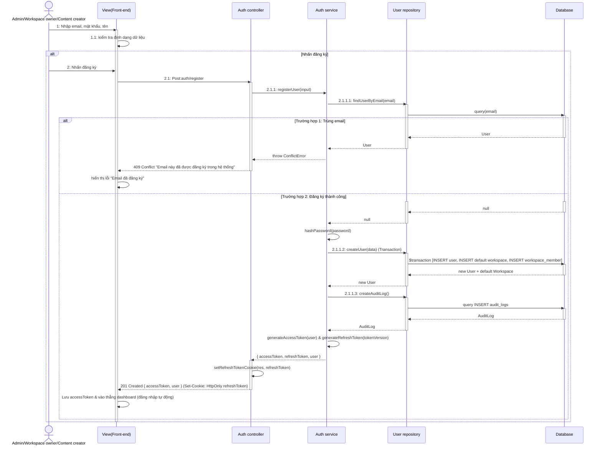
```mermaid
sequenceDiagram
    actor User as Admin/Workspace owner/Content creator
    participant View as View(Front-end)
    participant Controller as Auth controller
    participant Service as Auth service
    participant Repository as User repository
    participant DB as Database

    User->>View: 1: Nhập email, mật khẩu, tên
    activate View
    View->>View: 1.1: kiểm tra định dạng dữ liệu

    alt Nhấn đăng ký
        User->>View: 2: Nhấn đăng ký
        View->>Controller: 2.1: Post:auth/register
        activate Controller
        Controller->>Service: 2.1.1: registerUser(input)
        activate Service
        Service->>Repository: 2.1.1.1: findUserByEmail(email)
        activate Repository
        Repository->>DB: query(email)
        activate DB

        alt Trường hợp 1: Trùng email
            DB-->>Repository: User
            deactivate DB
            Repository-->>Service: User
            deactivate Repository
            Service-->>Controller: throw ConflictError
            Controller-->>View: 409 Conflict "Email này đã được đăng ký trong hệ thống"
            deactivate Controller
            View->>View: hiển thị lỗi "Email đã đăng ký"
        else Trường hợp 2: Đăng ký thành công
            activate Repository
            activate DB
            DB-->>Repository: null
            deactivate DB
            Repository-->>Service: null
            deactivate Repository
            Service->>Service: hashPassword(password)
            Service->>Repository: 2.1.1.2: createUser(data) (Transaction)
            activate Repository
            Repository->>DB: $transaction [INSERT user, INSERT default workspace, INSERT workspace_member]
            activate DB
            DB-->>Repository: new User + default Workspace
            deactivate DB
            Repository-->>Service: new User
            deactivate Repository
            Service->>Repository: 2.1.1.3: createAuditLog()
            activate Repository
            Repository->>DB: query INSERT audit_logs
            activate DB
            DB-->>Repository: AuditLog
            deactivate DB
            Repository-->>Service: AuditLog
            deactivate Repository
            Service->>Service: generateAccessToken(user) & generateRefreshToken(tokenVersion)
            Service-->>Controller: { accessToken, refreshToken, user }
            activate Controller
            Controller->>Controller: setRefreshTokenCookie(res, refreshToken)
            Controller-->>View: 201 Created { accessToken, user } (Set-Cookie: HttpOnly refreshToken)
            deactivate Controller
            View->>View: Lưu accessToken & vào thẳng dashboard (đăng nhập tự động)
        end
    end
    deactivate View
```

### UC02 — Login

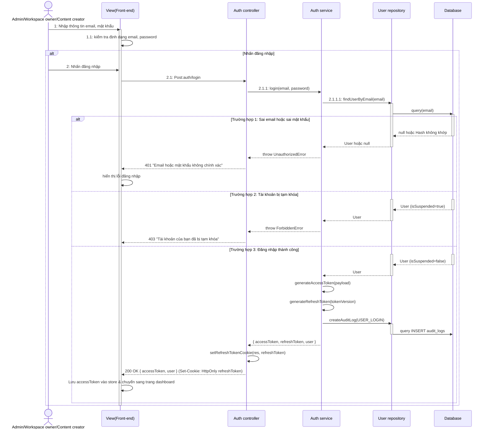
```mermaid
sequenceDiagram
    actor User as Admin/Workspace owner/Content creator
    participant View as View(Front-end)
    participant Controller as Auth controller
    participant Service as Auth service
    participant Repository as User repository
    participant DB as Database

    User->>View: 1: Nhập thông tin email, mật khẩu
    activate View
    View->>View: 1.1: kiểm tra định dạng email, password

    alt Nhấn đăng nhập
        User->>View: 2: Nhấn đăng nhập
        View->>Controller: 2.1: Post:auth/login
        activate Controller
        Controller->>Service: 2.1.1: login(email, password)
        activate Service
        Service->>Repository: 2.1.1.1: findUserByEmail(email)
        activate Repository
        Repository->>DB: query(email)
        activate DB

        alt Trường hợp 1: Sai email hoặc sai mật khẩu
            DB-->>Repository: null hoặc Hash không khớp
            deactivate DB
            Repository-->>Service: User hoặc null
            deactivate Repository
            Service-->>Controller: throw UnauthorizedError
            Controller-->>View: 401 "Email hoặc mật khẩu không chính xác"
            View->>View: hiển thị lỗi đăng nhập
        else Trường hợp 2: Tài khoản bị tạm khóa
            activate Repository
            activate DB
            DB-->>Repository: User (isSuspended=true)
            deactivate DB
            Repository-->>Service: User
            deactivate Repository
            Service-->>Controller: throw ForbiddenError
            Controller-->>View: 403 "Tài khoản của bạn đã bị tạm khóa"
        else Trường hợp 3: Đăng nhập thành công
            activate Repository
            activate DB
            DB-->>Repository: User (isSuspended=false)
            deactivate DB
            Repository-->>Service: User
            deactivate Repository
            Service->>Service: generateAccessToken(payload)
            Service->>Service: generateRefreshToken(tokenVersion)
            Service->>Repository: createAuditLog(USER_LOGIN)
            activate Repository
            Repository->>DB: query INSERT audit_logs
            deactivate Repository
            Service-->>Controller: { accessToken, refreshToken, user }
            Controller->>Controller: setRefreshTokenCookie(res, refreshToken)
            Controller-->>View: 200 OK { accessToken, user } (Set-Cookie: HttpOnly refreshToken)
            View->>View: Lưu accessToken vào store & chuyển sang trang dashboard
        end
    end
    deactivate View
```

### UC02b — Google OAuth Login

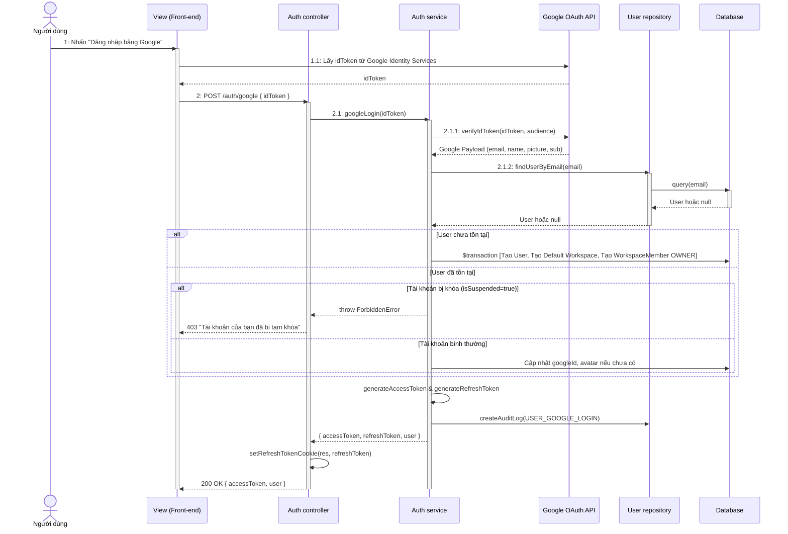
```mermaid
sequenceDiagram
    actor User as Người dùng
    participant View as View (Front-end)
    participant Controller as Auth controller
    participant Service as Auth service
    participant Google as Google OAuth API
    participant Repository as User repository
    participant DB as Database

    User->>View: 1: Nhấn "Đăng nhập bằng Google"
    activate View
    View->>Google: 1.1: Lấy idToken từ Google Identity Services
    Google-->>View: idToken
    View->>Controller: 2: POST /auth/google { idToken }
    activate Controller
    Controller->>Service: 2.1: googleLogin(idToken)
    activate Service
    Service->>Google: 2.1.1: verifyIdToken(idToken, audience)
    Google-->>Service: Google Payload (email, name, picture, sub)
    Service->>Repository: 2.1.2: findUserByEmail(email)
    activate Repository
    Repository->>DB: query(email)
    activate DB
    DB-->>Repository: User hoặc null
    deactivate DB
    Repository-->>Service: User hoặc null
    deactivate Repository

    alt User chưa tồn tại
        Service->>DB: $transaction [Tạo User, Tạo Default Workspace, Tạo WorkspaceMember OWNER]
    else User đã tồn tại
        alt Tài khoản bị khóa (isSuspended=true)
            Service-->>Controller: throw ForbiddenError
            Controller-->>View: 403 "Tài khoản của bạn đã bị tạm khóa"
        else Tài khoản bình thường
            Service->>DB: Cập nhật googleId, avatar nếu chưa có
        end
    end

    Service->>Service: generateAccessToken & generateRefreshToken
    Service->>Repository: createAuditLog(USER_GOOGLE_LOGIN)
    Service-->>Controller: { accessToken, refreshToken, user }
    Controller->>Controller: setRefreshTokenCookie(res, refreshToken)
    Controller-->>View: 200 OK { accessToken, user }
    deactivate Controller
    deactivate Service
    deactivate View
```

### UC03 — Logout

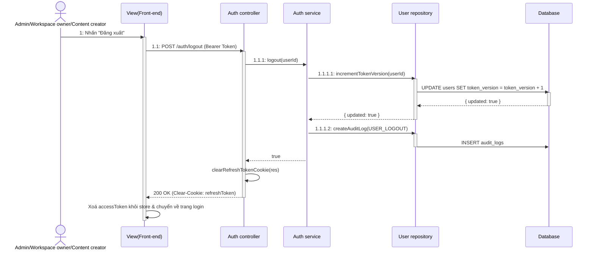
```mermaid
sequenceDiagram
    actor User as Admin/Workspace owner/Content creator
    participant View as View(Front-end)
    participant Controller as Auth controller
    participant Service as Auth service
    participant Repository as User repository
    participant DB as Database

    User->>View: 1: Nhấn "Đăng xuất"
    activate View
    View->>Controller: 1.1: POST /auth/logout (Bearer Token)
    activate Controller
    Controller->>Service: 1.1.1: logout(userId)
    activate Service
    Service->>Repository: 1.1.1.1: incrementTokenVersion(userId)
    activate Repository
    Repository->>DB: UPDATE users SET token_version = token_version + 1
    activate DB
    DB-->>Repository: { updated: true }
    deactivate DB
    Repository-->>Service: { updated: true }
    deactivate Repository
    Service->>Repository: 1.1.1.2: createAuditLog(USER_LOGOUT)
    activate Repository
    Repository->>DB: INSERT audit_logs
    deactivate Repository
    Service-->>Controller: true
    Controller->>Controller: clearRefreshTokenCookie(res)
    Controller-->>View: 200 OK (Clear-Cookie: refreshToken)
    deactivate Controller
    View->>View: Xoá accessToken khỏi store & chuyển về trang login
    deactivate View
```

### UC04 — Change Password

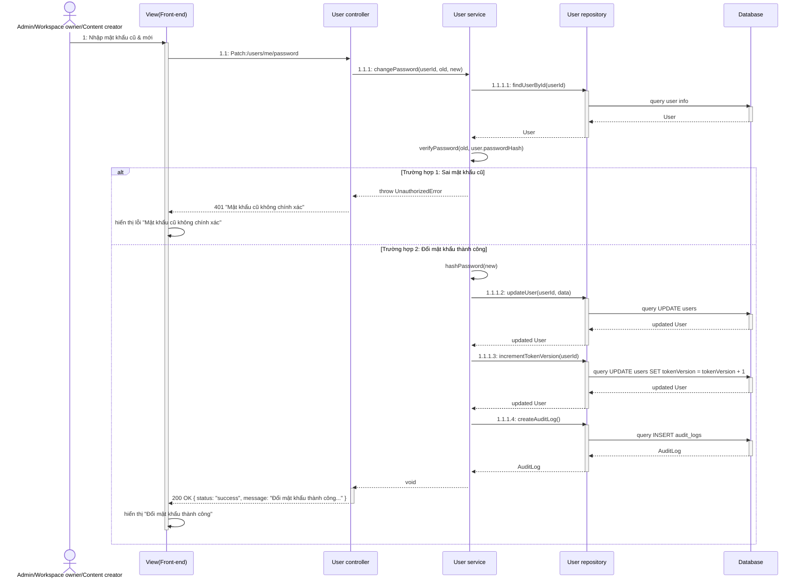
```mermaid
sequenceDiagram
    actor User as Admin/Workspace owner/Content creator
    participant View as View(Front-end)
    participant Controller as User controller
    participant Service as User service
    participant Repository as User repository
    participant DB as Database

    User->>View: 1: Nhập mật khẩu cũ & mới
    activate View
    View->>Controller: 1.1: Patch:/users/me/password
    activate Controller
    Controller->>Service: 1.1.1: changePassword(userId, old, new)
    activate Service
    Service->>Repository: 1.1.1.1: findUserById(userId)
    activate Repository
    Repository->>DB: query user info
    activate DB
    DB-->>Repository: User
    deactivate DB
    Repository-->>Service: User
    deactivate Repository
    Service->>Service: verifyPassword(old, user.passwordHash)

    alt Trường hợp 1: Sai mật khẩu cũ
        Service-->>Controller: throw UnauthorizedError
        Controller-->>View: 401 "Mật khẩu cũ không chính xác"
        View->>View: hiển thị lỗi "Mật khẩu cũ không chính xác"
    else Trường hợp 2: Đổi mật khẩu thành công
        Service->>Service: hashPassword(new)
        Service->>Repository: 1.1.1.2: updateUser(userId, data)
        activate Repository
        Repository->>DB: query UPDATE users
        activate DB
        DB-->>Repository: updated User
        deactivate DB
        Repository-->>Service: updated User
        deactivate Repository

        Service->>Repository: 1.1.1.3: incrementTokenVersion(userId)
        activate Repository
        Repository->>DB: query UPDATE users SET tokenVersion = tokenVersion + 1
        activate DB
        DB-->>Repository: updated User
        deactivate DB
        Repository-->>Service: updated User
        deactivate Repository

        Service->>Repository: 1.1.1.4: createAuditLog()
        activate Repository
        Repository->>DB: query INSERT audit_logs
        activate DB
        DB-->>Repository: AuditLog
        deactivate DB
        Repository-->>Service: AuditLog
        deactivate Repository

        Service-->>Controller: void
        activate Controller
        Controller-->>View: 200 OK { status: "success", message: "Đổi mật khẩu thành công..." }
        deactivate Controller
        View->>View: hiển thị "Đổi mật khẩu thành công"
        deactivate View
    end
```

### UC16 — Create Workspace

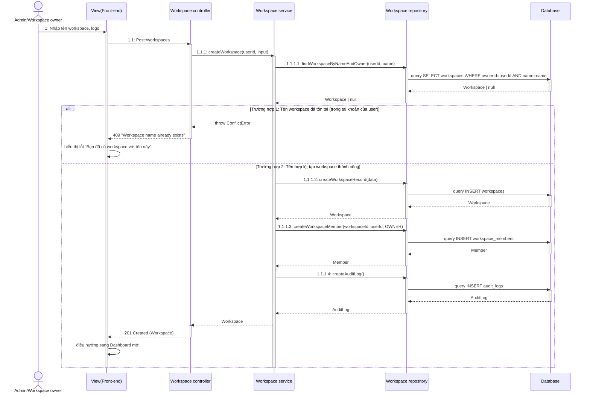
```mermaid
sequenceDiagram
    actor User as Admin/Workspace owner
    participant View as View(Front-end)
    participant Controller as Workspace controller
    participant Service as Workspace service
    participant Repository as Workspace repository
    participant DB as Database

    User->>View: 1: Nhập tên workspace, logo
    activate View
    View->>Controller: 1.1: Post:/workspaces
    activate Controller
    Controller->>Service: 1.1.1: createWorkspace(userId, input)
    activate Service

    Service->>Repository: 1.1.1.1: findWorkspaceByNameAndOwner(userId, name)
    activate Repository
    Repository->>DB: query SELECT workspaces WHERE ownerId=userId AND name=name
    activate DB
    DB-->>Repository: Workspace | null
    deactivate DB
    Repository-->>Service: Workspace | null
    deactivate Repository

    alt Trường hợp 1: Tên workspace đã tồn tại (trong tài khoản của user)
        Service-->>Controller: throw ConflictError
        Controller-->>View: 409 "Workspace name already exists"
        deactivate Controller
        View->>View: hiển thị lỗi "Bạn đã có workspace với tên này"
    else Trường hợp 2: Tên hợp lệ, tạo workspace thành công
        Service->>Repository: 1.1.1.2: createWorkspaceRecord(data)
        activate Repository
        Repository->>DB: query INSERT workspaces
        activate DB
        DB-->>Repository: Workspace
        deactivate DB
        Repository-->>Service: Workspace
        deactivate Repository

        Service->>Repository: 1.1.1.3: createWorkspaceMember(workspaceId, userId, OWNER)
        activate Repository
        Repository->>DB: query INSERT workspace_members
        activate DB
        DB-->>Repository: Member
        deactivate DB
        Repository-->>Service: Member
        deactivate Repository

        Service->>Repository: 1.1.1.4: createAuditLog()
        activate Repository
        Repository->>DB: query INSERT audit_logs
        activate DB
        DB-->>Repository: AuditLog
        deactivate DB
        Repository-->>Service: AuditLog
        deactivate Repository

        Service-->>Controller: Workspace
        activate Controller
        Controller-->>View: 201 Created (Workspace)
        deactivate Controller
        View->>View: điều hướng sang Dashboard mới
    end
    deactivate Service
    deactivate View
```

### UC17 — Update Workspace

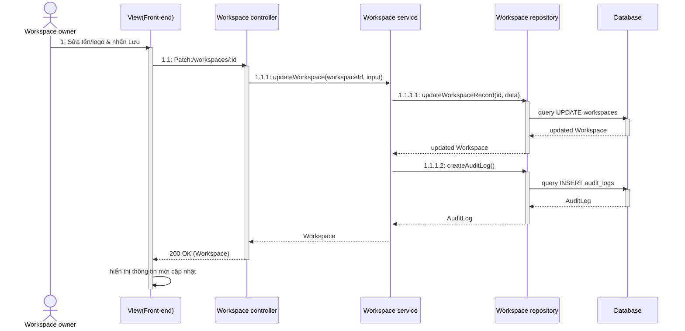
```mermaid
sequenceDiagram
    actor User as Workspace owner
    participant View as View(Front-end)
    participant Controller as Workspace controller
    participant Service as Workspace service
    participant Repository as Workspace repository
    participant DB as Database

    User->>View: 1: Sửa tên/logo & nhấn Lưu
    activate View
    View->>Controller: 1.1: Patch:/workspaces/:id
    activate Controller
    Controller->>Service: 1.1.1: updateWorkspace(workspaceId, input)
    activate Service

    Service->>Repository: 1.1.1.1: updateWorkspaceRecord(id, data)
    activate Repository
    Repository->>DB: query UPDATE workspaces
    activate DB
    DB-->>Repository: updated Workspace
    deactivate DB
    Repository-->>Service: updated Workspace
    deactivate Repository

    Service->>Repository: 1.1.1.2: createAuditLog()
    activate Repository
    Repository->>DB: query INSERT audit_logs
    activate DB
    DB-->>Repository: AuditLog
    deactivate DB
    Repository-->>Service: AuditLog
    deactivate Repository

    Service-->>Controller: Workspace
    Controller-->>View: 200 OK (Workspace)
    deactivate Controller
    View->>View: hiển thị thông tin mới cập nhật
    deactivate View
```

### UC18 — Delete Workspace

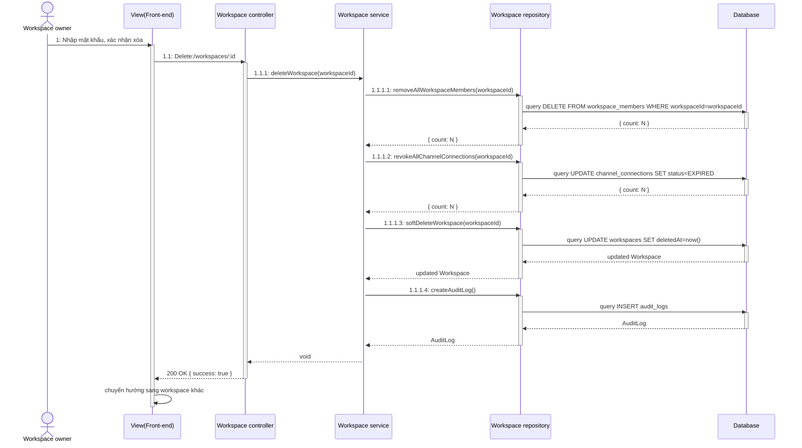
```mermaid
sequenceDiagram
    actor User as Workspace owner
    participant View as View(Front-end)
    participant Controller as Workspace controller
    participant Service as Workspace service
    participant Repository as Workspace repository
    participant DB as Database

    User->>View: 1: Nhập mật khẩu, xác nhận xóa
    activate View
    View->>Controller: 1.1: Delete:/workspaces/:id
    activate Controller
    Controller->>Service: 1.1.1: deleteWorkspace(workspaceId)
    activate Service

    Service->>Repository: 1.1.1.1: removeAllWorkspaceMembers(workspaceId)
    activate Repository
    Repository->>DB: query DELETE FROM workspace_members WHERE workspaceId=workspaceId
    activate DB
    DB-->>Repository: { count: N }
    deactivate DB
    Repository-->>Service: { count: N }
    deactivate Repository

    Service->>Repository: 1.1.1.2: revokeAllChannelConnections(workspaceId)
    activate Repository
    Repository->>DB: query UPDATE channel_connections SET status=EXPIRED
    activate DB
    DB-->>Repository: { count: N }
    deactivate DB
    Repository-->>Service: { count: N }
    deactivate Repository

    Service->>Repository: 1.1.1.3: softDeleteWorkspace(workspaceId)
    activate Repository
    Repository->>DB: query UPDATE workspaces SET deletedAt=now()
    activate DB
    DB-->>Repository: updated Workspace
    deactivate DB
    Repository-->>Service: updated Workspace
    deactivate Repository

    Service->>Repository: 1.1.1.4: createAuditLog()
    activate Repository
    Repository->>DB: query INSERT audit_logs
    activate DB
    DB-->>Repository: AuditLog
    deactivate DB
    Repository-->>Service: AuditLog
    deactivate Repository

    Service-->>Controller: void
    Controller-->>View: 200 OK { success: true }
    deactivate Controller
    View->>View: chuyển hướng sang workspace khác
    deactivate View
```

### UC19 — View member in workspace

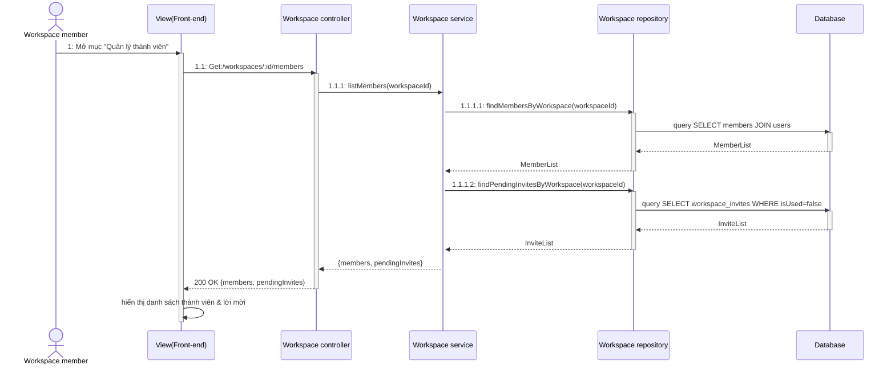
```mermaid
sequenceDiagram
    actor User as Workspace member
    participant View as View(Front-end)
    participant Controller as Workspace controller
    participant Service as Workspace service
    participant Repository as Workspace repository
    participant DB as Database

    User->>View: 1: Mở mục "Quản lý thành viên"
    activate View
    View->>Controller: 1.1: Get:/workspaces/:id/members
    activate Controller
    Controller->>Service: 1.1.1: listMembers(workspaceId)
    activate Service

    Service->>Repository: 1.1.1.1: findMembersByWorkspace(workspaceId)
    activate Repository
    Repository->>DB: query SELECT members JOIN users
    activate DB
    DB-->>Repository: MemberList
    deactivate DB
    Repository-->>Service: MemberList
    deactivate Repository

    Service->>Repository: 1.1.1.2: findPendingInvitesByWorkspace(workspaceId)
    activate Repository
    Repository->>DB: query SELECT workspace_invites WHERE isUsed=false
    activate DB
    DB-->>Repository: InviteList
    deactivate DB
    Repository-->>Service: InviteList
    deactivate Repository

    Service-->>Controller: {members, pendingInvites}
    Controller-->>View: 200 OK {members, pendingInvites}
    deactivate Controller
    View->>View: hiển thị danh sách thành viên & lời mời
    deactivate View
```

### UC20 — Invite member

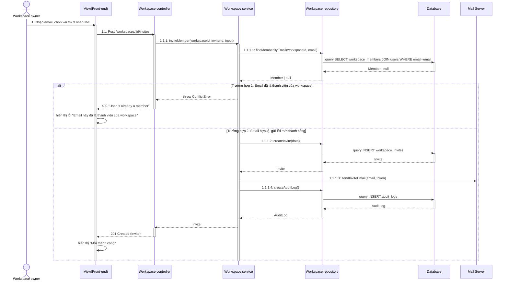
```mermaid
sequenceDiagram
    actor User as Workspace owner
    participant View as View(Front-end)
    participant Controller as Workspace controller
    participant Service as Workspace service
    participant Repository as Workspace repository
    participant DB as Database
    participant Mail as Mail Server

    User->>View: 1: Nhập email, chọn vai trò & nhấn Mời
    activate View
    View->>Controller: 1.1: Post:/workspaces/:id/invites
    activate Controller
    Controller->>Service: 1.1.1: inviteMember(workspaceId, inviterId, input)
    activate Service

    Service->>Repository: 1.1.1.1: findMemberByEmail(workspaceId, email)
    activate Repository
    Repository->>DB: query SELECT workspace_members JOIN users WHERE email=email
    activate DB
    DB-->>Repository: Member | null
    deactivate DB
    Repository-->>Service: Member | null
    deactivate Repository

    alt Trường hợp 1: Email đã là thành viên của workspace
        Service-->>Controller: throw ConflictError
        Controller-->>View: 409 "User is already a member"
        deactivate Controller
        View->>View: hiển thị lỗi "Email này đã là thành viên của workspace"
    else Trường hợp 2: Email hợp lệ, gửi lời mời thành công
        Service->>Repository: 1.1.1.2: createInvite(data)
        activate Repository
        Repository->>DB: query INSERT workspace_invites
        activate DB
        DB-->>Repository: Invite
        deactivate DB
        Repository-->>Service: Invite
        deactivate Repository

        Service->>Mail: 1.1.1.3: sendInviteEmail(email, token)

        Service->>Repository: 1.1.1.4: createAuditLog()
        activate Repository
        Repository->>DB: query INSERT audit_logs
        activate DB
        DB-->>Repository: AuditLog
        deactivate DB
        Repository-->>Service: AuditLog
        deactivate Repository

        Service-->>Controller: Invite
        activate Controller
        Controller-->>View: 201 Created (Invite)
        deactivate Controller
        View->>View: hiển thị "Mời thành công"
    end
    deactivate Service
    deactivate View
```

### UC21 — Accept invitation

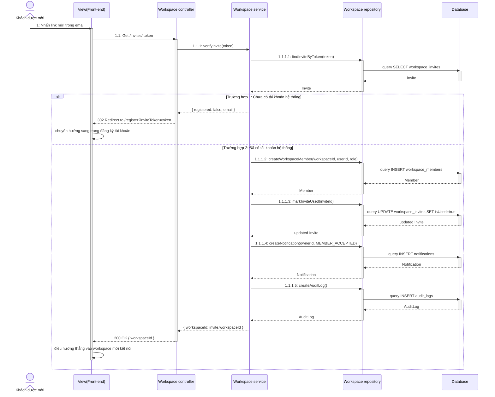
```mermaid
sequenceDiagram
    actor Guest as Khách được mời
    participant View as View(Front-end)
    participant Controller as Workspace controller
    participant Service as Workspace service
    participant Repository as Workspace repository
    participant DB as Database

    Guest->>View: 1: Nhấn link mời trong email
    activate View
    View->>Controller: 1.1: Get:/invites/:token
    activate Controller
    Controller->>Service: 1.1.1: verifyInvite(token)
    activate Service
    Service->>Repository: 1.1.1.1: findInviteByToken(token)
    activate Repository
    Repository->>DB: query SELECT workspace_invites
    activate DB
    DB-->>Repository: Invite
    deactivate DB
    Repository-->>Service: Invite
    deactivate Repository

    alt Trường hợp 1: Chưa có tài khoản hệ thống
        Service-->>Controller: { registered: false, email }
        Controller-->>View: 302 Redirect to /register?inviteToken=token
        View->>View: chuyển hướng sang trang đăng ký tài khoản
    else Trường hợp 2: Đã có tài khoản hệ thống
        Service->>Repository: 1.1.1.2: createWorkspaceMember(workspaceId, userId, role)
        activate Repository
        Repository->>DB: query INSERT workspace_members
        activate DB
        DB-->>Repository: Member
        deactivate DB
        Repository-->>Service: Member
        deactivate Repository

        Service->>Repository: 1.1.1.3: markInviteUsed(inviteId)
        activate Repository
        Repository->>DB: query UPDATE workspace_invites SET isUsed=true
        activate DB
        DB-->>Repository: updated Invite
        deactivate DB
        Repository-->>Service: updated Invite
        deactivate Repository

        Service->>Repository: 1.1.1.4: createNotification(ownerId, MEMBER_ACCEPTED)
        activate Repository
        Repository->>DB: query INSERT notifications
        activate DB
        DB-->>Repository: Notification
        deactivate DB
        Repository-->>Service: Notification
        deactivate Repository

        Service->>Repository: 1.1.1.5: createAuditLog()
        activate Repository
        Repository->>DB: query INSERT audit_logs
        activate DB
        DB-->>Repository: AuditLog
        deactivate DB
        Repository-->>Service: AuditLog
        deactivate Repository

        Service-->>Controller: { workspaceId: invite.workspaceId }
        Controller-->>View: 200 OK { workspaceId }
        deactivate Controller
        View->>View: điều hướng thẳng vào workspace mới kết nối
        deactivate View
    end
```

### UC22 — Leave workspace

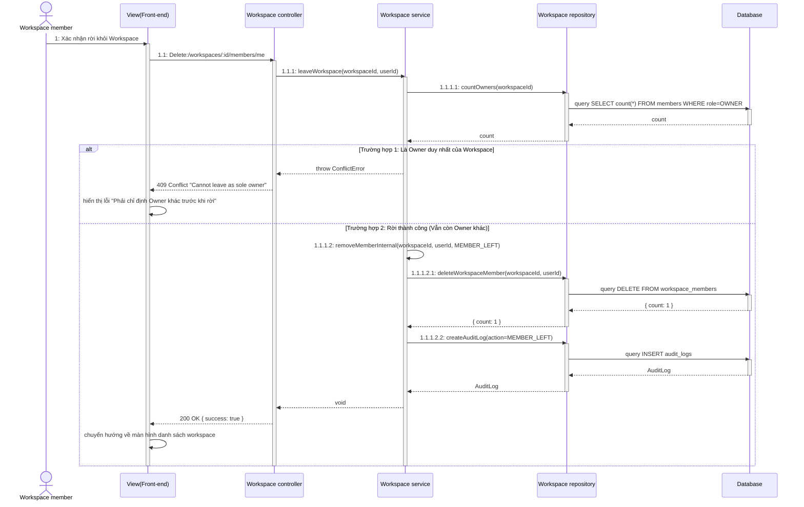
```mermaid
sequenceDiagram
    actor User as Workspace member
    participant View as View(Front-end)
    participant Controller as Workspace controller
    participant Service as Workspace service
    participant Repository as Workspace repository
    participant DB as Database

    User->>View: 1: Xác nhận rời khỏi Workspace
    activate View
    View->>Controller: 1.1: Delete:/workspaces/:id/members/me
    activate Controller
    Controller->>Service: 1.1.1: leaveWorkspace(workspaceId, userId)
    activate Service

    Service->>Repository: 1.1.1.1: countOwners(workspaceId)
    activate Repository
    Repository->>DB: query SELECT count(*) FROM members WHERE role=OWNER
    activate DB
    DB-->>Repository: count
    deactivate DB
    Repository-->>Service: count
    deactivate Repository

    alt Trường hợp 1: Là Owner duy nhất của Workspace
        Service-->>Controller: throw ConflictError
        Controller-->>View: 409 Conflict "Cannot leave as sole owner"
        View->>View: hiển thị lỗi "Phải chỉ định Owner khác trước khi rời"
    else Trường hợp 2: Rời thành công (Vẫn còn Owner khác)
        Service->>Service: 1.1.1.2: removeMemberInternal(workspaceId, userId, MEMBER_LEFT)

        Service->>Repository: 1.1.1.2.1: deleteWorkspaceMember(workspaceId, userId)
        activate Repository
        Repository->>DB: query DELETE FROM workspace_members
        activate DB
        DB-->>Repository: { count: 1 }
        deactivate DB
        Repository-->>Service: { count: 1 }
        deactivate Repository

        Service->>Repository: 1.1.1.2.2: createAuditLog(action=MEMBER_LEFT)
        activate Repository
        Repository->>DB: query INSERT audit_logs
        activate DB
        DB-->>Repository: AuditLog
        deactivate DB
        Repository-->>Service: AuditLog
        deactivate Repository

        Service-->>Controller: void
        Controller-->>View: 200 OK { success: true }
        View->>View: chuyển hướng về màn hình danh sách workspace
    end
    deactivate Controller
    deactivate Service
    deactivate View
```

> Ghi chú: bước 1.1.1.2 (`removeMemberInternal`) là hàm **private dùng chung** với UC23, chỉ thực hiện thao tác xoá + ghi log, khác nhau ở `action` truyền vào và ở bước kiểm tra điều kiện trước đó (1.1.1.1).

### UC23 — Remove member

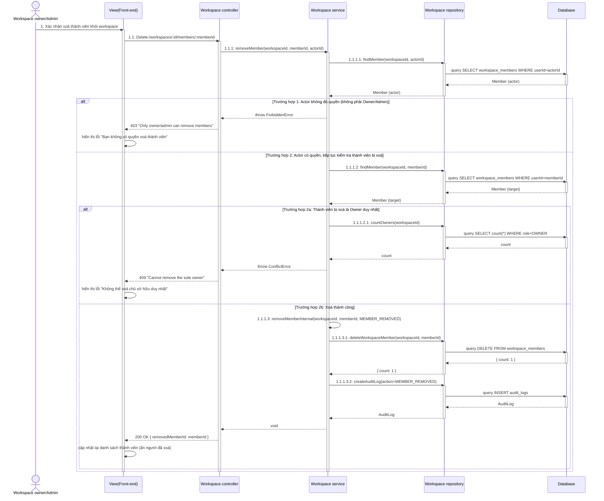
```mermaid
sequenceDiagram
    actor User as Workspace owner/Admin
    participant View as View(Front-end)
    participant Controller as Workspace controller
    participant Service as Workspace service
    participant Repository as Workspace repository
    participant DB as Database

    User->>View: 1: Xác nhận xoá thành viên khỏi workspace
    activate View
    View->>Controller: 1.1: Delete:/workspaces/:id/members/:memberId
    activate Controller
    Controller->>Service: 1.1.1: removeMember(workspaceId, memberId, actorId)
    activate Service

    Service->>Repository: 1.1.1.1: findMember(workspaceId, actorId)
    activate Repository
    Repository->>DB: query SELECT workspace_members WHERE userId=actorId
    activate DB
    DB-->>Repository: Member (actor)
    deactivate DB
    Repository-->>Service: Member (actor)
    deactivate Repository

    alt Trường hợp 1: Actor không đủ quyền (không phải Owner/Admin)
        Service-->>Controller: throw ForbiddenError
        Controller-->>View: 403 "Only owner/admin can remove members"
        View->>View: hiển thị lỗi "Bạn không có quyền xoá thành viên"
    else Trường hợp 2: Actor có quyền, tiếp tục kiểm tra thành viên bị xoá
        Service->>Repository: 1.1.1.2: findMember(workspaceId, memberId)
        activate Repository
        Repository->>DB: query SELECT workspace_members WHERE userId=memberId
        activate DB
        DB-->>Repository: Member (target)
        deactivate DB
        Repository-->>Service: Member (target)
        deactivate Repository

        alt Trường hợp 2a: Thành viên bị xoá là Owner duy nhất
            Service->>Repository: 1.1.1.2.1: countOwners(workspaceId)
            activate Repository
            Repository->>DB: query SELECT count(*) WHERE role=OWNER
            activate DB
            DB-->>Repository: count
            deactivate DB
            Repository-->>Service: count
            deactivate Repository
            Service-->>Controller: throw ConflictError
            Controller-->>View: 409 "Cannot remove the sole owner"
            View->>View: hiển thị lỗi "Không thể xoá chủ sở hữu duy nhất"
        else Trường hợp 2b: Xoá thành công
            Service->>Service: 1.1.1.3: removeMemberInternal(workspaceId, memberId, MEMBER_REMOVED)

            Service->>Repository: 1.1.1.3.1: deleteWorkspaceMember(workspaceId, memberId)
            activate Repository
            Repository->>DB: query DELETE FROM workspace_members
            activate DB
            DB-->>Repository: { count: 1 }
            deactivate DB
            Repository-->>Service: { count: 1 }
            deactivate Repository

            Service->>Repository: 1.1.1.3.2: createAuditLog(action=MEMBER_REMOVED)
            activate Repository
            Repository->>DB: query INSERT audit_logs
            activate DB
            DB-->>Repository: AuditLog
            deactivate DB
            Repository-->>Service: AuditLog
            deactivate Repository

            Service-->>Controller: void
            Controller-->>View: 200 OK { removedMemberId: memberId }
            View->>View: cập nhật lại danh sách thành viên (ẩn người đã xoá)
        end
    end
    deactivate Controller
    deactivate Service
    deactivate View
```

> Ghi chú: bước 1.1.1.3 (`removeMemberInternal`) dùng chung logic với UC22 — chỉ khác `action` audit log truyền vào.

### UC32 — Update Profile

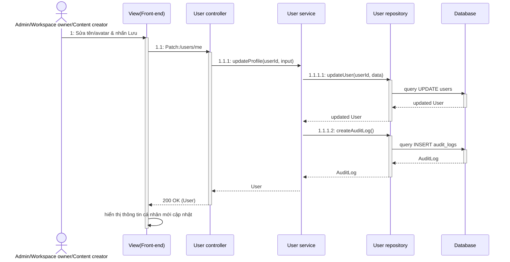
```mermaid
sequenceDiagram
    actor User as Admin/Workspace owner/Content creator
    participant View as View(Front-end)
    participant Controller as User controller
    participant Service as User service
    participant Repository as User repository
    participant DB as Database

    User->>View: 1: Sửa tên/avatar & nhấn Lưu
    activate View
    View->>Controller: 1.1: Patch:/users/me
    activate Controller
    Controller->>Service: 1.1.1: updateProfile(userId, input)
    activate Service

    Service->>Repository: 1.1.1.1: updateUser(userId, data)
    activate Repository
    Repository->>DB: query UPDATE users
    activate DB
    DB-->>Repository: updated User
    deactivate DB
    Repository-->>Service: updated User
    deactivate Repository

    Service->>Repository: 1.1.1.2: createAuditLog()
    activate Repository
    Repository->>DB: query INSERT audit_logs
    activate DB
    DB-->>Repository: AuditLog
    deactivate DB
    Repository-->>Service: AuditLog
    deactivate Repository

    Service-->>Controller: User
    Controller-->>View: 200 OK (User)
    deactivate Controller
    View->>View: hiển thị thông tin cá nhân mới cập nhật
    deactivate View
```

### UC35 — List Workspaces

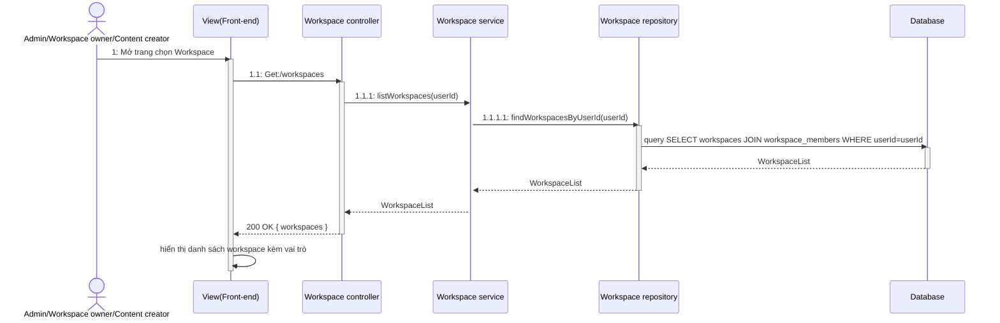
```mermaid
sequenceDiagram
    actor User as Admin/Workspace owner/Content creator
    participant View as View(Front-end)
    participant Controller as Workspace controller
    participant Service as Workspace service
    participant Repository as Workspace repository
    participant DB as Database

    User->>View: 1: Mở trang chọn Workspace
    activate View
    View->>Controller: 1.1: Get:/workspaces
    activate Controller
    Controller->>Service: 1.1.1: listWorkspaces(userId)
    activate Service

    Service->>Repository: 1.1.1.1: findWorkspacesByUserId(userId)
    activate Repository
    Repository->>DB: query SELECT workspaces JOIN workspace_members WHERE userId=userId
    activate DB
    DB-->>Repository: WorkspaceList
    deactivate DB
    Repository-->>Service: WorkspaceList
    deactivate Repository

    Service-->>Controller: WorkspaceList
    Controller-->>View: 200 OK { workspaces }
    deactivate Controller
    View->>View: hiển thị danh sách workspace kèm vai trò
    deactivate View
```

### UC36 — Change Member Role

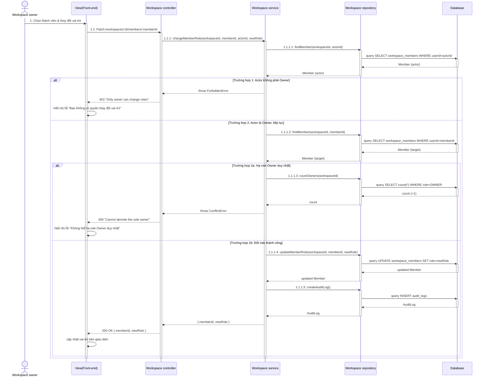
```mermaid
sequenceDiagram
    actor Owner as Workspace owner
    participant View as View(Front-end)
    participant Controller as Workspace controller
    participant Service as Workspace service
    participant Repository as Workspace repository
    participant DB as Database

    Owner->>View: 1: Chọn thành viên & thay đổi vai trò
    activate View
    View->>Controller: 1.1: Patch:/workspaces/:id/members/:memberId
    activate Controller
    Controller->>Service: 1.1.1: changeMemberRole(workspaceId, memberId, actorId, newRole)
    activate Service

    Service->>Repository: 1.1.1.1: findMember(workspaceId, actorId)
    activate Repository
    Repository->>DB: query SELECT workspace_members WHERE userId=actorId
    activate DB
    DB-->>Repository: Member (actor)
    deactivate DB
    Repository-->>Service: Member (actor)
    deactivate Repository

    alt Trường hợp 1: Actor không phải Owner
        Service-->>Controller: throw ForbiddenError
        Controller-->>View: 403 "Only owner can change roles"
        View->>View: hiển thị lỗi "Bạn không có quyền thay đổi vai trò"
    else Trường hợp 2: Actor là Owner, tiếp tục
        Service->>Repository: 1.1.1.2: findMember(workspaceId, memberId)
        activate Repository
        Repository->>DB: query SELECT workspace_members WHERE userId=memberId
        activate DB
        DB-->>Repository: Member (target)
        deactivate DB
        Repository-->>Service: Member (target)
        deactivate Repository

        alt Trường hợp 2a: Hạ role Owner duy nhất
            Service->>Repository: 1.1.1.3: countOwners(workspaceId)
            activate Repository
            Repository->>DB: query SELECT count(*) WHERE role=OWNER
            activate DB
            DB-->>Repository: count (=1)
            deactivate DB
            Repository-->>Service: count
            deactivate Repository
            Service-->>Controller: throw ConflictError
            Controller-->>View: 409 "Cannot demote the sole owner"
            View->>View: hiển thị lỗi "Không thể hạ role Owner duy nhất"
        else Trường hợp 2b: Đổi role thành công
            Service->>Repository: 1.1.1.4: updateMemberRole(workspaceId, memberId, newRole)
            activate Repository
            Repository->>DB: query UPDATE workspace_members SET role=newRole
            activate DB
            DB-->>Repository: updated Member
            deactivate DB
            Repository-->>Service: updated Member
            deactivate Repository

            Service->>Repository: 1.1.1.5: createAuditLog()
            activate Repository
            Repository->>DB: query INSERT audit_logs
            activate DB
            DB-->>Repository: AuditLog
            deactivate DB
            Repository-->>Service: AuditLog
            deactivate Repository

            Service-->>Controller: { memberId, newRole }
            Controller-->>View: 200 OK { memberId, newRole }
            View->>View: cập nhật vai trò trên giao diện
        end
    end
    deactivate Controller
    deactivate Service
    deactivate View
```

## Phân hệ 2 — Nội dung & Media

### UC05 — Create Content

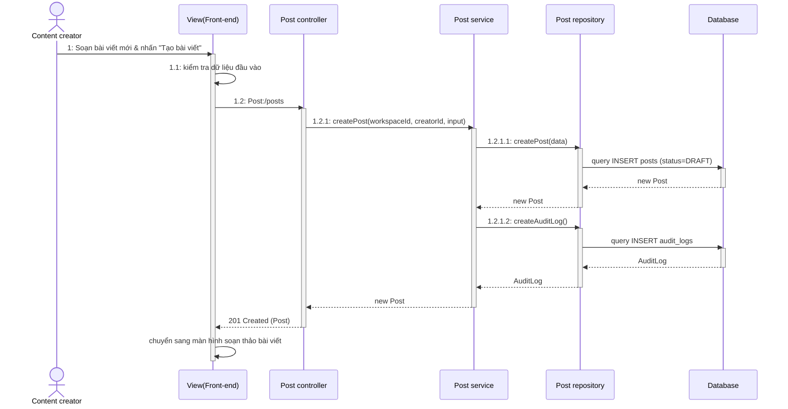
```mermaid
sequenceDiagram
    actor User as Content creator
    participant View as View(Front-end)
    participant Controller as Post controller
    participant Service as Post service
    participant Repository as Post repository
    participant DB as Database

    User->>View: 1: Soạn bài viết mới & nhấn "Tạo bài viết"
    activate View
    View->>View: 1.1: kiểm tra dữ liệu đầu vào
    View->>Controller: 1.2: Post:/posts
    activate Controller
    Controller->>Service: 1.2.1: createPost(workspaceId, creatorId, input)
    activate Service

    Service->>Repository: 1.2.1.1: createPost(data)
    activate Repository
    Repository->>DB: query INSERT posts (status=DRAFT)
    activate DB
    DB-->>Repository: new Post
    deactivate DB
    Repository-->>Service: new Post
    deactivate Repository

    Service->>Repository: 1.2.1.2: createAuditLog()
    activate Repository
    Repository->>DB: query INSERT audit_logs
    activate DB
    DB-->>Repository: AuditLog
    deactivate DB
    Repository-->>Service: AuditLog
    deactivate Repository

    Service-->>Controller: new Post
    deactivate Service
    Controller-->>View: 201 Created (Post)
    deactivate Controller
    View->>View: chuyển sang màn hình soạn thảo bài viết
    deactivate View
```

### UC07 — Update Content

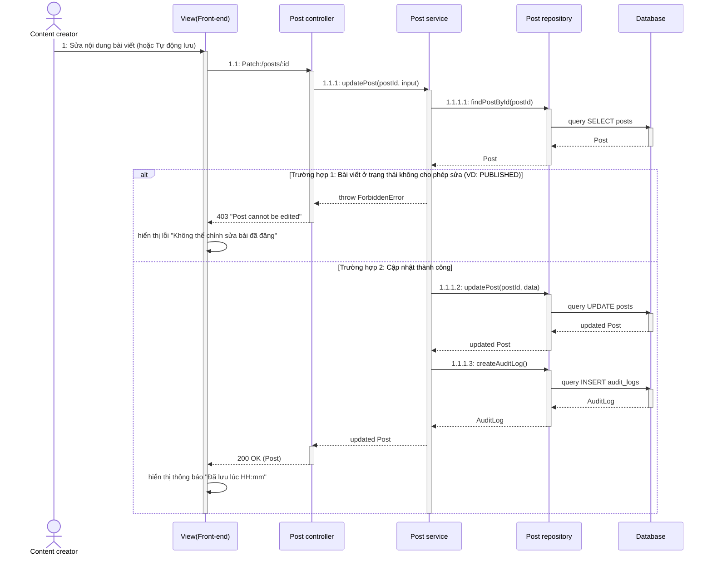
```mermaid
sequenceDiagram
    actor User as Content creator
    participant View as View(Front-end)
    participant Controller as Post controller
    participant Service as Post service
    participant Repository as Post repository
    participant DB as Database

    User->>View: 1: Sửa nội dung bài viết (hoặc Tự động lưu)
    activate View
    View->>Controller: 1.1: Patch:/posts/:id
    activate Controller
    Controller->>Service: 1.1.1: updatePost(postId, input)
    activate Service

    Service->>Repository: 1.1.1.1: findPostById(postId)
    activate Repository
    Repository->>DB: query SELECT posts
    activate DB
    DB-->>Repository: Post
    deactivate DB
    Repository-->>Service: Post
    deactivate Repository

    alt Trường hợp 1: Bài viết ở trạng thái không cho phép sửa (VD: PUBLISHED)
        Service-->>Controller: throw ForbiddenError
        Controller-->>View: 403 "Post cannot be edited"
        deactivate Controller
        View->>View: hiển thị lỗi "Không thể chỉnh sửa bài đã đăng"
    else Trường hợp 2: Cập nhật thành công
        Service->>Repository: 1.1.1.2: updatePost(postId, data)
        activate Repository
        Repository->>DB: query UPDATE posts
        activate DB
        DB-->>Repository: updated Post
        deactivate DB
        Repository-->>Service: updated Post
        deactivate Repository

        Service->>Repository: 1.1.1.3: createAuditLog()
        activate Repository
        Repository->>DB: query INSERT audit_logs
        activate DB
        DB-->>Repository: AuditLog
        deactivate DB
        Repository-->>Service: AuditLog
        deactivate Repository

        Service-->>Controller: updated Post
        activate Controller
        Controller-->>View: 200 OK (Post)
        deactivate Controller
        View->>View: hiển thị thông báo "Đã lưu lúc HH:mm"
    end
    deactivate Service
    deactivate View
```

### UC08 — View Content

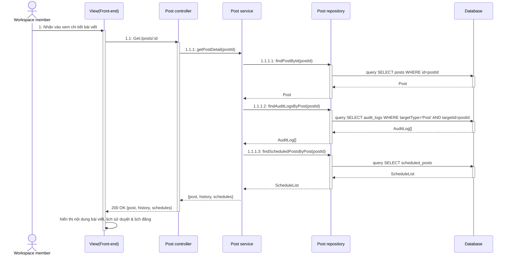
```mermaid
sequenceDiagram
    actor User as Workspace member
    participant View as View(Front-end)
    participant Controller as Post controller
    participant Service as Post service
    participant Repository as Post repository
    participant DB as Database

    User->>View: 1: Nhấn vào xem chi tiết bài viết
    activate View
    View->>Controller: 1.1: Get:/posts/:id
    activate Controller
    Controller->>Service: 1.1.1: getPostDetail(postId)
    activate Service

    Service->>Repository: 1.1.1.1: findPostById(postId)
    activate Repository
    Repository->>DB: query SELECT posts WHERE id=postId
    activate DB
    DB-->>Repository: Post
    deactivate DB
    Repository-->>Service: Post
    deactivate Repository

    Service->>Repository: 1.1.1.2: findAuditLogsByPost(postId)
    activate Repository
    Repository->>DB: query SELECT audit_logs WHERE targetType='Post' AND targetId=postId
    activate DB
    DB-->>Repository: AuditLog[]
    deactivate DB
    Repository-->>Service: AuditLog[]
    deactivate Repository

    Service->>Repository: 1.1.1.3: findScheduledPostsByPost(postId)
    activate Repository
    Repository->>DB: query SELECT scheduled_posts
    activate DB
    DB-->>Repository: ScheduleList
    deactivate DB
    Repository-->>Service: ScheduleList
    deactivate Repository

    Service-->>Controller: {post, history, schedules}
    Controller-->>View: 200 OK {post, history, schedules}
    deactivate Controller
    View->>View: hiển thị nội dung bài viết, lịch sử duyệt & lịch đăng
    deactivate View
```

### UC09 — Search content

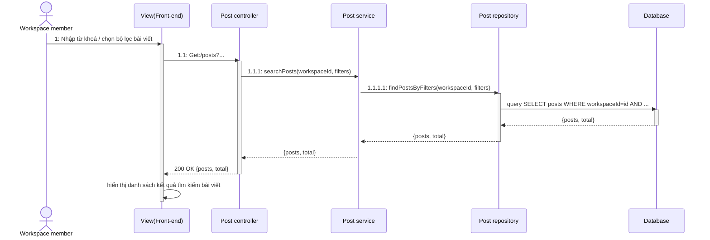
```mermaid
sequenceDiagram
    actor User as Workspace member
    participant View as View(Front-end)
    participant Controller as Post controller
    participant Service as Post service
    participant Repository as Post repository
    participant DB as Database

    User->>View: 1: Nhập từ khoá / chọn bộ lọc bài viết
    activate View
    View->>Controller: 1.1: Get:/posts?...
    activate Controller
    Controller->>Service: 1.1.1: searchPosts(workspaceId, filters)
    activate Service

    Service->>Repository: 1.1.1.1: findPostsByFilters(workspaceId, filters)
    activate Repository
    Repository->>DB: query SELECT posts WHERE workspaceId=id AND ...
    activate DB
    DB-->>Repository: {posts, total}
    deactivate DB
    Repository-->>Service: {posts, total}
    deactivate Repository

    Service-->>Controller: {posts, total}
    Controller-->>View: 200 OK {posts, total}
    deactivate Controller
    View->>View: hiển thị danh sách kết quả tìm kiếm bài viết
    deactivate View
```

### UC10 — Delete Content

```mermaid
sequenceDiagram
    actor User as Content creator/Workspace owner
    participant View as View(Front-end)
    participant Controller as Post controller
    participant Service as Post service
    participant Queue as BullMQ (Queue)
    participant Repository as Post repository
    participant DB as Database

    User->>View: 1: Nhấn xoá bài viết & xác nhận
    activate View
    View->>Controller: 1.1: Delete:/posts/:id
    activate Controller
    Controller->>Service: 1.1.1: deletePost(postId, actorId)
    activate Service

    Service->>Repository: 1.1.1.1: findPostById(postId)
    activate Repository
    Repository->>DB: query SELECT posts WHERE id=postId
    activate DB
    DB-->>Repository: Post
    deactivate DB
    Repository-->>Service: Post
    deactivate Repository

    alt Trường hợp 1: Trạng thái PUBLISHED (đã đăng — D16)
        Note over Service,Controller: Không xoá bài đã đăng; chỉ archive
        Service->>Repository: 1.1.1.2c: archivePost(postId)
        activate Repository
        Repository->>DB: query UPDATE posts SET status=ARCHIVED
        activate DB
        DB-->>Repository: archived Post
        deactivate DB
        Repository-->>Service: archived Post
        deactivate Repository

        Service-->>Controller: throw ForbiddenError
        Controller-->>View: 403 "Published post cannot be deleted — chỉ archive"
    else Trường hợp 2: Trạng thái Draft / Rejected / Failed / Archived
        Service->>Repository: 1.1.1.2a: softDeletePost(postId)
        activate Repository
        Repository->>DB: query UPDATE posts SET deletedAt=now()
        activate DB
        DB-->>Repository: updated Post
        deactivate DB
        Repository-->>Service: updated Post
        deactivate Repository

        Service->>Repository: 1.1.1.3a: createAuditLog()
        activate Repository
        Repository->>DB: query INSERT audit_logs
        activate DB
        DB-->>Repository: AuditLog
        deactivate DB
        Repository-->>Service: AuditLog
        deactivate Repository

        Service-->>Controller: void
        Controller-->>View: 200 OK { success: true }
    else Trường hợp 3: Trạng thái Scheduled (Đang chờ đăng bài)
        Service->>Queue: 1.1.1.2b: cancelScheduledJob(postId)
        Queue-->>Service: job cancelled

        Service->>Repository: 1.1.1.3b: softDeletePost(postId)
        activate Repository
        Repository->>DB: query UPDATE posts SET deletedAt=now()
        activate DB
        DB-->>Repository: updated Post
        deactivate DB
        Repository-->>Service: updated Post
        deactivate Repository

        Service->>Repository: 1.1.1.4b: createAuditLog()
        activate Repository
        Repository->>DB: query INSERT audit_logs
        activate DB
        DB-->>Repository: AuditLog
        deactivate DB
        Repository-->>Service: AuditLog
        deactivate Repository

        Service-->>Controller: void
        Controller-->>View: 200 OK { success: true }
    end

    deactivate Controller
    View->>View: xóa bài viết khỏi danh sách hiển thị
    deactivate View
```

### UC37 — Upload Media

```mermaid
sequenceDiagram
    actor User as Content creator/Workspace member
    participant View as View(Front-end)
    participant Controller as Media controller
    participant Service as Media service
    participant Cloud as Cloudinary (External)
    participant Repository as Media repository
    participant DB as Database

    User->>View: 1: Chọn file ảnh/video & nhấn Upload
    activate View
    View->>Controller: 1.1: Post:/workspaces/:id/media (multipart/form-data)
    activate Controller
    Controller->>Service: 1.1.1: uploadMedia(workspaceId, userId, file, tags)
    activate Service

    Service->>Service: 1.1.1.1: validateFile(file)

    alt Trường hợp 1: File không hợp lệ (sai định dạng / quá lớn)
        Service-->>Controller: throw BadRequestError
        Controller-->>View: 400 "Invalid file type or size exceeded"
        View->>View: hiển thị lỗi "File không hợp lệ"
    else Trường hợp 2: Upload thành công
        Service->>Cloud: 1.1.1.2: uploadToCloudinary(file)
        activate Cloud
        Cloud-->>Service: { url, mimeType, size, thumbnailUrl }
        deactivate Cloud

        Service->>Repository: 1.1.1.3: createMediaAsset(data)
        activate Repository
        Repository->>DB: query INSERT media_assets
        activate DB
        DB-->>Repository: MediaAsset
        deactivate DB
        Repository-->>Service: MediaAsset
        deactivate Repository

        Service->>Repository: 1.1.1.4: createAuditLog()
        activate Repository
        Repository->>DB: query INSERT audit_logs
        activate DB
        DB-->>Repository: AuditLog
        deactivate DB
        Repository-->>Service: AuditLog
        deactivate Repository

        Service-->>Controller: MediaAsset
        Controller-->>View: 201 Created (MediaAsset)
        View->>View: hiển thị file đã upload thành công
    end
    deactivate Controller
    deactivate Service
    deactivate View
```

## Phân hệ 2.3 — Duyệt bài

### UC11 — Submit Content for Approval

```mermaid
sequenceDiagram
    actor User as Content creator
    participant View as View(Front-end)
    participant Controller as Post controller
    participant Service as Post service
    participant Repository as Post repository
    participant DB as Database

    User->>View: 1: Nhấn "Gửi duyệt" bài viết
    activate View
    View->>Controller: 1.1: Post:/posts/:id/submit
    activate Controller
    Controller->>Service: 1.1.1: submitPostForApproval(postId, submitterId)
    activate Service

    Service->>Repository: 1.1.1.1: findPostById(postId)
    activate Repository
    Repository->>DB: query SELECT posts
    activate DB
    DB-->>Repository: Post
    deactivate DB
    Repository-->>Service: Post
    deactivate Repository

    Service->>Repository: 1.1.1.2: updatePostStatus(postId, PENDING, details)
    activate Repository
    Repository->>DB: query UPDATE posts SET status=PENDING
    activate DB
    DB-->>Repository: updated Post
    deactivate DB
    Repository-->>Service: updated Post
    deactivate Repository

    Service->>Repository: 1.1.1.3: createNotification(ownerId, POST_PENDING)
    activate Repository
    Repository->>DB: query INSERT notifications
    activate DB
    DB-->>Repository: Notification
    deactivate DB
    Repository-->>Service: Notification
    deactivate Repository

    Service->>Repository: 1.1.1.4: createAuditLog()
    activate Repository
    Repository->>DB: query INSERT audit_logs
    activate DB
    DB-->>Repository: AuditLog
    deactivate DB
    Repository-->>Service: AuditLog
    deactivate Repository

    Service-->>Controller: updated Post
    Controller-->>View: 200 OK (Post)
    deactivate Controller
    View->>View: cập nhật trạng thái bài viết thành "Chờ duyệt"
    deactivate View
```

### UC14 — Review Content

```mermaid
sequenceDiagram
    actor Owner as Workspace owner
    participant View as View(Front-end)
    participant Controller as Post controller
    participant Service as Post service
    participant Repository as Post repository
    participant DB as Database

    Owner->>View: 1: Chọn bài viết Chờ duyệt & nhấn Duyệt/Từ chối
    activate View
    View->>Controller: 1.1: Post:/posts/:id/review
    activate Controller
    Controller->>Service: 1.1.1: reviewPost(postId, reviewerId, action, reason)
    activate Service

    Service->>Repository: 1.1.1.1: findPostById(postId)
    activate Repository
    Repository->>DB: query SELECT posts WHERE id=postId
    activate DB
    DB-->>Repository: Post
    deactivate DB
    Repository-->>Service: Post
    deactivate Repository

    alt Trường hợp 1: Owner nhấn DUYỆT (Approve)
        Service->>Repository: 1.1.1.2a: updatePostStatus(postId, APPROVED, details)
        activate Repository
        Repository->>DB: query UPDATE posts SET status=APPROVED
        activate DB
        DB-->>Repository: updated Post
        deactivate DB
        Repository-->>Service: updated Post
        deactivate Repository

        Service->>Repository: 1.1.1.3a: createAuditLog(action=POST_APPROVED, targetType=Post, targetId=postId)
        activate Repository
        Repository->>DB: query INSERT audit_logs
        activate DB
        DB-->>Repository: AuditLog
        deactivate DB
        Repository-->>Service: AuditLog
        deactivate Repository

        Service->>Repository: 1.1.1.4a: createNotification(creatorId, POST_APPROVED)
        activate Repository
        Repository->>DB: query INSERT notifications
        activate DB
        DB-->>Repository: Notification
        deactivate DB
        Repository-->>Service: Notification
        deactivate Repository

        Service-->>Controller: { status: APPROVED }
        Controller-->>View: 200 OK { status: APPROVED }
        View->>View: hiển thị trạng thái "Đã phê duyệt"
    else Trường hợp 2: Owner nhấn TỪ CHỐI (Reject)
        Service->>Repository: 1.1.1.2b: updatePostStatus(postId, REJECTED, details)
        activate Repository
        Repository->>DB: query UPDATE posts SET status=REJECTED
        activate DB
        DB-->>Repository: updated Post
        deactivate DB
        Repository-->>Service: updated Post
        deactivate Repository

        Service->>Repository: 1.1.1.3b: createAuditLog(action=POST_REJECTED, targetType=Post, targetId=postId, reason=reason)
        activate Repository
        Repository->>DB: query INSERT audit_logs
        activate DB
        DB-->>Repository: AuditLog
        deactivate DB
        Repository-->>Service: AuditLog
        deactivate Repository

        Service->>Repository: 1.1.1.4b: createNotification(creatorId, POST_REJECTED)
        activate Repository
        Repository->>DB: query INSERT notifications
        activate DB
        DB-->>Repository: Notification
        deactivate DB
        Repository-->>Service: Notification
        deactivate Repository

        Service-->>Controller: { status: REJECTED }
        activate Controller
        Controller-->>View: 200 OK { status: REJECTED }
        deactivate Controller
        View->>View: hiển thị trạng thái "Đã từ chối duyệt"
        deactivate View
    end
```

## Phân hệ 3 — AI Content

### UC06 — Generate AI Content

```mermaid
sequenceDiagram
    actor User as Content creator/Workspace member
    participant View as View(Front-end)
    participant Controller as AI controller
    participant Service as AI service
    participant Repository as AI repository
    participant DB as Database
    participant Queue as QueueManager (BullMQ content-generation-queue)
    participant OpenAI as OpenAI API (External)

    User->>View: 1: Nhập ý tưởng & nhấn Sinh nội dung
    activate View
    View->>Controller: 1.1: Post:/workspaces/:id/ai/generate-text
    activate Controller
    Controller->>Service: 1.1.1: generateAiText(workspaceId, userId, input)
    activate Service

    Service->>Repository: 1.1.1.1: findWorkspaceById(workspaceId)
    activate Repository
    Repository->>DB: query SELECT workspace credit
    activate DB
    DB-->>Repository: Workspace
    deactivate DB
    Repository-->>Service: Workspace
    deactivate Repository

    Service->>Repository: 1.1.1.2: getWorkspaceBrandVoice(workspaceId)
    activate Repository
    Repository->>DB: query SELECT brandVoice FROM workspaces WHERE id=workspaceId
    activate DB
    DB-->>Repository: Workspace (brandVoice)
    deactivate DB
    Repository-->>Service: Workspace (brandVoice)
    deactivate Repository

    Service->>Queue: 1.1.1.3: enqueueGenerateJob({ workspaceId, userId, type, prompt, creditCost })  (D10)
    activate Queue
    Queue-->>Service: jobId (trạng thái PENDING)
    deactivate Queue

    Service-->>Controller: { jobId, status: PENDING }
    Controller-->>View: 202 Accepted { jobId, status: 'PENDING' }
    deactivate Controller
    View->>View: hiển thị "Đang xử lý..." & theo dõi trạng thái job
    deactivate View

    Note over Queue,OpenAI: ── Worker xử lý nền (content-generation-queue) ──
    Queue->>Service: 2.1: processGenerateJob(job)
    Service->>OpenAI: 2.1.1: generateText(prompt)
    OpenAI-->>Service: Generated Content / Error

    alt Worker: Sinh nội dung thành công
        Service->>Repository: 2.1.2a: deductCredit + createAiGeneration({status: SUCCESS})
        activate Repository
        Repository->>DB: query UPDATE workspaces + INSERT ai_generations
        activate DB
        DB-->>Repository: GenerationRecord
        deactivate DB
        Repository-->>Service: GenerationRecord
        deactivate Repository

        Service->>Repository: 2.1.3a: createNotification(userId, AI_GENERATION_DONE)
        activate Repository
        Repository->>DB: query INSERT notifications
        activate DB
        DB-->>Repository: Notification
        deactivate DB
        Repository-->>Service: Notification
        deactivate Repository
    else Worker: Lỗi từ phía OpenAI
        Service->>Repository: 2.1.2b: createAiGeneration({status: FAILED})
        activate Repository
        Repository->>DB: query INSERT ai_generations
        activate DB
        DB-->>Repository: GenerationRecord
        deactivate DB
        Repository-->>Service: GenerationRecord
        deactivate Repository

        Service->>Repository: 2.1.3b: createNotification(userId, AI_GENERATION_FAILED)
        activate Repository
        Repository->>DB: query INSERT notifications
        activate DB
        DB-->>Repository: Notification
        deactivate DB
        Repository-->>Service: Notification
        deactivate Repository
    end
```

## Phân hệ 4 — Kết nối & Đăng bài

### UC27 — View connected channels

```mermaid
sequenceDiagram
    actor User as Workspace member
    participant View as View(Front-end)
    participant Controller as Channel controller
    participant Service as Channel service
    participant Repository as Channel repository
    participant DB as Database

    User->>View: 1: Mở trang "Kênh liên kết"
    activate View
    View->>Controller: 1.1: Get:/workspaces/:id/channels
    activate Controller
    Controller->>Service: 1.1.1: listChannels(workspaceId)
    activate Service

    Service->>Repository: 1.1.1.1: findChannelsByWorkspace(workspaceId)
    activate Repository
    Repository->>DB: query SELECT channel_connections WHERE workspaceId=id
    activate DB
    DB-->>Repository: ChannelList
    deactivate DB
    Repository-->>Service: ChannelList
    deactivate Repository

    Service-->>Controller: ChannelList
    Controller-->>View: 200 OK {channels}
    deactivate Controller
    View->>View: hiển thị các tài khoản MXH đã kết nối
    deactivate View
```

### UC28 — Connect social channels

```mermaid
sequenceDiagram
    actor Owner as Workspace owner
    participant View as View(Front-end)
    participant Controller as Channel controller
    participant Service as Channel service
    participant Repository as Channel repository
    participant DB as Database
    participant FB as Facebook API (External)

    alt Kịch bản 1: Kết nối Kênh Facebook thật (Nhập key thủ công)
        Owner->>View: 1: Nhập Page ID, Page Access Token & nhấn "Kết nối"
        activate View
        View->>View: 1.1: kiểm tra định dạng dữ liệu đầu vào
        View->>Controller: 1.2: Post:/channels/facebook/connect
        activate Controller
        Controller->>Service: 1.2.1: connectFacebookChannel(workspaceId, input)
        activate Service

        Service->>FB: 1.2.1.1: verifyPageAccessToken(pageId, accessToken)
        activate FB
        FB-->>Service: Response (Page info hoặc Error)
        deactivate FB

        alt Trường hợp 1: Key/Token không hợp lệ hoặc hết hạn
            Service->>Repository: 1.2.1.2a: createAuditLog(CONNECT_FAILED)
            activate Repository
            Repository->>DB: query INSERT audit_logs
            activate DB
            DB-->>Repository: AuditLog
            deactivate DB
            Repository-->>Service: AuditLog
            deactivate Repository
            Service-->>Controller: throw BadRequestError
            Controller-->>View: 400 "Invalid page access token"
            deactivate Controller
            View->>View: hiển thị lỗi "Key không hợp lệ, vui lòng kiểm tra lại"
        else Trường hợp 2: Key hợp lệ, kết nối thành công
            Service->>Service: encryptPageAccessToken(accessToken)  (appId/appSecret lấy từ biến môi trường, KHÔNG lưu DB — D13)

            Service->>Repository: 1.2.1.2b: upsertChannelConnection({platform: FB, encryptedAccessToken, ...})
            activate Repository
            Repository->>DB: query INSERT/UPDATE channel_connections
            activate DB
            DB-->>Repository: ConnectionRecord
            deactivate DB
            Repository-->>Service: ConnectionRecord
            deactivate Repository

            Service->>Repository: 1.2.1.3b: createAuditLog(CONNECT_SUCCESS)
            activate Repository
            Repository->>DB: query INSERT audit_logs
            activate DB
            DB-->>Repository: AuditLog
            deactivate DB
            Repository-->>Service: AuditLog
            deactivate Repository

            Service-->>Controller: ConnectionRecord
            activate Controller
            Controller-->>View: 201 Created (Connection)
            deactivate Controller
            View->>View: thêm kênh Facebook vào danh sách hiển thị
        end
        deactivate Service
        deactivate View

    else Kịch bản 2: Kết nối Kênh Giả lập (Simulation)
        Owner->>View: 1: Nhấn "Kết nối (Giả lập)"
        activate View
        View->>Controller: 1.2: Post:/channels/simulate
        activate Controller
        Controller->>Service: 1.2.1: connectSimulatedChannel(workspaceId, input)
        activate Service

        Service->>Repository: 1.2.1.1: upsertChannelConnection({type: SIMULATED, ...})
        activate Repository
        Repository->>DB: query INSERT channel_connections
        activate DB
        DB-->>Repository: ConnectionRecord
        deactivate DB
        Repository-->>Service: ConnectionRecord
        deactivate Repository

        Service->>Repository: 1.2.1.2: createAuditLog()
        activate Repository
        Repository->>DB: query INSERT audit_logs
        activate DB
        DB-->>Repository: AuditLog
        deactivate DB
        Repository-->>Service: AuditLog
        deactivate Repository

        Service-->>Controller: ConnectionRecord
        deactivate Service
        Controller-->>View: 201 Created (Connection)
        deactivate Controller
        View->>View: thêm kênh giả lập vào danh sách hiển thị
        deactivate View
    end
```

### UC29 — Disconnect social channel

```mermaid
sequenceDiagram
    actor Owner as Workspace owner
    participant View as View(Front-end)
    participant Controller as Channel controller
    participant Service as Channel service
    participant Queue as BullMQ (Queue)
    participant Repository as Channel repository
    participant DB as Database

    Owner->>View: 1: Xác nhận ngắt kết nối tài khoản mạng xã hội
    activate View
    View->>Controller: 1.1: Delete:/channels/:id
    activate Controller
    Controller->>Service: 1.1.1: disconnectChannel(channelId)
    activate Service

    Service->>Repository: 1.1.1.1: cancelScheduledPostsByChannel(channelId)
    activate Repository
    Repository->>DB: query UPDATE/DELETE scheduled_posts SET status=CANCELLED
    activate DB
    DB-->>Repository: { count: N }
    deactivate DB
    Repository-->>Service: { count: N }
    deactivate Repository

    Service->>Queue: 1.1.1.2: Hủy các Job đăng bài tương ứng trong hàng đợi
    Queue-->>Service: Job cancelled

    Service->>Repository: 1.1.1.3: deleteChannelConnection(channelId)
    activate Repository
    Repository->>DB: query DELETE FROM channel_connections
    activate DB
    DB-->>Repository: { count: 1 }
    deactivate DB
    Repository-->>Service: { count: 1 }
    deactivate Repository

    Service->>Repository: 1.1.1.4: createAuditLog()
    activate Repository
    Repository->>DB: query INSERT audit_logs
    activate DB
    DB-->>Repository: AuditLog
    deactivate DB
    Repository-->>Service: AuditLog
    deactivate Repository

    Service-->>Controller: void
    Controller-->>View: 200 OK { success: true }
    deactivate Controller
    View->>View: xoá tài khoản MXH khỏi giao diện
    deactivate View
```

### UC12 — Schedule content

> Biểu đồ gộp cả 2 giai đoạn: **đặt lịch** (đồng bộ, trả `201`) và **tự động đăng khi tới giờ** (chạy nền, worker BullMQ). Các cột `Post Controller / Post Service / Post Repository / Queue-Worker` là các lớp trong code; `User`, `View`, `Database`, `Facebook` là ngoại lệ.
>
> `scheduledAt` lưu và truyền dưới dạng **UTC** (ISO-8601); FE tự chuyển sang giờ local (D19).

```mermaid
sequenceDiagram
    actor User as Workspace Owner / Creator được ủy quyền
    participant View as View (Front-end)
    participant Controller as Post Controller
    participant Service as Post Service
    participant Queue as Queue / Worker (BullMQ)
    participant Repository as Post Repository
    participant DB as Database
    participant FB as Facebook (External)

    User->>View: 1: Chọn bài đã duyệt, kênh & ngày giờ đăng
    View->>Controller: 1.1: POST /posts/:id/schedule
    Controller->>Service: 1.1.1: schedulePost(postId, actorId, input)

    Service->>Repository: 1.1.1.1: findPostById(postId)
    Repository->>DB: SELECT post
    DB-->>Repository: Post
    Repository-->>Service: Post

    Service->>Repository: 1.1.1.1b: findWorkspaceMember(workspaceId, actorId)
    Repository->>DB: SELECT role, allowDirectPublish FROM workspace_members
    DB-->>Repository: Member
    Repository-->>Service: Member

    alt Không hợp lệ (chưa APPROVED / sai thời gian / không có quyền / Creator có allowDirectPublish=false)
        Service-->>Controller: 400 | 403
        Controller-->>View: hiển thị lỗi
    else Hợp lệ (Owner luôn được; Creator chỉ khi allowDirectPublish=true — D11)
        Service->>Repository: 1.1.1.2: createScheduledPost() + updatePostStatus(SCHEDULED) + auditLog()
        Repository->>DB: INSERT scheduled_posts, UPDATE posts, INSERT audit_logs
        DB-->>Repository: ScheduledPosts
        Repository-->>Service: ScheduledPosts

        Service->>Queue: 1.1.1.3: enqueuePublishJob(scheduledPostId, scheduledAt)
        Queue-->>Service: Job Enqueued

        Service-->>Controller: ScheduledPosts
        Controller-->>View: 201 Created
        View->>View: hiển thị "Đã lên lịch đăng bài"
    end

    Note over Queue,FB: ── Đến scheduledAt, hệ thống tự đăng (worker chạy nền) ──

    Queue->>Service: 2.1: processPublishJob(scheduledPostId)
    Service->>Repository: 2.1.1: findScheduledPost + findChannel
    Repository->>DB: SELECT scheduled_post + channel
    DB-->>Repository: dữ liệu
    Repository-->>Service: dữ liệu

    alt Kênh thật (Facebook)
        Service->>FB: 2.1.2: POST /{page-id}/feed
        FB-->>Service: externalPostId
    else Kênh mô phỏng (Instagram/TikTok/Zalo)
        Service->>Service: 2.1.2: simulatePublish() → ghi ScheduledPost (ChannelType.SIMULATED, status=PUBLISHED, externalPostId giả)  (D9)
    end

    Service->>Repository: 2.1.3: updateScheduledPostStatus(PUBLISHED | FAILED)
    Repository->>DB: UPDATE scheduled_posts (+ posts, notification nếu lỗi)
```

### UC13 — View content schedule (Calendar)

```mermaid
sequenceDiagram
    actor User as Workspace member
    participant View as View(Front-end)
    participant Controller as Post controller
    participant Service as Post service
    participant Repository as Post repository
    participant DB as Database

    User->>View: 1: Mở giao diện Lịch đăng bài (Calendar)
    activate View
    View->>Controller: 1.1: Get:/workspaces/:id/schedule?month=MM&year=YYYY
    activate Controller
    Controller->>Service: 1.1.1: getScheduleByMonth(workspaceId, month, year)
    activate Service

    Service->>Repository: 1.1.1.1: findScheduledPostsByRange(workspaceId, from, to)
    activate Repository
    Repository->>DB: query SELECT scheduled_posts JOIN posts/channels
    activate DB
    DB-->>Repository: ScheduledList
    deactivate DB
    Repository-->>Service: ScheduledList
    deactivate Repository

    Service-->>Controller: ScheduledList
    Controller-->>View: 200 OK { scheduledPosts }
    deactivate Controller
    View->>View: hiển thị các bài viết trên ô lịch tương ứng
    deactivate View
```

### UC38 — Cancel Scheduled Post

```mermaid
sequenceDiagram
    actor Owner as Workspace owner/Admin
    participant View as View(Front-end)
    participant Controller as Post controller
    participant Service as Post service
    participant Queue as BullMQ (Queue)
    participant Repository as Post repository
    participant DB as Database

    Owner->>View: 1: Chọn lịch đăng bài & nhấn Huỷ
    activate View
    View->>Controller: 1.1: Delete:/posts/:id/schedule/:scheduleId
    activate Controller
    Controller->>Service: 1.1.1: cancelScheduledPost(postId, scheduleId)
    activate Service

    Service->>Repository: 1.1.1.1: findScheduledPostById(scheduleId)
    activate Repository
    Repository->>DB: query SELECT scheduled_posts WHERE id=scheduleId
    activate DB
    DB-->>Repository: ScheduledPost
    deactivate DB
    Repository-->>Service: ScheduledPost
    deactivate Repository

    alt Trường hợp 1: Lịch đăng đã PUBLISHED
        Service-->>Controller: throw ConflictError
        Controller-->>View: 409 "Cannot cancel a published schedule"
        View->>View: hiển thị lỗi "Không thể huỷ lịch đăng đã publish"
    else Trường hợp 2: Huỷ thành công
        Service->>Queue: 1.1.1.2: cancelBullMQJob(scheduleId)
        Queue-->>Service: Job cancelled

        Service->>Repository: 1.1.1.3: updateScheduledPostStatus(scheduleId, CANCELLED)
        activate Repository
        Repository->>DB: query UPDATE scheduled_posts SET status=CANCELLED
        activate DB
        DB-->>Repository: updated ScheduledPost
        deactivate DB
        Repository-->>Service: updated ScheduledPost
        deactivate Repository

        Service->>Repository: 1.1.1.4: checkAndUpdatePostOverallStatus(postId)
        activate Repository
        Repository->>DB: query UPDATE posts SET status=APPROVED (nếu tất cả schedule đã huỷ)
        activate DB
        DB-->>Repository: updated Post
        deactivate DB
        Repository-->>Service: updated Post
        deactivate Repository

        Service->>Repository: 1.1.1.5: createAuditLog()
        activate Repository
        Repository->>DB: query INSERT audit_logs
        activate DB
        DB-->>Repository: AuditLog
        deactivate DB
        Repository-->>Service: AuditLog
        deactivate Repository

        Service-->>Controller: void
        Controller-->>View: 200 OK { success: true }
        View->>View: cập nhật giao diện lịch đăng
    end
    deactivate Controller
    deactivate Service
    deactivate View
```

### UC15 — Post content to social media (Đăng ngay)

```mermaid
sequenceDiagram
    actor Owner as Workspace Owner / Creator được ủy quyền
    participant View as View(Front-end)
    participant Controller as Post controller
    participant Service as Post service
    participant Queue as QueueManager (BullMQ publishing-queue)
    participant Repository as Post repository
    participant DB as Database
    participant FB as Facebook Graph API (External)

    Owner->>View: 1: Chọn kênh Facebook & nhấn "Đăng ngay"
    activate View
    View->>Controller: 1.1: Post:/posts/:id/publish
    activate Controller
    Controller->>Service: 1.1.1: publishPostNow(postId, channelId, actorId)
    activate Service

    Service->>Repository: 1.1.1.1: findPostById(postId)
    activate Repository
    Repository->>DB: query SELECT posts
    activate DB
    DB-->>Repository: Post (Status: APPROVED)
    deactivate DB
    Repository-->>Service: Post
    deactivate Repository

    Service->>Repository: 1.1.1.2: findChannelById(channelId)
    activate Repository
    Repository->>DB: query SELECT channel_connections
    activate DB
    DB-->>Repository: Channel (Facebook)
    deactivate DB
    Repository-->>Service: Channel
    deactivate Repository

    Service->>Repository: 1.1.1.3: findWorkspaceMember(workspaceId, actorId)
    activate Repository
    Repository->>DB: query SELECT role, allowDirectPublish FROM workspace_members
    activate DB
    DB-->>Repository: Member
    deactivate DB
    Repository-->>Service: Member
    deactivate Repository

    alt Không hợp lệ (Creator có allowDirectPublish=false — D11)
        Service-->>Controller: throw ForbiddenError
        Controller-->>View: 403 "Bạn không có quyền đăng trực tiếp"
    else Hợp lệ (Owner luôn được; Creator chỉ khi allowDirectPublish=true)
        Service->>Repository: 1.1.1.4: createScheduledPost({ status: SCHEDULED, scheduledAt: now(UTC) })
        activate Repository
        Repository->>DB: query INSERT scheduled_posts
        activate DB
        DB-->>Repository: ScheduledPost
        deactivate DB
        Repository-->>Service: ScheduledPost
        deactivate Repository

        Service->>Queue: 1.1.1.5: enqueuePublishJob(scheduledPostId, delay=0)  (D10)
        activate Queue
        Queue-->>Service: jobId (trạng thái PENDING)
        deactivate Queue

        Service-->>Controller: { jobId, status: PENDING }
        Controller-->>View: 202 Accepted { jobId, status: 'PENDING' }
        View->>View: hiển thị "Đang đăng bài..." & theo dõi trạng thái
    end
    deactivate Controller
    deactivate Service
    deactivate View

    Note over Queue,FB: ── Worker xử lý nền (publishing-queue, delay=0) ──
    Queue->>Service: 2.1: processPublishJob(scheduledPostId)
    Service->>Repository: 2.1.1: findScheduledPost + findChannel
    Repository->>DB: query SELECT scheduled_post + channel
    DB-->>Repository: dữ liệu
    Repository-->>Service: dữ liệu

    Service->>FB: 2.1.2: publishToFacebook(pageToken, content)
    activate FB
    FB-->>Service: externalPostId / Error
    deactivate FB

    Service->>Repository: 2.1.3: updateScheduledPostStatus(PUBLISHED | FAILED) (kèm posts, notification nếu lỗi)
    Repository->>DB: query UPDATE scheduled_posts, posts, notifications
```

## Phân hệ 5 — Brand Voice

### UC24 / UC25 — Create / Update Brand Voice

```mermaid
sequenceDiagram
    actor Owner as Workspace owner
    participant View as View(Front-end)
    participant Controller as Brand voice controller
    participant Service as Brand voice service
    participant Repository as Brand voice repository
    participant DB as Database

    Owner->>View: 1: Nhập ngành hàng, đối tượng, từ khoá, mẫu viết & nhấn Lưu
    activate View
    View->>Controller: 1.1: Put:/workspaces/:id/brand-voice
    activate Controller
    Controller->>Service: 1.1.1: upsertBrandVoice(workspaceId, input)
    activate Service

    Service->>Repository: 1.1.1.1: findWorkspaceById(workspaceId)
    activate Repository
    Repository->>DB: query SELECT brandVoice FROM workspaces WHERE id=workspaceId
    activate DB
    DB-->>Repository: Workspace (brandVoice có thể null)
    deactivate DB
    Repository-->>Service: Workspace
    deactivate Repository

    Service->>Repository: 1.1.1.2: updateWorkspaceBrandVoice(workspaceId, data)
    activate Repository
    Repository->>DB: query UPDATE workspaces SET brandVoice = data
    activate DB
    DB-->>Repository: brandVoice
    deactivate DB
    Repository-->>Service: brandVoice
    deactivate Repository

    Service->>Repository: 1.1.1.3: createAuditLog()
    activate Repository
    Repository->>DB: query INSERT audit_logs
    activate DB
    DB-->>Repository: AuditLog
    deactivate DB
    Repository-->>Service: AuditLog
    deactivate Repository

    Service-->>Controller: brandVoice
    Controller-->>View: 200 OK { brandVoice }
    deactivate Controller
    View->>View: hiển thị thông báo lưu Brand Voice thành công
    deactivate View
```

### UC26 — View brand voice

```mermaid
sequenceDiagram
    actor User as Workspace member
    participant View as View(Front-end)
    participant Controller as Brand voice controller
    participant Service as Brand voice service
    participant Repository as Brand voice repository
    participant DB as Database

    User->>View: 1: Mở cài đặt Brand Voice
    activate View
    View->>Controller: 1.1: Get:/workspaces/:id/brand-voice
    activate Controller
    Controller->>Service: 1.1.1: getBrandVoice(workspaceId)
    activate Service

    Service->>Repository: 1.1.1.1: getWorkspaceBrandVoice(workspaceId)
    activate Repository
    Repository->>DB: query SELECT brandVoice FROM workspaces WHERE id=workspaceId
    activate DB
    DB-->>Repository: Workspace (brandVoice)
    deactivate DB
    Repository-->>Service: Workspace (brandVoice)
    deactivate Repository

    Service-->>Controller: BrandVoice
    Controller-->>View: 200 OK { brandVoice }
    deactivate Controller
    View->>View: điền thông tin ngành hàng, từ khóa... lên các trường nhập
    deactivate View
```

## Phân hệ 6 — Credit & PayOS

### UC30 — Purchase Credits

```mermaid
sequenceDiagram
    actor Owner as Workspace owner
    participant View as View(Front-end)
    participant Controller as Order controller
    participant Service as Order service
    participant Repository as Order repository
    participant DB as Database
    participant PayOS as PayOS API (External)

    Owner->>View: 1: Chọn gói nạp & bấm "Nạp tiền"
    activate View
    View->>Controller: 1.1: Post:/workspaces/:id/orders
    activate Controller
    Controller->>Service: 1.1.1: createOrder(workspaceId, userId, input)
    activate Service

    Service->>Repository: 1.1.1.1: createOrderRecord(data)
    activate Repository
    Repository->>DB: query INSERT orders (status: PENDING)
    activate DB
    DB-->>Repository: Order
    deactivate DB
    Repository-->>Service: Order
    deactivate Repository

    Service->>PayOS: 1.1.1.2: createPayosPaymentLink(orderCode, amount)
    activate PayOS
    PayOS-->>Service: { payUrl, qrCode }
    deactivate PayOS

    Service->>Repository: 1.1.1.3: createAuditLog()
    activate Repository
    Repository->>DB: query INSERT audit_logs
    activate DB
    DB-->>Repository: AuditLog
    deactivate DB
    Repository-->>Service: AuditLog
    deactivate Repository

    Service-->>Controller: { payUrl, qrCode }
    Controller-->>View: 201 Created { payUrl, qrCode }
    deactivate Controller
    View->>View: hiển thị mã QR thanh toán & bắt đầu polling trạng thái đơn

    note over View, PayOS: Webhook xác nhận thanh toán (Chạy song song khi khách chuyển khoản)
    PayOS->>Controller: 2: Post:/payos/webhook (mã đơn, số tiền, chữ ký...)
    activate Controller
    Controller->>Service: 2.1: confirmOrderPaid(orderCode, transactionId, signature)
    activate Service

    Service->>Service: 2.1.1: verifyPayosSignature(payload, signature)  (D12 — verify ở Service, không ở Controller)
    alt Chữ ký không hợp lệ
        Service-->>Controller: throw BadRequestError
        Controller-->>PayOS: 400 "Invalid signature"
    else Chữ ký hợp lệ
        Service->>Repository: 2.1.2: $transaction updateMany({ where: { orderCode, status: 'PENDING' }, data: { status: PAID, paidAt, payosTransId } })  (idempotency — D12)
        activate Repository
        Repository->>DB: query SELECT/UPDATE orders WHERE orderCode AND status=PENDING
        activate DB
        DB-->>Repository: { count }
        deactivate DB
        Repository-->>Service: { count }
        deactivate Repository

        alt count = 0 (đơn đã PAID/CANCELLED — PayOS retry)
            Note over Service: Bỏ qua, không cộng credit lần 2
        else count = 1 (lần xử lý đầu tiên)
            Service->>Repository: 2.1.3: addCredit(workspaceId, creditAmount)
            activate Repository
            Repository->>DB: query UPDATE workspaces SET credit=credit+amount & INSERT credit_transactions
            activate DB
            DB-->>Repository: updated Workspace
            deactivate DB
            Repository-->>Service: updated Workspace
            deactivate Repository

            Service->>Repository: 2.1.4: createNotification(ownerId, ORDER_COMPLETED)
            activate Repository
            Repository->>DB: query INSERT notifications
            activate DB
            DB-->>Repository: Notification
            deactivate DB
            Repository-->>Service: Notification
            deactivate Repository

            Service->>Repository: 2.1.5: createAuditLog()
            activate Repository
            Repository->>DB: query INSERT audit_logs
            activate DB
            DB-->>Repository: AuditLog
            deactivate DB
            Repository-->>Service: AuditLog
            deactivate Repository
        end
    end

    Service-->>Controller: void
    Controller-->>PayOS: 200 OK (Xác nhận nhận webhook)
    deactivate Controller

    loop Polling trạng thái đơn hàng (Mỗi 5 giây)
        View->>Controller: 3: Get:/orders/:code
        activate Controller
        Controller->>Service: 3.1: getOrderStatus(code)
        Service->>Repository: 3.1.1: findOrderByCode(code)
        Repository-->>Service: Order (Status: PAID)
        Service-->>Controller: OrderStatus (PAID)
        Controller-->>View: 200 OK (PAID)
        deactivate Controller
    end
    View->>View: Dừng polling & hiển thị "Nạp tiền thành công!"
    deactivate View
```

## Phân hệ 7 — Admin

### UC31 — View Dashboard & Audit Log

```mermaid
sequenceDiagram
    actor Admin as System Admin / Workspace Owner
    participant View as View(Front-end)
    participant Controller as Admin controller
    participant Service as Admin service
    participant Repository as Admin/Audit repository
    participant DB as Database

    alt Kịch bản 1: Xem biểu đồ Dashboard (Thống kê doanh thu, người dùng)
        Admin->>View: 1: Mở trang Dashboard
        activate View
        View->>Controller: 1.1: Get:/admin/dashboard (hoặc /workspaces/:id/dashboard)
        activate Controller
        Controller->>Service: 1.1.1: getDashboardStats(workspaceId?)
        activate Service

        opt Nếu là Admin hệ thống
            Service->>Repository: 1.1.1.2a: aggregateUsersAndWorkspaces()
            activate Repository
            Repository->>DB: query SELECT COUNT(*) users, workspaces
            activate DB
            DB-->>Repository: User & Workspace counts
            deactivate DB
            Repository-->>Service: User & Workspace counts
            deactivate Repository
        end

        Service->>Repository: 1.1.1.3: aggregateCreditAndRevenue(workspaceId?)
        activate Repository
        Repository->>DB: query SUM(amount) from transactions/orders
        activate DB
        DB-->>Repository: credit and revenue statistics
        deactivate DB
        Repository-->>Service: credit and revenue statistics
        deactivate Repository

        Service-->>Controller: StatsData
        Controller-->>View: 200 OK { stats }
        View->>View: hiển thị biểu đồ thống kê trực quan

    else Kịch bản 2: Xem nhật ký hệ thống (Audit Logs)
        Admin->>View: 1: Mở mục "Nhật ký hệ thống (Audit Log)"
        View->>Controller: 1.1: Get:/admin/audit-logs?filters=...
        activate Controller
        Controller->>Service: 1.1.1: listAuditLogs(filters)
        activate Service

        Service->>Repository: 1.1.1.2: findAuditLogsByFilters(filters)
        activate Repository
        Repository->>DB: query SELECT audit_logs JOIN users WHERE ...
        activate DB
        DB-->>Repository: { logs, total }
        deactivate DB
        Repository-->>Service: { logs, total }
        deactivate Repository

        Service-->>Controller: { logs, total }
        Controller-->>View: 200 OK { logs }
        deactivate Controller
        View->>View: hiển thị danh sách nhật ký hệ thống kèm bộ lọc
        deactivate View
    end
```

## Phân hệ 8 — Notification

### UC39 — List Notifications

```mermaid
sequenceDiagram
    actor User as Admin/Workspace owner/Content creator
    participant View as View(Front-end)
    participant Controller as Notification controller
    participant Service as Notification service
    participant Repository as Notification repository
    participant DB as Database

    User->>View: 1: Mở danh sách thông báo
    activate View
    View->>Controller: 1.1: Get:/notifications?page=1&limit=20
    activate Controller
    Controller->>Service: 1.1.1: listNotifications(userId, filters)
    activate Service

    Service->>Repository: 1.1.1.1: findNotificationsByUserId(userId, filters)
    activate Repository
    Repository->>DB: query SELECT notifications WHERE userId=userId ORDER BY createdAt DESC
    activate DB
    DB-->>Repository: { notifications, total }
    deactivate DB
    Repository-->>Service: { notifications, total }
    deactivate Repository

    Service->>Repository: 1.1.1.2: countUnreadNotifications(userId)
    activate Repository
    Repository->>DB: query SELECT count(*) WHERE userId=userId AND isRead=false
    activate DB
    DB-->>Repository: unreadCount
    deactivate DB
    Repository-->>Service: unreadCount
    deactivate Repository

    Service-->>Controller: { notifications, total, unreadCount }
    Controller-->>View: 200 OK { notifications, total, unreadCount }
    deactivate Controller
    View->>View: hiển thị danh sách thông báo kèm badge số chưa đọc
    deactivate View
```

### UC40 — Mark Notification as Read

```mermaid
sequenceDiagram
    actor User as Admin/Workspace owner/Content creator
    participant View as View(Front-end)
    participant Controller as Notification controller
    participant Service as Notification service
    participant Repository as Notification repository
    participant DB as Database

    User->>View: 1: Nhấn vào thông báo để đọc
    activate View
    View->>Controller: 1.1: Patch:/notifications/:id/read
    activate Controller
    Controller->>Service: 1.1.1: markAsRead(notificationId, userId)
    activate Service

    Service->>Repository: 1.1.1.1: findNotificationById(id)
    activate Repository
    Repository->>DB: query SELECT notifications WHERE id=id
    activate DB

    alt Trường hợp 1: Không tìm thấy hoặc không thuộc user
        DB-->>Repository: null
        deactivate DB
        Repository-->>Service: null
        deactivate Repository
        Service-->>Controller: throw NotFoundError
        Controller-->>View: 404 "Notification not found"
        View->>View: hiển thị lỗi
    else Trường hợp 2: Đánh dấu thành công
        activate DB
        DB-->>Repository: Notification
        deactivate DB
        Repository-->>Service: Notification
        deactivate Repository

        Service->>Repository: 1.1.1.2: updateNotification(id, { isRead: true })
        activate Repository
        Repository->>DB: query UPDATE notifications SET isRead=true
        activate DB
        DB-->>Repository: updated Notification
        deactivate DB
        Repository-->>Service: updated Notification
        deactivate Repository

        Service-->>Controller: void
        Controller-->>View: 200 OK { success: true }
        View->>View: cập nhật trạng thái thông báo đã đọc
    end
    deactivate Controller
    deactivate Service
    deactivate View
```

### UC41 — Mark All Notifications as Read

```mermaid
sequenceDiagram
    actor User as Admin/Workspace owner/Content creator
    participant View as View(Front-end)
    participant Controller as Notification controller
    participant Service as Notification service
    participant Repository as Notification repository
    participant DB as Database

    User->>View: 1: Nhấn "Đánh dấu tất cả đã đọc"
    activate View
    View->>Controller: 1.1: Patch:/notifications/read-all
    activate Controller
    Controller->>Service: 1.1.1: markAllAsRead(userId)
    activate Service

    Service->>Repository: 1.1.1.1: markAllNotificationsRead(userId)
    activate Repository
    Repository->>DB: query UPDATE notifications SET isRead=true WHERE userId=userId AND isRead=false
    activate DB
    DB-->>Repository: { count: N }
    deactivate DB
    Repository-->>Service: { count: N }
    deactivate Repository

    Service-->>Controller: { updatedCount: N }
    Controller-->>View: 200 OK { updatedCount: N }
    deactivate Controller
    View->>View: cập nhật tất cả thông báo thành đã đọc, ẩn badge
    deactivate View
```

## Phân hệ 9 — Credit Package Management

### UC47 — List Credit Packages

```mermaid
sequenceDiagram
    actor User as Tất cả user
    participant View as View(Front-end)
    participant Controller as Credit package controller
    participant Service as Credit package service
    participant Repository as Credit package repository
    participant DB as Database

    User->>View: 1: Mở trang Nạp tiền / Quản lý gói credit
    activate View
    View->>Controller: 1.1: Get:/credit-packages
    activate Controller
    Controller->>Service: 1.1.1: listCreditPackages(isAdmin, includeInactive)
    activate Service

    alt Admin xem tất cả gói (kể cả inactive)
        Service->>Repository: 1.1.1.1a: findAllCreditPackages()
        activate Repository
        Repository->>DB: query SELECT credit_packages WHERE deletedAt IS NULL ORDER BY sortOrder
        activate DB
        DB-->>Repository: PackageList
        deactivate DB
        Repository-->>Service: PackageList
        deactivate Repository
    else User thường chỉ xem gói active
        Service->>Repository: 1.1.1.1b: findActiveCreditPackages()
        activate Repository
        Repository->>DB: query SELECT credit_packages WHERE isActive=true AND deletedAt IS NULL ORDER BY sortOrder
        activate DB
        DB-->>Repository: PackageList
        deactivate DB
        Repository-->>Service: PackageList
        deactivate Repository
    end

    Service-->>Controller: PackageList
    Controller-->>View: 200 OK { packages }
    deactivate Controller
    View->>View: hiển thị danh sách gói credit
    deactivate View
```

### UC48 — Create Credit Package

```mermaid
sequenceDiagram
    actor Admin as System Admin
    participant View as View(Front-end)
    participant Controller as Credit package controller
    participant Service as Credit package service
    participant Repository as Credit package repository
    participant DB as Database

    Admin->>View: 1: Nhập thông tin gói credit & nhấn Tạo
    activate View
    View->>Controller: 1.1: Post:/credit-packages
    activate Controller
    Controller->>Service: 1.1.1: createCreditPackage(input)
    activate Service

    Service->>Repository: 1.1.1.1: findCreditPackageByName(name)
    activate Repository
    Repository->>DB: query SELECT credit_packages WHERE name=name
    activate DB
    DB-->>Repository: CreditPackage | null
    deactivate DB
    Repository-->>Service: CreditPackage | null
    deactivate Repository

    alt Trường hợp 1: Tên gói đã tồn tại
        Service-->>Controller: throw ConflictError
        Controller-->>View: 409 "Package name already exists"
        View->>View: hiển thị lỗi "Tên gói đã tồn tại"
    else Trường hợp 2: Tạo thành công
        Service->>Repository: 1.1.1.2: createCreditPackageRecord(data)
        activate Repository
        Repository->>DB: query INSERT credit_packages
        activate DB
        DB-->>Repository: CreditPackage
        deactivate DB
        Repository-->>Service: CreditPackage
        deactivate Repository

        Service->>Repository: 1.1.1.3: createAuditLog()
        activate Repository
        Repository->>DB: query INSERT audit_logs
        activate DB
        DB-->>Repository: AuditLog
        deactivate DB
        Repository-->>Service: AuditLog
        deactivate Repository

        Service-->>Controller: CreditPackage
        Controller-->>View: 201 Created (CreditPackage)
        View->>View: thêm gói mới vào danh sách
    end
    deactivate Controller
    deactivate Service
    deactivate View
```

### UC49 — Update Credit Package

```mermaid
sequenceDiagram
    actor Admin as System Admin
    participant View as View(Front-end)
    participant Controller as Credit package controller
    participant Service as Credit package service
    participant Repository as Credit package repository
    participant DB as Database

    Admin->>View: 1: Sửa thông tin gói credit & nhấn Lưu
    activate View
    View->>Controller: 1.1: Patch:/credit-packages/:id
    activate Controller
    Controller->>Service: 1.1.1: updateCreditPackage(packageId, input)
    activate Service

    Service->>Repository: 1.1.1.1: findCreditPackageById(id)
    activate Repository
    Repository->>DB: query SELECT credit_packages WHERE id=id
    activate DB

    alt Trường hợp 1: Gói không tồn tại
        DB-->>Repository: null
        deactivate DB
        Repository-->>Service: null
        deactivate Repository
        Service-->>Controller: throw NotFoundError
        Controller-->>View: 404 "Credit package not found"
        View->>View: hiển thị lỗi "Gói credit không tồn tại"
    else Trường hợp 2: Cập nhật thành công
        activate DB
        DB-->>Repository: CreditPackage
        deactivate DB
        Repository-->>Service: CreditPackage
        deactivate Repository

        Service->>Repository: 1.1.1.2: updateCreditPackageRecord(id, data)
        activate Repository
        Repository->>DB: query UPDATE credit_packages
        activate DB
        DB-->>Repository: updated CreditPackage
        deactivate DB
        Repository-->>Service: updated CreditPackage
        deactivate Repository

        Service->>Repository: 1.1.1.3: createAuditLog()
        activate Repository
        Repository->>DB: query INSERT audit_logs
        activate DB
        DB-->>Repository: AuditLog
        deactivate DB
        Repository-->>Service: AuditLog
        deactivate Repository

        Service-->>Controller: updated CreditPackage
        Controller-->>View: 200 OK (CreditPackage)
        View->>View: cập nhật thông tin gói trên giao diện
    end
    deactivate Controller
    deactivate Service
    deactivate View
```

### UC50 — Delete Credit Package

```mermaid
sequenceDiagram
    actor Admin as System Admin
    participant View as View(Front-end)
    participant Controller as Credit package controller
    participant Service as Credit package service
    participant Repository as Credit package repository
    participant DB as Database

    Admin->>View: 1: Nhấn Xoá gói credit & xác nhận
    activate View
    View->>Controller: 1.1: Delete:/credit-packages/:id
    activate Controller
    Controller->>Service: 1.1.1: deleteCreditPackage(packageId)
    activate Service

    Service->>Repository: 1.1.1.1: findCreditPackageById(id)
    activate Repository
    Repository->>DB: query SELECT credit_packages WHERE id=id
    activate DB

    alt Trường hợp 1: Gói không tồn tại
        DB-->>Repository: null
        deactivate DB
        Repository-->>Service: null
        deactivate Repository
        Service-->>Controller: throw NotFoundError
        Controller-->>View: 404 "Credit package not found"
        View->>View: hiển thị lỗi
    else Trường hợp 2: Xoá mềm thành công
        activate DB
        DB-->>Repository: CreditPackage
        deactivate DB
        Repository-->>Service: CreditPackage
        deactivate Repository

        Service->>Repository: 1.1.1.2: softDeleteCreditPackage(id)
        activate Repository
        Repository->>DB: query UPDATE credit_packages SET deletedAt=now()
        activate DB
        DB-->>Repository: updated CreditPackage
        deactivate DB
        Repository-->>Service: updated CreditPackage
        deactivate Repository

        Service->>Repository: 1.1.1.3: createAuditLog()
        activate Repository
        Repository->>DB: query INSERT audit_logs
        activate DB
        DB-->>Repository: AuditLog
        deactivate DB
        Repository-->>Service: AuditLog
        deactivate Repository

        Service-->>Controller: void
        Controller-->>View: 200 OK { success: true }
        View->>View: xoá gói khỏi danh sách hiển thị
    end
    deactivate Controller
    deactivate Service
    deactivate View
```

### UC51 — View Credit Balance & History

```mermaid
sequenceDiagram
    actor User as Workspace member
    participant View as View(Front-end)
    participant Controller as Credit controller
    participant Service as Credit service
    participant Repository as Credit repository
    participant DB as Database

    User->>View: 1: Mở trang "Quản lý Credit"
    activate View
    View->>Controller: 1.1: Get:/workspaces/:id/credits?page=1&limit=20
    activate Controller
    Controller->>Service: 1.1.1: getCreditInfo(workspaceId, pagination)
    activate Service

    Service->>Repository: 1.1.1.1: findWorkspaceById(workspaceId)
    activate Repository
    Repository->>DB: query SELECT workspaces (remainingCredit, monthlyQuota)
    activate DB
    DB-->>Repository: Workspace
    deactivate DB
    Repository-->>Service: Workspace
    deactivate Repository

    Service->>Repository: 1.1.1.2: findCreditTransactionsByWorkspace(workspaceId, pagination)
    activate Repository
    Repository->>DB: query SELECT credit_transactions WHERE workspaceId=id ORDER BY createdAt DESC
    activate DB
    DB-->>Repository: { transactions, total }
    deactivate DB
    Repository-->>Service: { transactions, total }
    deactivate Repository

    Service-->>Controller: { remainingCredit, monthlyQuota, transactions, total }
    Controller-->>View: 200 OK { remainingCredit, monthlyQuota, transactions, total }
    deactivate Controller
    View->>View: hiển thị số dư credit và lịch sử giao dịch
    deactivate View
```

## Phụ lục — Tiến trình kỹ thuật chạy nền (không phải UC do người dùng thao tác)

### Worker tự động đăng bài đã lên lịch (BullMQ Job Processor)

Tiến trình nền này đã được **thể hiện chung trong biểu đồ UC12 — Schedule content** (phần sau mốc `── Đến scheduledAt`). Vì người dùng không thao tác trực tiếp, không tách thành biểu đồ riêng.

Tóm tắt: BullMQ (Redis) giữ job với `delay = scheduledAt - now`. Khi tới hạn, Worker gọi `processPublishJob(scheduledPostId)` → Post Service đăng lên Facebook thật hoặc mô phỏng → cập nhật trạng thái `scheduled_posts` thành `PUBLISHED`/`FAILED`, cập nhật trạng thái tổng thể bài viết và gửi thông báo nếu lỗi. Thất bại được BullMQ tự động thử lại (retry + exponential backoff).
