# Ánh xạ chức năng & Sequence Diagram — Marka

> **Phạm vi:** Chỉ các UC có endpoint trong `backend/src/routes/index.ts`.
> Nội dung bám theo code đang chạy: `backend/src/routes/index.ts`, `backend/src/modules/**`,
> `backend/src/middlewares/**`, `backend/src/utils/**`, `backend/prisma/schema.prisma`.
> Các tính năng chưa có endpoint (Viral Score/regenerate, calendar nâng cao, mở rộng kênh,
> video, email queue) **không được vẽ sơ đồ**, chỉ liệt kê ở
> [mục 9](#9-chưa-triển-khai-roadmap).
>
> **Lưu ý phiên bản:** từ khi thêm Threads, OAuth dùng route generic `/channels/:platform/oauth/*`,
> body `{ accountIds }` và redirect `connect=FACEBOOK` / `connected=THREADS`. Các sequence Facebook
> bên dưới ghi lại luồng ban đầu; chi tiết hiện tại xem [`specs/04`](./specs/04-social-publishing.md).

## Mục lục

| # | Nhóm chức năng | UC / endpoint |
| :-: | :--- | :--- |
| [0](#0-quy-ước-đọc-sơ-đồ) | Quy ước đọc sơ đồ | middleware, mã lỗi, audit |
| [1](#1-health) | Health | `GET /health` |
| [2](#2-auth-và-tài-khoản) | Auth và tài khoản | UC01, UC02, UC03, UC04, UC05, UC33, UC34, `GET /users/me` |
| [3](#3-workspace-và-thành-viên) | Workspace và thành viên | UC17, UC35, UC18, UC19, UC20, UC21, UC22, UC23, UC24, UC36 |
| [4](#4-brand-voice) | Brand Voice | UC25, UC26, UC27 |
| [5](#5-channel-và-facebook-oauth) | Channel và Facebook OAuth | UC28, UC29 (4 bước), UC30 |
| [6](#6-post-và-media) | Post và Media | UC06, UC08, UC09, UC10, UC11 (kèm media) |
| [7](#7-luồng-duyệt-bài) | Luồng duyệt bài | UC12, UC15 |
| [8](#8-bảng-đối-chiếu-uc-endpoint-và-hàm) | Bảng đối chiếu UC, endpoint và hàm | — |
| [9](#9-chưa-triển-khai-roadmap) | Chưa triển khai (Roadmap) | — |

---

## 0. Quy ước đọc sơ đồ

### 0.1. Chuỗi xử lý trong một request

```text
routes/index.ts
  → rate limiter (nếu route có)
  → requireAuth / optionalAuth (nếu route có)
  → validate(Zod)
  → requireWorkspaceRole (nếu route có)
  → upload middleware (nếu route có)
  → controller
  → service
  → repository
  → Prisma / PostgreSQL
```

Mọi endpoint đều nằm dưới tiền tố `/api/v1`. Bảng ở mục 8 ghi path tương đối; sơ đồ ghi
đầy đủ `/api/v1/...`.

- `validate` parse `body`, `params`, `query` bằng Zod rồi **ghi đè** `req.*` bằng dữ liệu đã
  chuẩn hoá; lỗi Zod đi qua `next(error)` → `422`.
- `requireAuth` đọc `Authorization: Bearer`, gọi `verifyAccessToken`, nạp user từ DB, kiểm tra
  `isSuspended` và `tokenVersion`.
- `optionalAuth` làm tương tự nhưng token sai/hết hạn chỉ ghi log và coi là khách.
- `requireWorkspaceRole` lấy `workspaceId` theo thứ tự: header `x-workspace-id` →
  `req.params.workspaceId` → `req.query.workspaceId` → `req.body.workspaceId`.
  Header lệch URL → `403`. `SYSTEM_ADMIN` được coi là `OWNER` ở mọi workspace.
  Tuy nhiên middleware chỉ bỏ qua bước kiểm tra thành viên/vai trò; service vẫn kiểm tra dữ
  liệu (ví dụ `leaveWorkspace` vẫn cần bản ghi `WorkspaceMember`, nếu không → `404`).
- Controller chỉ bóc dữ liệu từ `req`, gọi service và trả `ApiResponse`; không gọi Prisma.
- Service chứa nghiệp vụ, ném lỗi bằng `AppError` và các lớp con; không đụng `res`.
- Repository chỉ gọi Prisma. Những chỗ có `prisma.$transaction` được ghi rõ trong sơ đồ.
- `errorHandler` chuẩn hoá lỗi: `AppError` giữ mã, `ZodError` → `422`, Prisma `P2002` → `409`,
  `P2025` → `404`, còn lại → `500`.

### 0.2. Bảng mã lỗi

| Mã | Nguồn phát sinh trong code |
| :--- | :--- |
| `400` | Thiếu file upload, sai MIME/quá dung lượng, thiếu `workspaceId`, Page không thuộc phiên OAuth, chưa cấu hình Facebook/Cloudinary, tài khoản Google đổi mật khẩu |
| `401` | Thiếu/sai/hết hạn access token, sai email hoặc mật khẩu, sai mật khẩu cũ, refresh token không hợp lệ, `tokenVersion` lệch |
| `403` | Tài khoản bị tạm khoá, không phải thành viên workspace, không đủ vai trò, header workspace lệch URL, sửa/xoá bài của người khác, email lời mời không khớp |
| `404` | Không tìm thấy workspace, bài viết, kênh, thành viên, media, lời mời, phiên OAuth |
| `409` | Trùng email, trùng tên workspace, chuyển trạng thái bài không hợp lệ, lời mời đã dùng/hết hạn, còn 1 Owner |
| `422` | Dữ liệu không khớp schema Zod |
| `429` | Vượt `apiLimiter`, `authLimiter`, `loginLimiter` |
| `502` | Gửi email mời thất bại (`mailerClient.sendEmail` trả `false`) |
| `503` | Health check: DB hoặc Redis không ở trạng thái `connected` |

### 0.3. Audit, notification, email và upload

- **Audit:** các luồng cần audit gọi `auditService.recordAuditLog`. Hàm này bắt lỗi, chỉ
  `console.warn`, trả `null` và **không** làm hỏng request.
- **Notification:** ghi bảng `Notification` qua `workspaceRepository.createNotification`.
  Hiện chỉ có 2 luồng: thành viên mới tham gia workspace (gửi Owner còn lại) và bài viết
  được gửi duyệt / được duyệt / bị từ chối.
- **Email:** gửi qua `mailerClient.sendEmail` (Resend). Ở `NODE_ENV=test` luôn trả `true`; thiếu
  `RESEND_API_KEY` trả `false`. Riêng `inviteMember` coi `false` là lỗi `502`; các email
  notification của bài viết chỉ gọi mà không kiểm tra kết quả.
- **Upload:** Multer giữ file trong memory; service gọi `cloudinaryClient.uploadImageBuffer` (Cloudinary).
  Chưa cấu hình Cloudinary → `400`.

---

## 1. Health

### `GET /health`

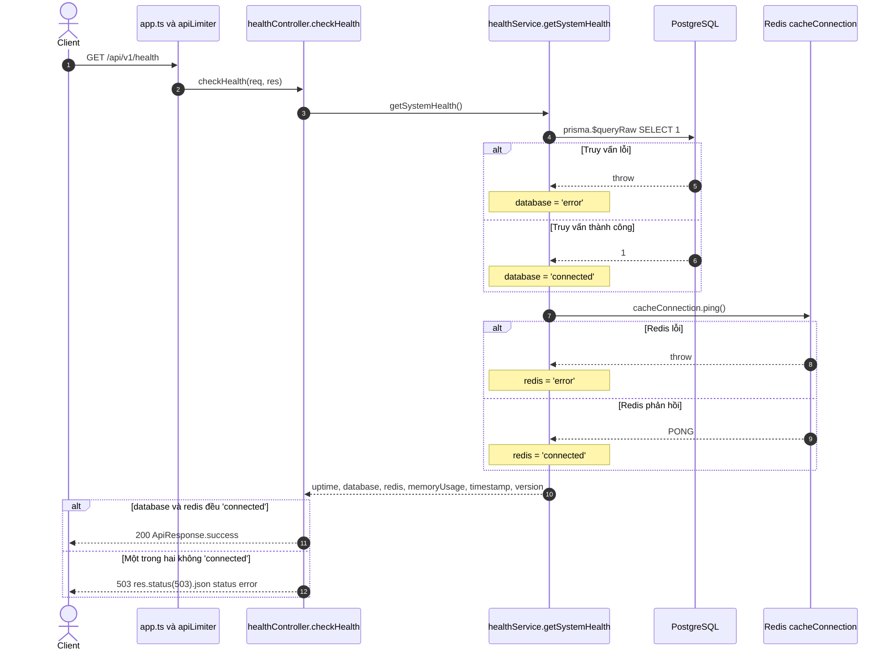
```mermaid
sequenceDiagram
    autonumber
    actor U as Client
    participant APP as app.ts và apiLimiter
    participant C as healthController.checkHealth
    participant S as healthService.getSystemHealth
    participant DB as PostgreSQL
    participant RD as Redis cacheConnection

    U->>APP: GET /api/v1/health
    APP->>C: checkHealth(req, res)
    C->>S: getSystemHealth()

    S->>DB: prisma.$queryRaw SELECT 1
    alt Truy vấn lỗi
        DB-->>S: throw
        Note over S: database = 'error'
    else Truy vấn thành công
        DB-->>S: 1
        Note over S: database = 'connected'
    end

    S->>RD: cacheConnection.ping()
    alt Redis lỗi
        RD-->>S: throw
        Note over S: redis = 'error'
    else Redis phản hồi
        RD-->>S: PONG
        Note over S: redis = 'connected'
    end

    S-->>C: uptime, database, redis, memoryUsage, timestamp, version
    alt database và redis đều 'connected'
        C-->>U: 200 ApiResponse.success
    else Một trong hai không 'connected'
        C-->>U: 503 res.status(503).json status error
    end
```

`/health` công khai, chỉ chịu `apiLimiter` toàn cục. Nhánh `503` gọi trực tiếp
`res.status(503).json` thay vì `ApiResponse`. Nếu `ping` trả về khác `PONG`, service ghi
`redis = 'idle'` và controller cũng trả `503`.

---

## 2. Auth và tài khoản

### UC01. Đăng ký tài khoản (`POST /auth/register`)

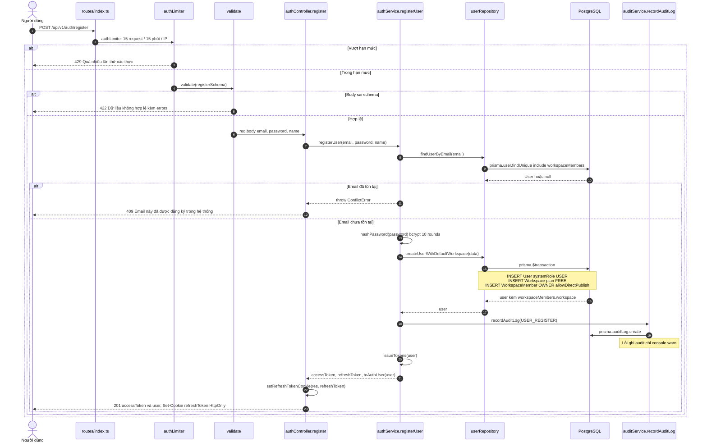
```mermaid
sequenceDiagram
    autonumber
    actor U as Người dùng
    participant RT as routes/index.ts
    participant RL as authLimiter
    participant V as validate
    participant C as authController.register
    participant S as authService.registerUser
    participant R as userRepository
    participant DB as PostgreSQL
    participant AU as auditService.recordAuditLog

    U->>RT: POST /api/v1/auth/register
    RT->>RL: authLimiter 15 request / 15 phút / IP
    alt Vượt hạn mức
        RL-->>U: 429 Quá nhiều lần thử xác thực
    else Trong hạn mức
        RL->>V: validate(registerSchema)
        alt Body sai schema
            V-->>U: 422 Dữ liệu không hợp lệ kèm errors
        else Hợp lệ
            V->>C: req.body email, password, name
            C->>S: registerUser(email, password, name)

            S->>R: findUserByEmail(email)
            R->>DB: prisma.user.findUnique include workspaceMembers
            DB-->>R: User hoặc null

            alt Email đã tồn tại
                S-->>C: throw ConflictError
                C-->>U: 409 Email này đã được đăng ký trong hệ thống
            else Email chưa tồn tại
                S->>S: hashPassword(password) bcrypt 10 rounds
                S->>R: createUserWithDefaultWorkspace(data)
                R->>DB: prisma.$transaction
                Note over R,DB: INSERT User systemRole USER<br/>INSERT Workspace plan FREE<br/>INSERT WorkspaceMember OWNER allowDirectPublish
                DB-->>R: user kèm workspaceMembers.workspace
                R-->>S: user

                S->>AU: recordAuditLog(USER_REGISTER)
                AU->>DB: prisma.auditLog.create
                Note over AU: Lỗi ghi audit chỉ console.warn

                S->>S: issueTokens(user)
                S-->>C: accessToken, refreshToken, toAuthUser(user)
                C->>C: setRefreshTokenCookie(res, refreshToken)
                C-->>U: 201 accessToken và user, Set-Cookie refreshToken HttpOnly
            end
        end
    end
```

- Workspace mặc định có tên `Workspace của <name>`, `plan = FREE`; user là `OWNER` với
  `allowDirectPublish = true`; cả 3 bản ghi nằm trong một transaction.
- Refresh token **không** lưu DB; thu hồi phiên dựa trên `User.tokenVersion`.

### UC02. Đăng nhập (`POST /auth/login`)

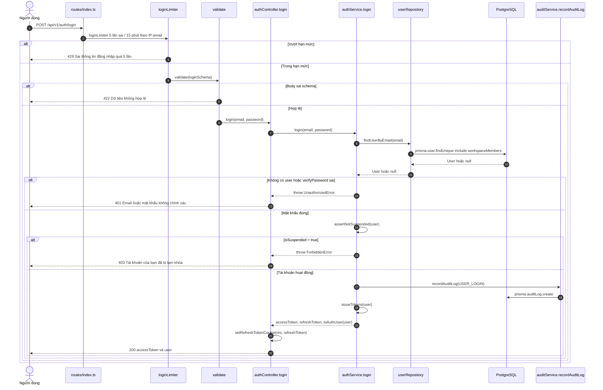
```mermaid
sequenceDiagram
    autonumber
    actor U as Người dùng
    participant RT as routes/index.ts
    participant RL as loginLimiter
    participant V as validate
    participant C as authController.login
    participant S as authService.login
    participant R as userRepository
    participant DB as PostgreSQL
    participant AU as auditService.recordAuditLog

    U->>RT: POST /api/v1/auth/login
    RT->>RL: loginLimiter 5 lần sai / 15 phút theo IP:email
    alt Vượt hạn mức
        RL-->>U: 429 Sai thông tin đăng nhập quá 5 lần
    else Trong hạn mức
        RL->>V: validate(loginSchema)
        alt Body sai schema
            V-->>U: 422 Dữ liệu không hợp lệ
        else Hợp lệ
            V->>C: login(email, password)
            C->>S: login(email, password)

            S->>R: findUserByEmail(email)
            R->>DB: prisma.user.findUnique include workspaceMembers
            DB-->>R: User hoặc null
            R-->>S: User hoặc null

            alt Không có user hoặc verifyPassword sai
                S-->>C: throw UnauthorizedError
                C-->>U: 401 Email hoặc mật khẩu không chính xác
            else Mật khẩu đúng
                S->>S: assertNotSuspended(user)
                alt isSuspended = true
                    S-->>C: throw ForbiddenError
                    C-->>U: 403 Tài khoản của bạn đã bị tạm khóa
                else Tài khoản hoạt động
                    S->>AU: recordAuditLog(USER_LOGIN)
                    AU->>DB: prisma.auditLog.create
                    S->>S: issueTokens(user)
                    S-->>C: accessToken, refreshToken, toAuthUser(user)
                    C->>C: setRefreshTokenCookie(res, refreshToken)
                    C-->>U: 200 accessToken và user
                end
            end
        end
    end
```

`loginLimiter` chỉ đếm request **thất bại** (`skipSuccessfulRequests`), key là `IP:email`.
Sai email và sai mật khẩu trả cùng một message để tránh dò tài khoản.

### UC03. Đăng nhập Google (`POST /auth/google`)

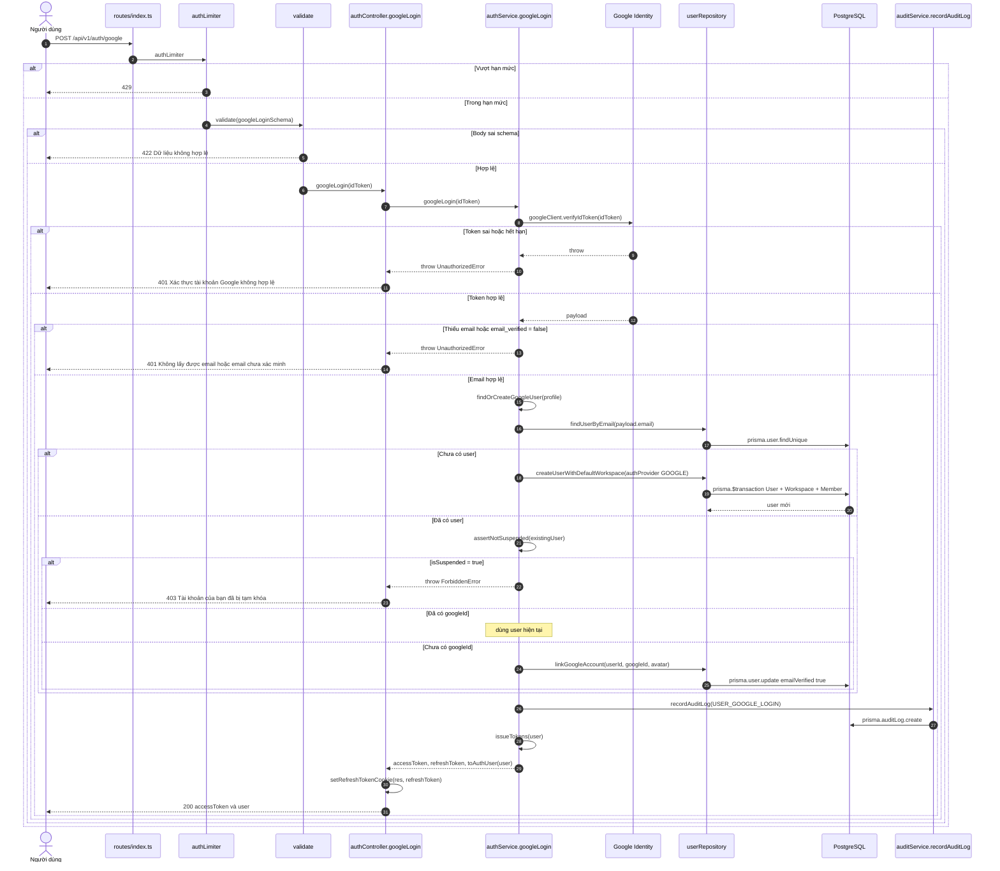
```mermaid
sequenceDiagram
    autonumber
    actor U as Người dùng
    participant RT as routes/index.ts
    participant RL as authLimiter
    participant V as validate
    participant C as authController.googleLogin
    participant S as authService.googleLogin
    participant G as Google Identity
    participant R as userRepository
    participant DB as PostgreSQL
    participant AU as auditService.recordAuditLog

    U->>RT: POST /api/v1/auth/google
    RT->>RL: authLimiter
    alt Vượt hạn mức
        RL-->>U: 429
    else Trong hạn mức
        RL->>V: validate(googleLoginSchema)
        alt Body sai schema
            V-->>U: 422 Dữ liệu không hợp lệ
        else Hợp lệ
            V->>C: googleLogin(idToken)
            C->>S: googleLogin(idToken)
            S->>G: googleClient.verifyIdToken(idToken)
            alt Token sai hoặc hết hạn
                G-->>S: throw
                S-->>C: throw UnauthorizedError
                C-->>U: 401 Xác thực tài khoản Google không hợp lệ
            else Token hợp lệ
                G-->>S: payload
                alt Thiếu email hoặc email_verified = false
                    S-->>C: throw UnauthorizedError
                    C-->>U: 401 Không lấy được email hoặc email chưa xác minh
                else Email hợp lệ
                    S->>S: findOrCreateGoogleUser(profile)
                    S->>R: findUserByEmail(payload.email)
                    R->>DB: prisma.user.findUnique
                    alt Chưa có user
                        S->>R: createUserWithDefaultWorkspace(authProvider GOOGLE)
                        R->>DB: prisma.$transaction User + Workspace + Member
                        DB-->>R: user mới
                    else Đã có user
                        S->>S: assertNotSuspended(existingUser)
                        alt isSuspended = true
                            S-->>C: throw ForbiddenError
                            C-->>U: 403 Tài khoản của bạn đã bị tạm khóa
                        else Đã có googleId
                            Note over S: dùng user hiện tại
                        else Chưa có googleId
                            S->>R: linkGoogleAccount(userId, googleId, avatar)
                            R->>DB: prisma.user.update emailVerified true
                        end
                    end

                    S->>AU: recordAuditLog(USER_GOOGLE_LOGIN)
                    AU->>DB: prisma.auditLog.create
                    S->>S: issueTokens(user)
                    S-->>C: accessToken, refreshToken, toAuthUser(user)
                    C->>C: setRefreshTokenCookie(res, refreshToken)
                    C-->>U: 200 accessToken và user
                end
            end
        end
    end
```

Backend chỉ liên kết tài khoản local với Google khi `email_verified = true`; nếu user đã có
`googleId` thì đăng nhập luôn, không ghi đè.

### UC04. Đăng xuất (`POST /auth/logout`)

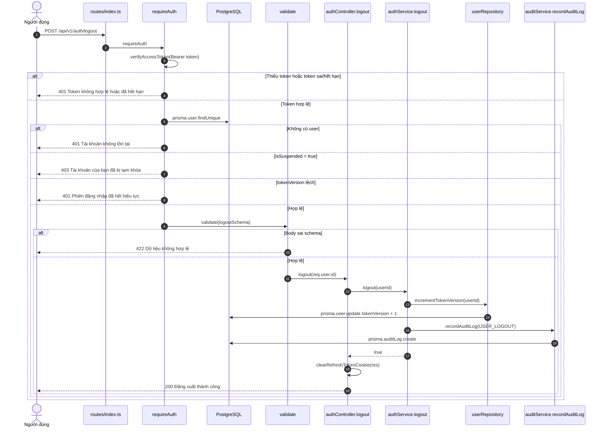
```mermaid
sequenceDiagram
    autonumber
    actor U as Người dùng
    participant RT as routes/index.ts
    participant MW as requireAuth
    participant DB as PostgreSQL
    participant V as validate
    participant C as authController.logout
    participant S as authService.logout
    participant R as userRepository
    participant AU as auditService.recordAuditLog

    U->>RT: POST /api/v1/auth/logout
    RT->>MW: requireAuth
    MW->>MW: verifyAccessToken(Bearer token)
    alt Thiếu token hoặc token sai/hết hạn
        MW-->>U: 401 Token không hợp lệ hoặc đã hết hạn
    else Token hợp lệ
        MW->>DB: prisma.user.findUnique
        alt Không có user
            MW-->>U: 401 Tài khoản không tồn tại
        else isSuspended = true
            MW-->>U: 403 Tài khoản của bạn đã bị tạm khóa
        else tokenVersion lệch
            MW-->>U: 401 Phiên đăng nhập đã hết hiệu lực
        else Hợp lệ
            MW->>V: validate(logoutSchema)
            alt Body sai schema
                V-->>U: 422 Dữ liệu không hợp lệ
            else Hợp lệ
                V->>C: logout(req.user.id)
                C->>S: logout(userId)
                S->>R: incrementTokenVersion(userId)
                R->>DB: prisma.user.update tokenVersion + 1
                S->>AU: recordAuditLog(USER_LOGOUT)
                AU->>DB: prisma.auditLog.create
                S-->>C: true
                C->>C: clearRefreshTokenCookie(res)
                C-->>U: 200 Đăng xuất thành công
            end
        end
    end
```

Body `{ refreshToken }` được validate nhưng service **không dùng**; mọi access/refresh token
cũ mất hiệu lực nhờ tăng `tokenVersion`.

### UC05. Đổi mật khẩu (`PATCH /users/me/password`)

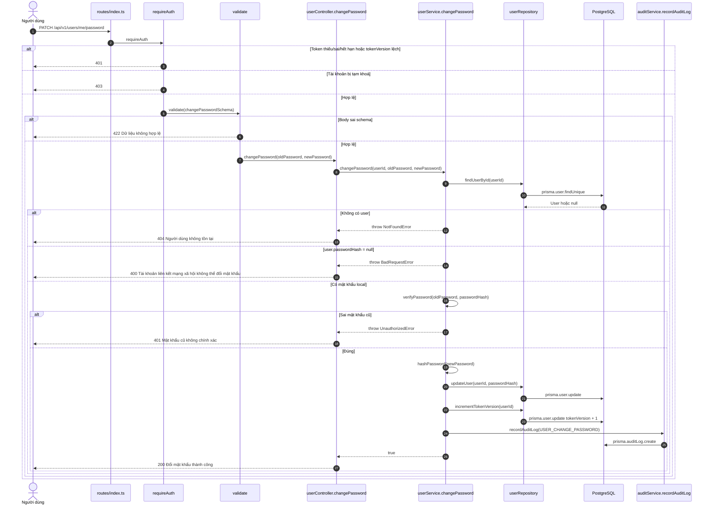
```mermaid
sequenceDiagram
    autonumber
    actor U as Người dùng
    participant RT as routes/index.ts
    participant MW as requireAuth
    participant V as validate
    participant C as userController.changePassword
    participant S as userService.changePassword
    participant R as userRepository
    participant DB as PostgreSQL
    participant AU as auditService.recordAuditLog

    U->>RT: PATCH /api/v1/users/me/password
    RT->>MW: requireAuth
    alt Token thiếu/sai/hết hạn hoặc tokenVersion lệch
        MW-->>U: 401
    else Tài khoản bị tạm khoá
        MW-->>U: 403
    else Hợp lệ
        MW->>V: validate(changePasswordSchema)
        alt Body sai schema
            V-->>U: 422 Dữ liệu không hợp lệ
        else Hợp lệ
            V->>C: changePassword(oldPassword, newPassword)
            C->>S: changePassword(userId, oldPassword, newPassword)

            S->>R: findUserById(userId)
            R->>DB: prisma.user.findUnique
            DB-->>R: User hoặc null
            alt Không có user
                S-->>C: throw NotFoundError
                C-->>U: 404 Người dùng không tồn tại
            else user.passwordHash = null
                S-->>C: throw BadRequestError
                C-->>U: 400 Tài khoản liên kết mạng xã hội không thể đổi mật khẩu
            else Có mật khẩu local
                S->>S: verifyPassword(oldPassword, passwordHash)
                alt Sai mật khẩu cũ
                    S-->>C: throw UnauthorizedError
                    C-->>U: 401 Mật khẩu cũ không chính xác
                else Đúng
                    S->>S: hashPassword(newPassword)
                    S->>R: updateUser(userId, passwordHash)
                    R->>DB: prisma.user.update
                    S->>R: incrementTokenVersion(userId)
                    R->>DB: prisma.user.update tokenVersion + 1
                    S->>AU: recordAuditLog(USER_CHANGE_PASSWORD)
                    AU->>DB: prisma.auditLog.create
                    S-->>C: true
                    C-->>U: 200 Đổi mật khẩu thành công
                end
            end
        end
    end
```

Sau khi đổi mật khẩu, `tokenVersion` tăng nên access token hiện tại và refresh token cũ đều
hết hiệu lực. Controller **không** xoá cookie `refreshToken`; cookie cũ chỉ bị từ chối ở lần
refresh sau.

### Lấy thông tin tài khoản (`GET /users/me`)

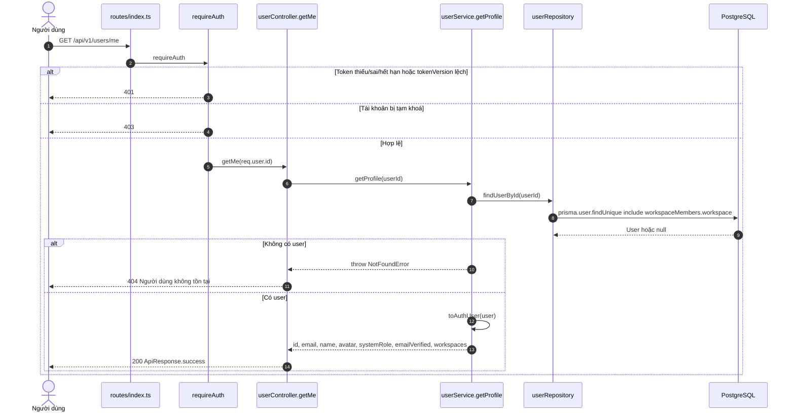
```mermaid
sequenceDiagram
    autonumber
    actor U as Người dùng
    participant RT as routes/index.ts
    participant MW as requireAuth
    participant C as userController.getMe
    participant S as userService.getProfile
    participant R as userRepository
    participant DB as PostgreSQL

    U->>RT: GET /api/v1/users/me
    RT->>MW: requireAuth
    alt Token thiếu/sai/hết hạn hoặc tokenVersion lệch
        MW-->>U: 401
    else Tài khoản bị tạm khoá
        MW-->>U: 403
    else Hợp lệ
        MW->>C: getMe(req.user.id)
        C->>S: getProfile(userId)
        S->>R: findUserById(userId)
        R->>DB: prisma.user.findUnique include workspaceMembers.workspace
        DB-->>R: User hoặc null
        alt Không có user
            S-->>C: throw NotFoundError
            C-->>U: 404 Người dùng không tồn tại
        else Có user
            S->>S: toAuthUser(user)
            S-->>C: id, email, name, avatar, systemRole, emailVerified, workspaces
            C-->>U: 200 ApiResponse.success
        end
    end
```

`requireAuth` đã nạp user nhưng service vẫn truy vấn lại DB để lấy kèm danh sách workspace.

### UC33. Cập nhật thông tin tài khoản (`PATCH /users/me`)

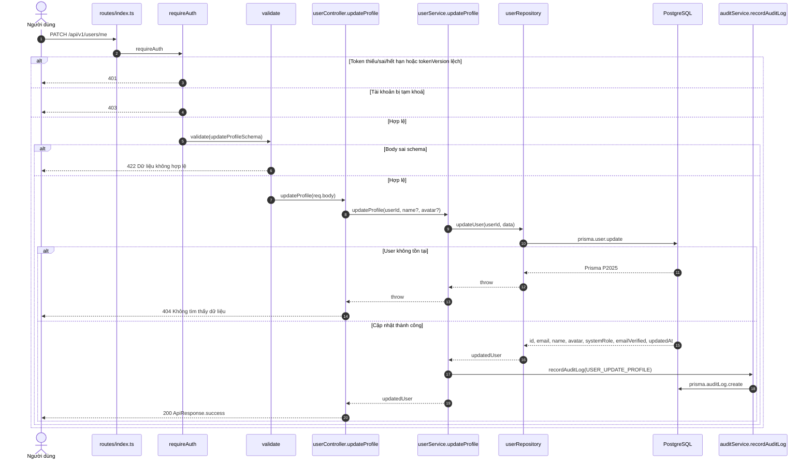
```mermaid
sequenceDiagram
    autonumber
    actor U as Người dùng
    participant RT as routes/index.ts
    participant MW as requireAuth
    participant V as validate
    participant C as userController.updateProfile
    participant S as userService.updateProfile
    participant R as userRepository
    participant DB as PostgreSQL
    participant AU as auditService.recordAuditLog

    U->>RT: PATCH /api/v1/users/me
    RT->>MW: requireAuth
    alt Token thiếu/sai/hết hạn hoặc tokenVersion lệch
        MW-->>U: 401
    else Tài khoản bị tạm khoá
        MW-->>U: 403
    else Hợp lệ
        MW->>V: validate(updateProfileSchema)
        alt Body sai schema
            V-->>U: 422 Dữ liệu không hợp lệ
        else Hợp lệ
            V->>C: updateProfile(req.body)
            C->>S: updateProfile(userId, name?, avatar?)
            S->>R: updateUser(userId, data)
            R->>DB: prisma.user.update
            alt User không tồn tại
                DB-->>R: Prisma P2025
                R-->>S: throw
                S-->>C: throw
                C-->>U: 404 Không tìm thấy dữ liệu
            else Cập nhật thành công
                DB-->>R: id, email, name, avatar, systemRole, emailVerified, updatedAt
                R-->>S: updatedUser
                S->>AU: recordAuditLog(USER_UPDATE_PROFILE)
                AU->>DB: prisma.auditLog.create
                S-->>C: updatedUser
                C-->>U: 200 ApiResponse.success
            end
        end
    end
```

Body cho phép `name` (2–100 ký tự) và `avatar` (URL hợp lệ hoặc `null`); không bắt buộc
phải có field nào.

### UC34. Làm mới token (`POST /auth/refresh-token`)

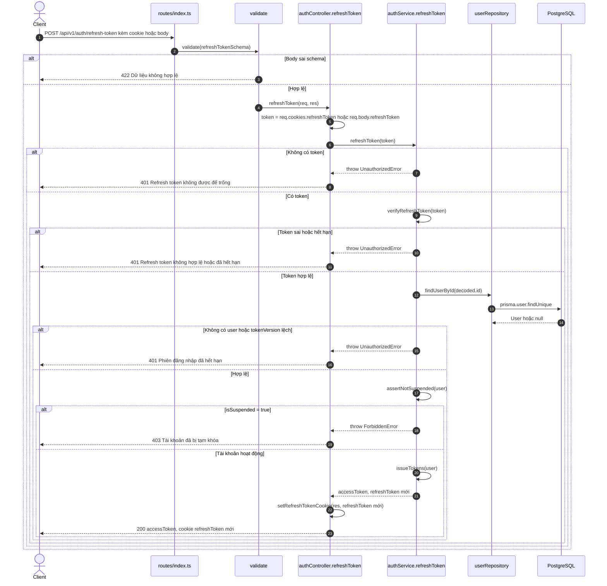
```mermaid
sequenceDiagram
    autonumber
    actor U as Client
    participant RT as routes/index.ts
    participant V as validate
    participant C as authController.refreshToken
    participant S as authService.refreshToken
    participant R as userRepository
    participant DB as PostgreSQL

    U->>RT: POST /api/v1/auth/refresh-token kèm cookie hoặc body
    RT->>V: validate(refreshTokenSchema)
    alt Body sai schema
        V-->>U: 422 Dữ liệu không hợp lệ
    else Hợp lệ
        V->>C: refreshToken(req, res)
        C->>C: token = req.cookies.refreshToken hoặc req.body.refreshToken
        C->>S: refreshToken(token)

        alt Không có token
            S-->>C: throw UnauthorizedError
            C-->>U: 401 Refresh token không được để trống
        else Có token
            S->>S: verifyRefreshToken(token)
            alt Token sai hoặc hết hạn
                S-->>C: throw UnauthorizedError
                C-->>U: 401 Refresh token không hợp lệ hoặc đã hết hạn
            else Token hợp lệ
                S->>R: findUserById(decoded.id)
                R->>DB: prisma.user.findUnique
                DB-->>R: User hoặc null
                alt Không có user hoặc tokenVersion lệch
                    S-->>C: throw UnauthorizedError
                    C-->>U: 401 Phiên đăng nhập đã hết hạn
                else Hợp lệ
                    S->>S: assertNotSuspended(user)
                    alt isSuspended = true
                        S-->>C: throw ForbiddenError
                        C-->>U: 403 Tài khoản đã bị tạm khóa
                    else Tài khoản hoạt động
                        S->>S: issueTokens(user)
                        S-->>C: accessToken, refreshToken mới
                        C->>C: setRefreshTokenCookie(res, refreshToken mới)
                        C-->>U: 200 accessToken, cookie refreshToken mới
                    end
                end
            end
        end
    end
```

Endpoint không yêu cầu access token. Response chỉ trả `accessToken`; refresh token mới đi qua
cookie `refreshToken`.

---

## 3. Workspace và thành viên

### UC17. Tạo workspace (`POST /workspaces`)

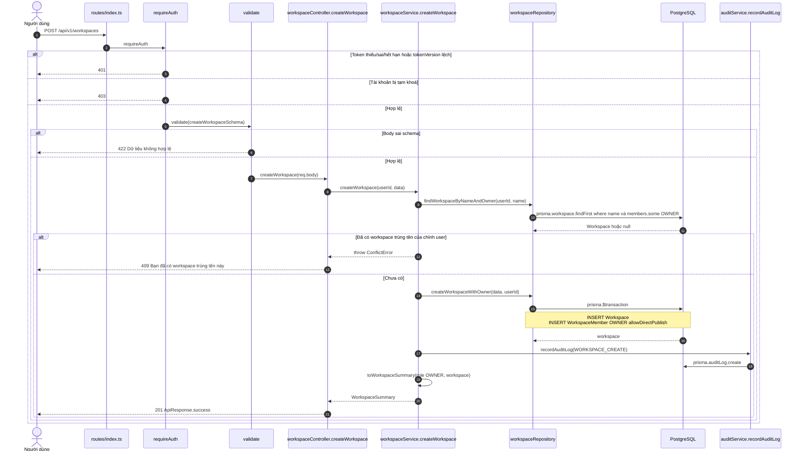
```mermaid
sequenceDiagram
    autonumber
    actor U as Người dùng
    participant RT as routes/index.ts
    participant MW as requireAuth
    participant V as validate
    participant C as workspaceController.createWorkspace
    participant S as workspaceService.createWorkspace
    participant R as workspaceRepository
    participant DB as PostgreSQL
    participant AU as auditService.recordAuditLog

    U->>RT: POST /api/v1/workspaces
    RT->>MW: requireAuth
    alt Token thiếu/sai/hết hạn hoặc tokenVersion lệch
        MW-->>U: 401
    else Tài khoản bị tạm khoá
        MW-->>U: 403
    else Hợp lệ
        MW->>V: validate(createWorkspaceSchema)
        alt Body sai schema
            V-->>U: 422 Dữ liệu không hợp lệ
        else Hợp lệ
            V->>C: createWorkspace(req.body)
            C->>S: createWorkspace(userId, data)

            S->>R: findWorkspaceByNameAndOwner(userId, name)
            R->>DB: prisma.workspace.findFirst where name và members.some OWNER
            DB-->>R: Workspace hoặc null
            alt Đã có workspace trùng tên của chính user
                S-->>C: throw ConflictError
                C-->>U: 409 Bạn đã có workspace trùng tên này
            else Chưa có
                S->>R: createWorkspaceWithOwner(data, userId)
                R->>DB: prisma.$transaction
                Note over R,DB: INSERT Workspace<br/>INSERT WorkspaceMember OWNER allowDirectPublish
                DB-->>R: workspace
                S->>AU: recordAuditLog(WORKSPACE_CREATE)
                AU->>DB: prisma.auditLog.create
                S->>S: toWorkspaceSummary(role OWNER, workspace)
                S-->>C: WorkspaceSummary
                C-->>U: 201 ApiResponse.success
            end
        end
    end
```

Route chỉ yêu cầu đăng nhập, không giới hạn số workspace. Tên chỉ được kiểm tra trùng trong
phạm vi các workspace mà user là `OWNER`.

### UC35. Danh sách workspace (`GET /workspaces`)

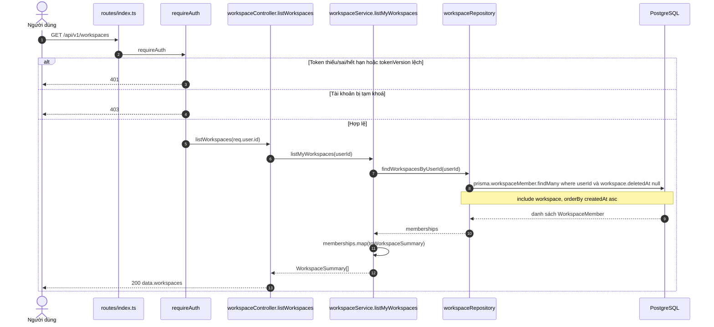
```mermaid
sequenceDiagram
    autonumber
    actor U as Người dùng
    participant RT as routes/index.ts
    participant MW as requireAuth
    participant C as workspaceController.listWorkspaces
    participant S as workspaceService.listMyWorkspaces
    participant R as workspaceRepository
    participant DB as PostgreSQL

    U->>RT: GET /api/v1/workspaces
    RT->>MW: requireAuth
    alt Token thiếu/sai/hết hạn hoặc tokenVersion lệch
        MW-->>U: 401
    else Tài khoản bị tạm khoá
        MW-->>U: 403
    else Hợp lệ
        MW->>C: listWorkspaces(req.user.id)
        C->>S: listMyWorkspaces(userId)
        S->>R: findWorkspacesByUserId(userId)
        R->>DB: prisma.workspaceMember.findMany where userId và workspace.deletedAt null
        Note over R,DB: include workspace, orderBy createdAt asc
        DB-->>R: danh sách WorkspaceMember
        R-->>S: memberships
        S->>S: memberships.map(toWorkspaceSummary)
        S-->>C: WorkspaceSummary[]
        C-->>U: 200 data.workspaces
    end
```

Workspace đã xoá mềm bị loại khỏi danh sách. Mỗi phần tử trả `id`, `name`, `plan`,
`role`, `remainingCredit`, `monthlyQuota`.

### UC18. Cập nhật workspace (`PATCH /workspaces/:workspaceId`)

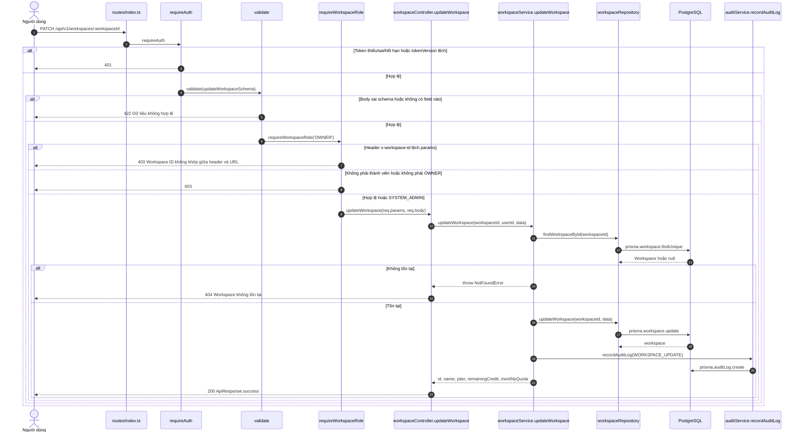
```mermaid
sequenceDiagram
    autonumber
    actor U as Người dùng
    participant RT as routes/index.ts
    participant MW as requireAuth
    participant V as validate
    participant WR as requireWorkspaceRole
    participant C as workspaceController.updateWorkspace
    participant S as workspaceService.updateWorkspace
    participant R as workspaceRepository
    participant DB as PostgreSQL
    participant AU as auditService.recordAuditLog

    U->>RT: PATCH /api/v1/workspaces/:workspaceId
    RT->>MW: requireAuth
    alt Token thiếu/sai/hết hạn hoặc tokenVersion lệch
        MW-->>U: 401
    else Hợp lệ
        MW->>V: validate(updateWorkspaceSchema)
        alt Body sai schema hoặc không có field nào
            V-->>U: 422 Dữ liệu không hợp lệ
        else Hợp lệ
            V->>WR: requireWorkspaceRole('OWNER')
            alt Header x-workspace-id lệch params
                WR-->>U: 403 Workspace ID không khớp giữa header và URL
            else Không phải thành viên hoặc không phải OWNER
                WR-->>U: 403
            else Hợp lệ hoặc SYSTEM_ADMIN
                WR->>C: updateWorkspace(req.params, req.body)
                C->>S: updateWorkspace(workspaceId, userId, data)
                S->>R: findWorkspaceById(workspaceId)
                R->>DB: prisma.workspace.findUnique
                DB-->>R: Workspace hoặc null
                alt Không tồn tại
                    S-->>C: throw NotFoundError
                    C-->>U: 404 Workspace không tồn tại
                else Tồn tại
                    S->>R: updateWorkspace(workspaceId, data)
                    R->>DB: prisma.workspace.update
                    DB-->>R: workspace
                    S->>AU: recordAuditLog(WORKSPACE_UPDATE)
                    AU->>DB: prisma.auditLog.create
                    S-->>C: id, name, plan, remainingCredit, monthlyQuota
                    C-->>U: 200 ApiResponse.success
                end
            end
        end
    end
```

`SYSTEM_ADMIN` được `requireWorkspaceRole` cho qua với `workspaceRole = OWNER` mà không cần
bản ghi `WorkspaceMember`.

### UC19. Xoá workspace (`DELETE /workspaces/:workspaceId`)

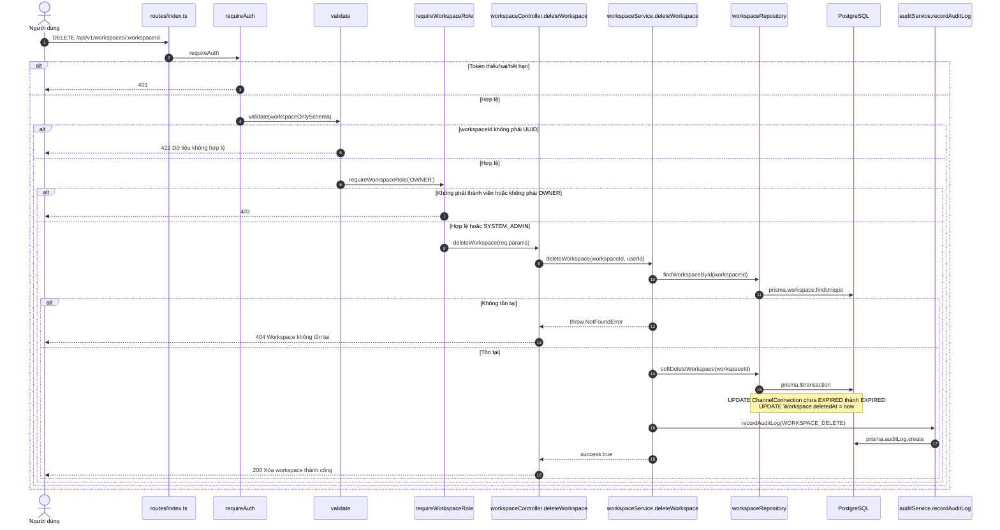
```mermaid
sequenceDiagram
    autonumber
    actor U as Người dùng
    participant RT as routes/index.ts
    participant MW as requireAuth
    participant V as validate
    participant WR as requireWorkspaceRole
    participant C as workspaceController.deleteWorkspace
    participant S as workspaceService.deleteWorkspace
    participant R as workspaceRepository
    participant DB as PostgreSQL
    participant AU as auditService.recordAuditLog

    U->>RT: DELETE /api/v1/workspaces/:workspaceId
    RT->>MW: requireAuth
    alt Token thiếu/sai/hết hạn
        MW-->>U: 401
    else Hợp lệ
        MW->>V: validate(workspaceOnlySchema)
        alt workspaceId không phải UUID
            V-->>U: 422 Dữ liệu không hợp lệ
        else Hợp lệ
            V->>WR: requireWorkspaceRole('OWNER')
            alt Không phải thành viên hoặc không phải OWNER
                WR-->>U: 403
            else Hợp lệ hoặc SYSTEM_ADMIN
                WR->>C: deleteWorkspace(req.params)
                C->>S: deleteWorkspace(workspaceId, userId)
                S->>R: findWorkspaceById(workspaceId)
                R->>DB: prisma.workspace.findUnique
                alt Không tồn tại
                    S-->>C: throw NotFoundError
                    C-->>U: 404 Workspace không tồn tại
                else Tồn tại
                    S->>R: softDeleteWorkspace(workspaceId)
                    R->>DB: prisma.$transaction
                    Note over R,DB: UPDATE ChannelConnection chưa EXPIRED thành EXPIRED<br/>UPDATE Workspace.deletedAt = now
                    S->>AU: recordAuditLog(WORKSPACE_DELETE)
                    AU->>DB: prisma.auditLog.create
                    S-->>C: success true
                    C-->>U: 200 Xóa workspace thành công
                end
            end
        end
    end
```

Đây là xoá mềm: `Workspace.deletedAt` được đánh dấu, kênh chuyển `EXPIRED`. Audit
`WORKSPACE_DELETE` chỉ có `actorId`, `targetType`, `targetId` (service không truyền
`workspaceId`).

### UC20. Danh sách thành viên (`GET /workspaces/:workspaceId/members`)

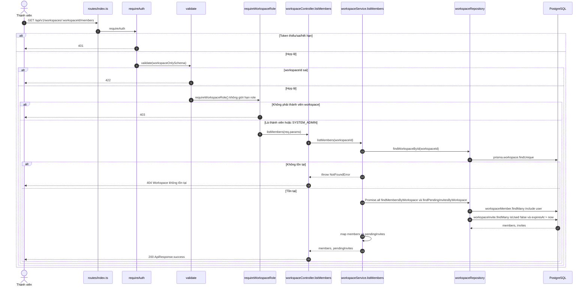
```mermaid
sequenceDiagram
    autonumber
    actor U as Thành viên
    participant RT as routes/index.ts
    participant MW as requireAuth
    participant V as validate
    participant WR as requireWorkspaceRole
    participant C as workspaceController.listMembers
    participant S as workspaceService.listMembers
    participant R as workspaceRepository
    participant DB as PostgreSQL

    U->>RT: GET /api/v1/workspaces/:workspaceId/members
    RT->>MW: requireAuth
    alt Token thiếu/sai/hết hạn
        MW-->>U: 401
    else Hợp lệ
        MW->>V: validate(workspaceOnlySchema)
        alt workspaceId sai
            V-->>U: 422
        else Hợp lệ
            V->>WR: requireWorkspaceRole() không giới hạn role
            alt Không phải thành viên workspace
                WR-->>U: 403
            else Là thành viên hoặc SYSTEM_ADMIN
                WR->>C: listMembers(req.params)
                C->>S: listMembers(workspaceId)
                S->>R: findWorkspaceById(workspaceId)
                R->>DB: prisma.workspace.findUnique
                alt Không tồn tại
                    S-->>C: throw NotFoundError
                    C-->>U: 404 Workspace không tồn tại
                else Tồn tại
                    S->>R: Promise.all findMembersByWorkspace và findPendingInvitesByWorkspace
                    R->>DB: workspaceMember.findMany include user
                    R->>DB: workspaceInvite.findMany isUsed false và expiresAt > now
                    DB-->>R: members, invites
                    S->>S: map members và pendingInvites
                    S-->>C: members, pendingInvites
                    C-->>U: 200 ApiResponse.success
                end
            end
        end
    end
```

`pendingInvites` chỉ gồm lời mời chưa dùng và còn hạn. Member trả `memberId`, `userId`,
`name`, `email`, `avatar`, `role`, `status = ACTIVE`, `joinedAt` (không trả `allowDirectPublish`).

### UC21. Mời thành viên (`POST /workspaces/:workspaceId/invites`)

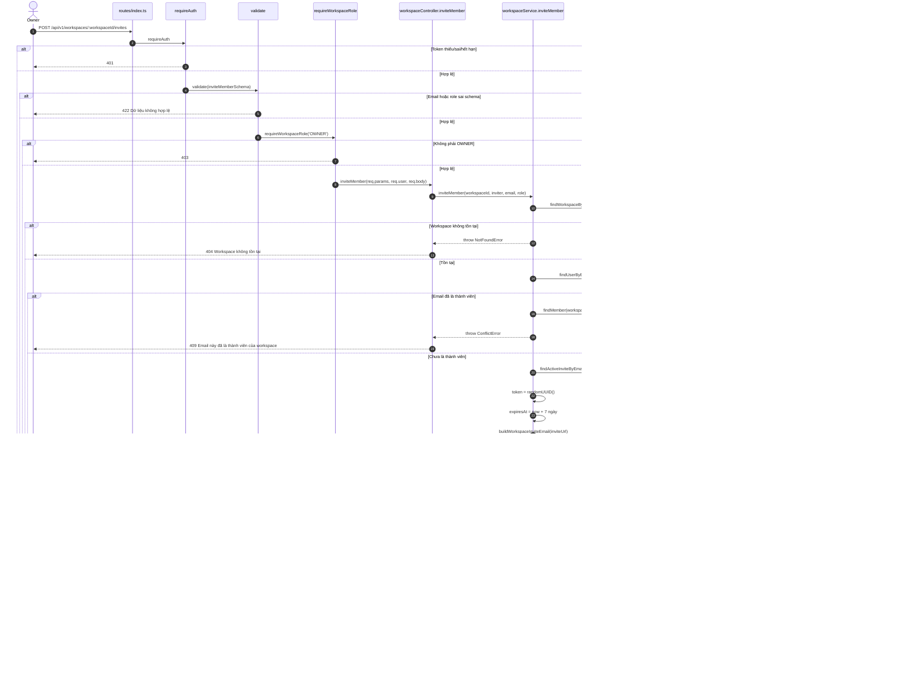
```mermaid
sequenceDiagram
    autonumber
    actor U as Owner
    participant RT as routes/index.ts
    participant MW as requireAuth
    participant V as validate
    participant WR as requireWorkspaceRole
    participant C as workspaceController.inviteMember
    participant S as workspaceService.inviteMember
    participant R as workspaceRepository
    participant DB as PostgreSQL
    participant MAIL as MailerClient
    participant AU as auditService.recordAuditLog

    U->>RT: POST /api/v1/workspaces/:workspaceId/invites
    RT->>MW: requireAuth
    alt Token thiếu/sai/hết hạn
        MW-->>U: 401
    else Hợp lệ
        MW->>V: validate(inviteMemberSchema)
        alt Email hoặc role sai schema
            V-->>U: 422 Dữ liệu không hợp lệ
        else Hợp lệ
            V->>WR: requireWorkspaceRole('OWNER')
            alt Không phải OWNER
                WR-->>U: 403
            else Hợp lệ
                WR->>C: inviteMember(req.params, req.user, req.body)
                C->>S: inviteMember(workspaceId, inviter, email, role)

                S->>R: findWorkspaceById(workspaceId)
                R->>DB: prisma.workspace.findUnique
                alt Workspace không tồn tại
                    S-->>C: throw NotFoundError
                    C-->>U: 404 Workspace không tồn tại
                else Tồn tại
                    S->>R: findUserByEmail(email)
                    R->>DB: prisma.user.findUnique
                    alt Email đã là thành viên
                        S->>R: findMember(workspaceId, invitedUser.id)
                        R->>DB: prisma.workspaceMember.findUnique
                        S-->>C: throw ConflictError
                        C-->>U: 409 Email này đã là thành viên của workspace
                    else Chưa là thành viên
                        S->>R: findActiveInviteByEmail(workspaceId, email)
                        R->>DB: prisma.workspaceInvite.findFirst isUsed false và còn hạn

                        S->>S: token = randomUUID()
                        S->>S: expiresAt = now + 7 ngày
                        S->>S: buildWorkspaceInviteEmail(inviteUrl)
                        S->>MAIL: mailerClient.sendEmail(to, subject, html)
                        alt mailerClient.sendEmail trả false
                            MAIL-->>S: false
                            S-->>C: throw AppError 502
                            C-->>U: 502 Gửi email mời thất bại
                        else Gửi thành công
                            MAIL-->>S: true
                            alt Đã có lời mời đang chờ
                                S->>R: refreshInvite(inviteId, token mới)
                                R->>DB: prisma.workspaceInvite.update
                            else Chưa có
                                S->>R: createInvite(data)
                                R->>DB: prisma.workspaceInvite.create
                            end
                            S->>AU: recordAuditLog(MEMBER_INVITED)
                            AU->>DB: prisma.auditLog.create
                            S-->>C: invite, inviteUrl
                            C-->>U: 201 Đã tạo lời mời tham gia workspace
                        end
                    end
                end
            end
        end
    end
```

Email được gửi **trước** khi ghi/ghi đè lời mời; gửi lỗi thì không tạo bản ghi. Mời lại cùng
email sẽ cấp token và hạn mới, token cũ hết hiệu lực.

### UC22. Chấp nhận lời mời (`GET /invites/:token`)

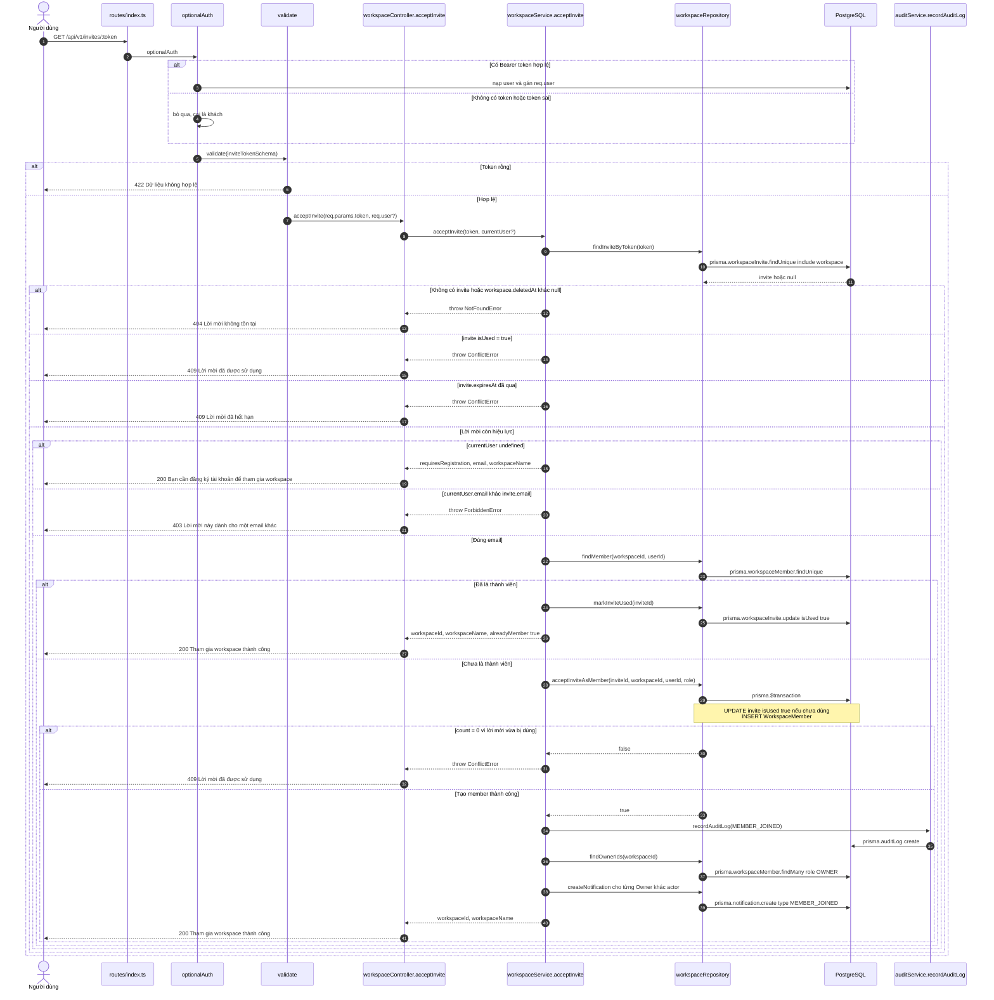
```mermaid
sequenceDiagram
    autonumber
    actor U as Người dùng
    participant RT as routes/index.ts
    participant OA as optionalAuth
    participant V as validate
    participant C as workspaceController.acceptInvite
    participant S as workspaceService.acceptInvite
    participant R as workspaceRepository
    participant DB as PostgreSQL
    participant AU as auditService.recordAuditLog

    U->>RT: GET /api/v1/invites/:token
    RT->>OA: optionalAuth
    alt Có Bearer token hợp lệ
        OA->>DB: nạp user và gán req.user
    else Không có token hoặc token sai
        OA->>OA: bỏ qua, coi là khách
    end
    OA->>V: validate(inviteTokenSchema)
    alt Token rỗng
        V-->>U: 422 Dữ liệu không hợp lệ
    else Hợp lệ
        V->>C: acceptInvite(req.params.token, req.user?)
        C->>S: acceptInvite(token, currentUser?)
        S->>R: findInviteByToken(token)
        R->>DB: prisma.workspaceInvite.findUnique include workspace
        DB-->>R: invite hoặc null
        alt Không có invite hoặc workspace.deletedAt khác null
            S-->>C: throw NotFoundError
            C-->>U: 404 Lời mời không tồn tại
        else invite.isUsed = true
            S-->>C: throw ConflictError
            C-->>U: 409 Lời mời đã được sử dụng
        else invite.expiresAt đã qua
            S-->>C: throw ConflictError
            C-->>U: 409 Lời mời đã hết hạn
        else Lời mời còn hiệu lực
            alt currentUser undefined
                S-->>C: requiresRegistration, email, workspaceName
                C-->>U: 200 Bạn cần đăng ký tài khoản để tham gia workspace
            else currentUser.email khác invite.email
                S-->>C: throw ForbiddenError
                C-->>U: 403 Lời mời này dành cho một email khác
            else Đúng email
                S->>R: findMember(workspaceId, userId)
                R->>DB: prisma.workspaceMember.findUnique
                alt Đã là thành viên
                    S->>R: markInviteUsed(inviteId)
                    R->>DB: prisma.workspaceInvite.update isUsed true
                    S-->>C: workspaceId, workspaceName, alreadyMember true
                    C-->>U: 200 Tham gia workspace thành công
                else Chưa là thành viên
                    S->>R: acceptInviteAsMember(inviteId, workspaceId, userId, role)
                    R->>DB: prisma.$transaction
                    Note over R,DB: UPDATE invite isUsed true nếu chưa dùng<br/>INSERT WorkspaceMember
                    alt count = 0 vì lời mời vừa bị dùng
                        R-->>S: false
                        S-->>C: throw ConflictError
                        C-->>U: 409 Lời mời đã được sử dụng
                    else Tạo member thành công
                        R-->>S: true
                        S->>AU: recordAuditLog(MEMBER_JOINED)
                        AU->>DB: prisma.auditLog.create
                        S->>R: findOwnerIds(workspaceId)
                        R->>DB: prisma.workspaceMember.findMany role OWNER
                        S->>R: createNotification cho từng Owner khác actor
                        R->>DB: prisma.notification.create type MEMBER_JOINED
                        S-->>C: workspaceId, workspaceName
                        C-->>U: 200 Tham gia workspace thành công
                    end
                end
            end
        end
    end
```

Token sai/hết hạn không làm `optionalAuth` trả lỗi; request tiếp tục như khách. Lời mời đã dùng
vẫn bị chặn `409` trước khi kiểm tra người dùng.

### UC23. Rời workspace (`DELETE /workspaces/:workspaceId/members/me`)

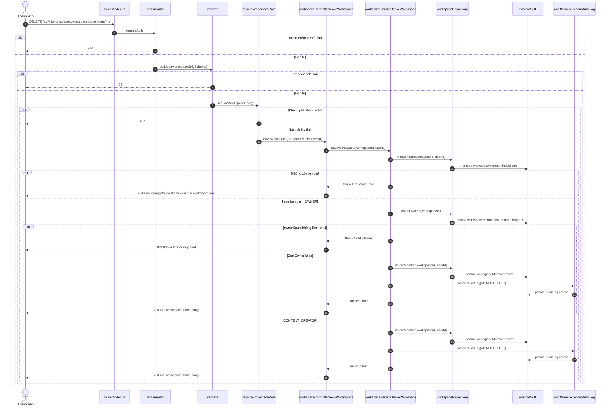
```mermaid
sequenceDiagram
    autonumber
    actor U as Thành viên
    participant RT as routes/index.ts
    participant MW as requireAuth
    participant V as validate
    participant WR as requireWorkspaceRole
    participant C as workspaceController.leaveWorkspace
    participant S as workspaceService.leaveWorkspace
    participant R as workspaceRepository
    participant DB as PostgreSQL
    participant AU as auditService.recordAuditLog

    U->>RT: DELETE /api/v1/workspaces/:workspaceId/members/me
    RT->>MW: requireAuth
    alt Token thiếu/sai/hết hạn
        MW-->>U: 401
    else Hợp lệ
        MW->>V: validate(workspaceOnlySchema)
        alt workspaceId sai
            V-->>U: 422
        else Hợp lệ
            V->>WR: requireWorkspaceRole()
            alt Không phải thành viên
                WR-->>U: 403
            else Là thành viên
                WR->>C: leaveWorkspace(req.params, req.user.id)
                C->>S: leaveWorkspace(workspaceId, userId)
                S->>R: findMember(workspaceId, userId)
                R->>DB: prisma.workspaceMember.findUnique
                alt Không có member
                    S-->>C: throw NotFoundError
                    C-->>U: 404 Bạn không phải là thành viên của workspace này
                else member.role = OWNER
                    S->>R: countOwners(workspaceId)
                    R->>DB: prisma.workspaceMember.count role OWNER
                    alt ownerCount không lớn hơn 1
                        S-->>C: throw ConflictError
                        C-->>U: 409 Bạn là Owner duy nhất
                    else Còn Owner khác
                        S->>R: deleteMember(workspaceId, userId)
                        R->>DB: prisma.workspaceMember.delete
                        S->>AU: recordAuditLog(MEMBER_LEFT)
                        AU->>DB: prisma.auditLog.create
                        S-->>C: success true
                        C-->>U: 200 Rời workspace thành công
                    end
                else CONTENT_CREATOR
                    S->>R: deleteMember(workspaceId, userId)
                    R->>DB: prisma.workspaceMember.delete
                    S->>AU: recordAuditLog(MEMBER_LEFT)
                    AU->>DB: prisma.auditLog.create
                    S-->>C: success true
                    C-->>U: 200 Rời workspace thành công
                end
            end
        end
    end
```

### UC24. Xoá thành viên (`DELETE /workspaces/:workspaceId/members/:memberId`)

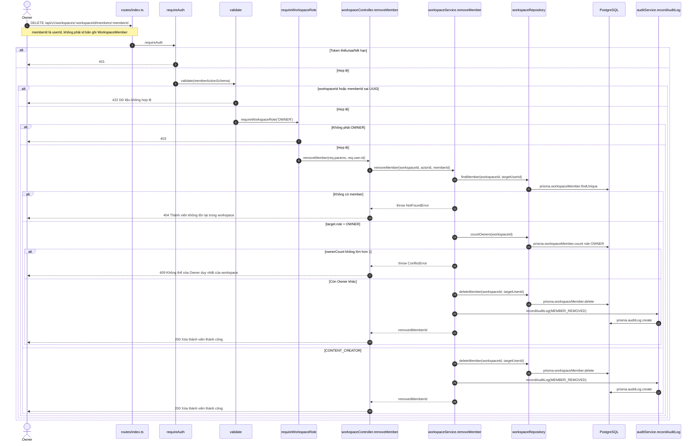
```mermaid
sequenceDiagram
    autonumber
    actor U as Owner
    participant RT as routes/index.ts
    participant MW as requireAuth
    participant V as validate
    participant WR as requireWorkspaceRole
    participant C as workspaceController.removeMember
    participant S as workspaceService.removeMember
    participant R as workspaceRepository
    participant DB as PostgreSQL
    participant AU as auditService.recordAuditLog

    U->>RT: DELETE /api/v1/workspaces/:workspaceId/members/:memberId
    Note over U,RT: memberId là userId, không phải id bản ghi WorkspaceMember
    RT->>MW: requireAuth
    alt Token thiếu/sai/hết hạn
        MW-->>U: 401
    else Hợp lệ
        MW->>V: validate(memberActionSchema)
        alt workspaceId hoặc memberId sai UUID
            V-->>U: 422 Dữ liệu không hợp lệ
        else Hợp lệ
            V->>WR: requireWorkspaceRole('OWNER')
            alt Không phải OWNER
                WR-->>U: 403
            else Hợp lệ
                WR->>C: removeMember(req.params, req.user.id)
                C->>S: removeMember(workspaceId, actorId, memberId)
                S->>R: findMember(workspaceId, targetUserId)
                R->>DB: prisma.workspaceMember.findUnique
                alt Không có member
                    S-->>C: throw NotFoundError
                    C-->>U: 404 Thành viên không tồn tại trong workspace
                else target.role = OWNER
                    S->>R: countOwners(workspaceId)
                    R->>DB: prisma.workspaceMember.count role OWNER
                    alt ownerCount không lớn hơn 1
                        S-->>C: throw ConflictError
                        C-->>U: 409 Không thể xóa Owner duy nhất của workspace
                    else Còn Owner khác
                        S->>R: deleteMember(workspaceId, targetUserId)
                        R->>DB: prisma.workspaceMember.delete
                        S->>AU: recordAuditLog(MEMBER_REMOVED)
                        AU->>DB: prisma.auditLog.create
                        S-->>C: removedMemberId
                        C-->>U: 200 Xóa thành viên thành công
                    end
                else CONTENT_CREATOR
                    S->>R: deleteMember(workspaceId, targetUserId)
                    R->>DB: prisma.workspaceMember.delete
                    S->>AU: recordAuditLog(MEMBER_REMOVED)
                    AU->>DB: prisma.auditLog.create
                    S-->>C: removedMemberId
                    C-->>U: 200 Xóa thành viên thành công
                end
            end
        end
    end
```

Owner có thể tự xoá chính mình nếu còn Owner khác; code không chặn `actorId = targetUserId`.

### UC36. Đổi vai trò thành viên (`PATCH /workspaces/:workspaceId/members/:memberId`)

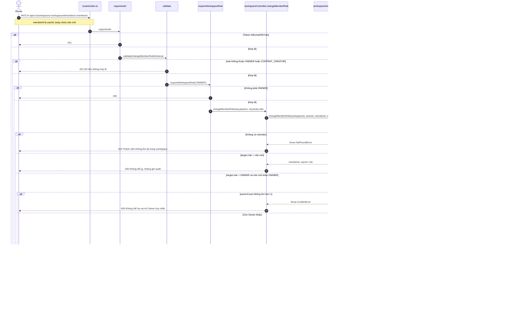
```mermaid
sequenceDiagram
    autonumber
    actor U as Owner
    participant RT as routes/index.ts
    participant MW as requireAuth
    participant V as validate
    participant WR as requireWorkspaceRole
    participant C as workspaceController.changeMemberRole
    participant S as workspaceService.changeMemberRole
    participant R as workspaceRepository
    participant DB as PostgreSQL
    participant AU as auditService.recordAuditLog

    U->>RT: PATCH /api/v1/workspaces/:workspaceId/members/:memberId
    Note over U,RT: memberId là userId, body chứa role mới
    RT->>MW: requireAuth
    alt Token thiếu/sai/hết hạn
        MW-->>U: 401
    else Hợp lệ
        MW->>V: validate(changeMemberRoleSchema)
        alt role không thuộc OWNER hoặc CONTENT_CREATOR
            V-->>U: 422 Dữ liệu không hợp lệ
        else Hợp lệ
            V->>WR: requireWorkspaceRole('OWNER')
            alt Không phải OWNER
                WR-->>U: 403
            else Hợp lệ
                WR->>C: changeMemberRole(req.params, req.body.role)
                C->>S: changeMemberRole(workspaceId, actorId, memberId, role)
                S->>R: findMember(workspaceId, targetUserId)
                R->>DB: prisma.workspaceMember.findUnique
                alt Không có member
                    S-->>C: throw NotFoundError
                    C-->>U: 404 Thành viên không tồn tại trong workspace
                else target.role = role mới
                    S-->>C: memberId, userId, role
                    C-->>U: 200 Không đổi gì, không ghi audit
                else target.role = OWNER và role mới khác OWNER
                    S->>R: countOwners(workspaceId)
                    R->>DB: prisma.workspaceMember.count role OWNER
                    alt ownerCount không lớn hơn 1
                        S-->>C: throw ConflictError
                        C-->>U: 409 Không thể hạ vai trò Owner duy nhất
                    else Còn Owner khác
                        S->>R: updateMemberRole(workspaceId, targetUserId, role)
                        R->>DB: prisma.workspaceMember.update
                        S->>AU: recordAuditLog(MEMBER_ROLE_CHANGED)
                        AU->>DB: prisma.auditLog.create
                        S-->>C: memberId, userId, role
                        C-->>U: 200 Cập nhật vai trò thành viên thành công
                    end
                else Trường hợp còn lại
                    S->>R: updateMemberRole(workspaceId, targetUserId, role)
                    R->>DB: prisma.workspaceMember.update
                    S->>AU: recordAuditLog(MEMBER_ROLE_CHANGED)
                    AU->>DB: prisma.auditLog.create
                    S-->>C: memberId, userId, role
                    C-->>U: 200 Cập nhật vai trò thành viên thành công
                end
            end
        end
    end
```

`memberId` trong response là id bản ghi `WorkspaceMember`, còn `memberId` trên URL là `userId`.
Nếu role không đổi, service trả sớm và **không** ghi audit.

---

## 4. Brand Voice

### UC25 và UC26. Cập nhật Brand Voice (`PUT /workspaces/:workspaceId/brand-voice`)

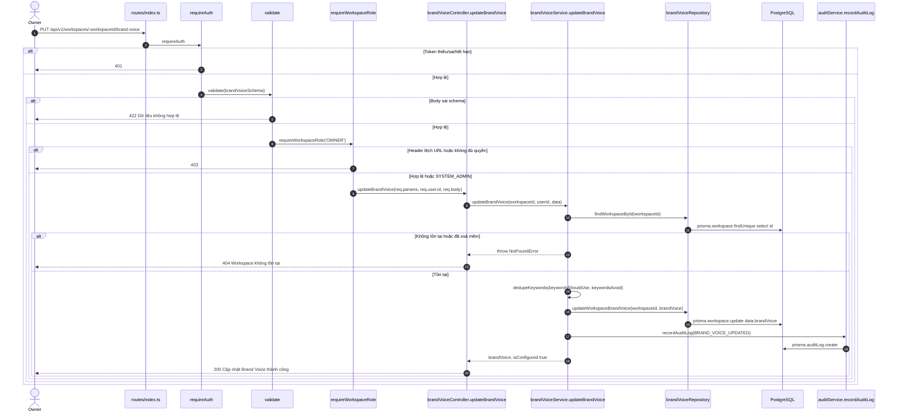
```mermaid
sequenceDiagram
    autonumber
    actor U as Owner
    participant RT as routes/index.ts
    participant MW as requireAuth
    participant V as validate
    participant WR as requireWorkspaceRole
    participant C as brandVoiceController.updateBrandVoice
    participant S as brandVoiceService.updateBrandVoice
    participant R as brandVoiceRepository
    participant DB as PostgreSQL
    participant AU as auditService.recordAuditLog

    U->>RT: PUT /api/v1/workspaces/:workspaceId/brand-voice
    RT->>MW: requireAuth
    alt Token thiếu/sai/hết hạn
        MW-->>U: 401
    else Hợp lệ
        MW->>V: validate(brandVoiceSchema)
        alt Body sai schema
            V-->>U: 422 Dữ liệu không hợp lệ
        else Hợp lệ
            V->>WR: requireWorkspaceRole('OWNER')
            alt Header lệch URL hoặc không đủ quyền
                WR-->>U: 403
            else Hợp lệ hoặc SYSTEM_ADMIN
                WR->>C: updateBrandVoice(req.params, req.user.id, req.body)
                C->>S: updateBrandVoice(workspaceId, userId, data)
                S->>R: findWorkspaceById(workspaceId)
                R->>DB: prisma.workspace.findUnique select id
                alt Không tồn tại hoặc đã xoá mềm
                    S-->>C: throw NotFoundError
                    C-->>U: 404 Workspace không tồn tại
                else Tồn tại
                    S->>S: dedupeKeywords(keywordsShouldUse, keywordsAvoid)
                    S->>R: updateWorkspaceBrandVoice(workspaceId, brandVoice)
                    R->>DB: prisma.workspace.update data.brandVoice
                    S->>AU: recordAuditLog(BRAND_VOICE_UPDATED)
                    AU->>DB: prisma.auditLog.create
                    S-->>C: brandVoice, isConfigured true
                    C-->>U: 200 Cập nhật Brand Voice thành công
                end
            end
        end
    end
```

Hai mảng `keywordsShouldUse` và `keywordsAvoid` được khử trùng lặp bằng `Set` trước khi lưu.
`fewShotExamples` tối đa 3 bài, mỗi bài `content` 10–5000 ký tự.

### UC27. Lấy Brand Voice (`GET /workspaces/:workspaceId/brand-voice`)

```mermaid
sequenceDiagram
    autonumber
    actor U as Thành viên
    participant RT as routes/index.ts
    participant MW as requireAuth
    participant V as validate
    participant WR as requireWorkspaceRole
    participant C as brandVoiceController.getBrandVoice
    participant S as brandVoiceService.getBrandVoice
    participant R as brandVoiceRepository
    participant DB as PostgreSQL

    U->>RT: GET /api/v1/workspaces/:workspaceId/brand-voice
    RT->>MW: requireAuth
    alt Token thiếu/sai/hết hạn
        MW-->>U: 401
    else Hợp lệ
        MW->>V: validate(workspaceOnlySchema)
        alt workspaceId sai
            V-->>U: 422
        else Hợp lệ
            V->>WR: requireWorkspaceRole()
            alt Không phải thành viên
                WR-->>U: 403
            else Là thành viên hoặc SYSTEM_ADMIN
                WR->>C: getBrandVoice(req.params)
                C->>S: getBrandVoice(workspaceId)
                S->>R: getWorkspaceBrandVoice(workspaceId)
                R->>DB: prisma.workspace.findUnique select brandVoice
                DB-->>R: Workspace hoặc null
                alt Không tồn tại
                    S-->>C: throw NotFoundError
                    C-->>U: 404 Workspace không tồn tại
                else Tồn tại
                    S-->>C: brandVoice hoặc null, isConfigured
                    C-->>U: 200 ApiResponse.success
                end
            end
        end
    end
```

Chưa cấu hình trả `brandVoice = null`, `isConfigured = false` với HTTP `200`, không phải `404`.

---

## 5. Channel và Facebook OAuth

### UC28. Danh sách kênh (`GET /workspaces/:workspaceId/channels`)

```mermaid
sequenceDiagram
    autonumber
    actor U as Thành viên
    participant RT as routes/index.ts
    participant MW as requireAuth
    participant V as validate
    participant WR as requireWorkspaceRole
    participant C as channelController.listChannels
    participant S as channelService.listChannels
    participant R as channelRepository
    participant DB as PostgreSQL

    U->>RT: GET /api/v1/workspaces/:workspaceId/channels
    RT->>MW: requireAuth
    alt Token thiếu/sai/hết hạn
        MW-->>U: 401
    else Hợp lệ
        MW->>V: validate(listChannelsSchema)
        alt workspaceId sai
            V-->>U: 422
        else Hợp lệ
            V->>WR: requireWorkspaceRole()
            alt Không phải thành viên
                WR-->>U: 403
            else Là thành viên hoặc SYSTEM_ADMIN
                WR->>C: listChannels(req.params)
                C->>S: listChannels(workspaceId)
                S->>R: findChannelsByWorkspace(workspaceId)
                R->>DB: prisma.channelConnection.findMany
                Note over R,DB: select CHANNEL_PUBLIC_SELECT, orderBy createdAt desc
                DB-->>R: ChannelSummary[]
                R-->>S: channels
                S-->>C: channels
                C-->>U: 200 Lấy danh sách kênh thành công
            end
        end
    end
```

`CHANNEL_PUBLIC_SELECT` không có `accessToken`; token Page không bao giờ trả về client.

### UC29. Kết nối Facebook Page qua OAuth

#### Bước 1 — Lấy URL đăng nhập Facebook (`GET /channels/FACEBOOK/oauth/url`)

```mermaid
sequenceDiagram
    autonumber
    actor U as Owner
    participant RT as routes/index.ts
    participant MW as requireAuth
    participant V as validate
    participant WR as requireWorkspaceRole
    participant C as channelController.getOauthUrl
    participant S as channelService.createAuthUrl
    participant OS as channel.oauth-store
    participant RD as Redis
    participant FB as facebookClient

    U->>RT: GET /api/v1/channels/FACEBOOK/oauth/url?workspaceId=...
    RT->>MW: requireAuth
    alt Token thiếu/sai/hết hạn
        MW-->>U: 401
    else Hợp lệ
        MW->>V: validate(oauthUrlSchema)
        alt Query workspaceId sai
            V-->>U: 422
        else Hợp lệ
            V->>WR: requireWorkspaceRole('OWNER')
            alt Không phải OWNER
                WR-->>U: 403
            else Hợp lệ
                WR->>C: getOauthUrl(req.workspaceId, req.user.id)
                C->>S: createAuthUrl(workspaceId, userId)
                S->>FB: facebookClient.isFacebookConfigured()
                alt Thiếu FACEBOOK_APP_ID, APP_SECRET hoặc REDIRECT_URI
                    S-->>C: throw BadRequestError
                    C-->>U: 400 Chưa cấu hình Facebook App
                else Đã cấu hình
                    S->>S: state = randomBytes(32).toString('hex')
                    S->>OS: saveOauthState(state, userId, workspaceId)
                    OS->>RD: SETEX fb:oauth:state:state 600
                    S->>FB: buildAuthorizationUrl(state)
                    FB-->>S: URL dialog/oauth kèm scope pages_show_list, pages_read_engagement, pages_manage_posts
                    S-->>C: url
                    C-->>U: 200 data.url
                end
            end
        end
    end
```

`req.workspaceId` do `requireWorkspaceRole` gán từ query `workspaceId`; state sống 600 giây.

#### Bước 2 — Facebook redirect về callback (`GET /channels/FACEBOOK/oauth/callback`)

```mermaid
sequenceDiagram
    autonumber
    actor FB as Facebook
    participant RT as routes/index.ts
    participant V as validate
    participant C as channelController.oauthCallback
    participant S as channelService.handleOauthCallback
    participant OS as channel.oauth-store
    participant RD as Redis
    participant API as facebookClient
    participant G as Facebook Graph API

    FB->>RT: GET /api/v1/channels/FACEBOOK/oauth/callback?code&state
    RT->>V: validate(oauthCallbackSchema)
    alt Query sai kiểu
        V-->>FB: 422 Dữ liệu không hợp lệ
    else Hợp lệ
        V->>C: oauthCallback(req.query)
        C->>S: handleOauthCallback(query)
        alt query.error tồn tại
            S->>OS: consumeOauthState(query.state) nếu có state
            OS->>RD: GETDEL fb:oauth:state:state
            Note over S: lỗi xoá state chỉ logger.warn
            S-->>C: CLIENT_URL/channels?platform=FACEBOOK&connect_error=access_denied hoặc token_exchange_failed
            C-->>FB: 302 redirect
        else Thiếu code hoặc state
            S-->>C: errorRedirect('invalid_state')
            C-->>FB: 302 redirect platform=FACEBOOK&connect_error=invalid_state
        else Có code và state
            S->>OS: consumeOauthState(state)
            OS->>RD: GETDEL
            alt State không tồn tại hoặc đã dùng
                S-->>C: errorRedirect('invalid_state')
                C-->>FB: 302 redirect platform=FACEBOOK&connect_error=invalid_state
            else State hợp lệ
                S->>API: exchangeCodeForToken(code)
                API->>G: GET /oauth/access_token
                G-->>API: short-lived token
                S->>API: exchangeForLongLivedToken(shortToken)
                API->>G: GET /oauth/access_token grant_type fb_exchange_token
                G-->>API: long-lived user token
                S->>API: fetchManagedPages(userToken)
                API->>G: GET /me/accounts kèm appsecret_proof
                G-->>API: danh sách Page
                alt Không có Page nào
                    S-->>C: errorRedirect('no_accounts')
                    C-->>FB: 302 redirect reason=no_accounts
                else Có Page
                    S->>S: sessionId = randomBytes(24).toString('hex')
                    S->>S: encrypt(accessToken) từng Page bằng AES-256-GCM
                    S->>OS: saveOauthSession(sessionId, userId, workspaceId, pages)
                    OS->>RD: SETEX fb:oauth:session:sessionId 600
                    S-->>C: CLIENT_URL/channels?connect=FACEBOOK&session=sessionId
                    C-->>FB: 302 redirect
                end
            end
        end
    end
```

Callback là endpoint công khai, **không** dùng `ApiResponse`; mọi nhánh đều trả `302` về
`CLIENT_URL/channels`. Lỗi gọi Graph API được log `logger.warn` và redirect
`connect_error=token_exchange_failed`. `fetchManagedPages` chỉ giữ Page có `access_token`; Page mà
người dùng không có quyền quản lý bị loại khỏi danh sách.

#### Bước 3 — Xem danh sách Page trong phiên (`GET /channels/FACEBOOK/oauth/session/:sessionId`)

```mermaid
sequenceDiagram
    autonumber
    actor U as Owner
    participant RT as routes/index.ts
    participant MW as requireAuth
    participant V as validate
    participant WR as requireWorkspaceRole
    participant C as channelController.getPendingAccounts
    participant S as channelService.getPendingAccounts
    participant OS as channel.oauth-store
    participant RD as Redis

    U->>RT: GET /api/v1/channels/FACEBOOK/oauth/session/:sessionId
    RT->>MW: requireAuth
    alt Token thiếu/sai/hết hạn
        MW-->>U: 401
    else Hợp lệ
        MW->>V: validate(oauthSessionSchema)
        alt sessionId không khớp 48 ký tự hex
            V-->>U: 422
        else Hợp lệ
            V->>WR: requireWorkspaceRole('OWNER')
            alt Thiếu workspaceId trên header x-workspace-id
                WR-->>U: 400 Vui lòng cung cấp Workspace ID
            else Không phải OWNER
                WR-->>U: 403
            else Hợp lệ
                WR->>C: getPendingAccounts(sessionId, userId, workspaceId)
                C->>S: getPendingAccounts(sessionId, userId, workspaceId)
                S->>OS: getOauthSession(sessionId)
                OS->>RD: GET fb:oauth:session:sessionId
                RD-->>OS: JSON hoặc null
                alt Không có session hoặc session.userId/workspaceId không khớp
                    S-->>C: throw NotFoundError
                    C-->>U: 404 Phiên kết nối không tồn tại hoặc đã hết hạn
                else Khớp
                    S->>S: map id, name, avatar, bỏ accessTokenEncrypted
                    S-->>C: pages
                    C-->>U: 200 Lấy danh sách Page thành công
                end
            end
        end
    end
```

Session thuộc đúng user **và** workspace hiện tại; token Page không có trong response. Bước 3 và
bước 4 không có `:workspaceId` trên URL, nên client phải gửi header `x-workspace-id`; thiếu
header → `400`.

#### Bước 4 — Chọn Page để lưu kênh (`POST /channels/FACEBOOK/oauth/session/:sessionId/connect`)

```mermaid
sequenceDiagram
    autonumber
    actor U as Owner
    participant RT as routes/index.ts
    participant MW as requireAuth
    participant V as validate
    participant WR as requireWorkspaceRole
    participant C as channelController.connectAccounts
    participant S as channelService.connectAccounts
    participant OS as channel.oauth-store
    participant RD as Redis
    participant EN as utils/encryption
    participant R as channelRepository
    participant DB as PostgreSQL
    participant AU as auditService.recordAuditLog

    U->>RT: POST /channels/FACEBOOK/oauth/session/:sessionId/connect
    RT->>MW: requireAuth
    alt Token thiếu/sai/hết hạn
        MW-->>U: 401
    else Hợp lệ
        MW->>V: validate(connectAccountsSchema)
        alt accountIds rỗng, quá 50 hoặc sessionId sai
            V-->>U: 422 Dữ liệu không hợp lệ
        else Hợp lệ
            V->>WR: requireWorkspaceRole('OWNER')
            alt Thiếu workspaceId trên header x-workspace-id
                WR-->>U: 400 Vui lòng cung cấp Workspace ID
            else Không phải OWNER
                WR-->>U: 403
            else Hợp lệ
                WR->>C: connectAccounts(sessionId, userId, workspaceId, accountIds)
                C->>S: connectAccounts(...)
                S->>OS: getOauthSession(sessionId)
                OS->>RD: GET
                alt Session không tồn tại hoặc sai chủ
                    S-->>C: throw NotFoundError
                    C-->>U: 404 Phiên kết nối không tồn tại hoặc đã hết hạn
                else Session hợp lệ
                    S->>S: uniqueAccountIds, đối chiếu accountsById
                    alt Có pageId không thuộc session
                        S-->>C: throw BadRequestError
                        C-->>U: 400 Page không hợp lệ trong phiên kết nối
                    else Tất cả hợp lệ
                        S->>EN: decrypt(accessTokenEncrypted) từng Page
                        alt decrypt trả falsy
                            S-->>C: throw BadRequestError
                            C-->>U: 400 Không đọc được token của Page
                        else Giải mã được
                            EN-->>S: token hợp lệ
                            S->>R: upsertChannels(workspaceId, pages)
                            R->>DB: prisma.$transaction nhiều upsert
                            Note over R,DB: unique workspaceId + FACEBOOK + externalAccountId<br/>type REAL, status ACTIVE
                            DB-->>R: ChannelSummary[]
                            R-->>S: channels
                            S->>AU: recordAuditLog(CHANNEL_CONNECTED) cho từng kênh
                            AU->>DB: prisma.auditLog.create
                            S->>OS: deleteOauthSession(sessionId)
                            OS->>RD: DEL
                            S-->>C: channels
                            C-->>U: 201 Kết nối Facebook thành công
                        end
                    end
                end
            end
        end
    end
```

`accountIds` được khử trùng lặp trước khi đối chiếu. Token Page vẫn ở dạng mã hoá khi lưu
`ChannelConnection.accessToken`; `decrypt` chỉ dùng để kiểm tra token đọc được. Nếu ciphertext
hỏng, `decrypt` ném lỗi; `connectAccounts` không bắt lỗi này nên `errorHandler` trả `500`.

### UC30. Ngắt kết nối kênh (`DELETE /channels/:channelId`)

```mermaid
sequenceDiagram
    autonumber
    actor U as Owner
    participant RT as routes/index.ts
    participant MW as requireAuth
    participant V as validate
    participant WR as requireWorkspaceRole
    participant C as channelController.disconnectChannel
    participant S as channelService.disconnectChannel
    participant R as channelRepository
    participant DB as PostgreSQL
    participant AU as auditService.recordAuditLog

    U->>RT: DELETE /api/v1/channels/:channelId
    Note over U,RT: workspaceId lấy từ header, query hoặc body vì URL không có :workspaceId
    RT->>MW: requireAuth
    alt Token thiếu/sai/hết hạn
        MW-->>U: 401
    else Hợp lệ
        MW->>V: validate(channelIdSchema)
        alt channelId không phải UUID
            V-->>U: 422
        else Hợp lệ
            V->>WR: requireWorkspaceRole('OWNER')
            alt Thiếu workspaceId
                WR-->>U: 400
            else Không phải OWNER
                WR-->>U: 403
            else Hợp lệ
                WR->>C: disconnectChannel(req.params, req.workspaceId, req.user.id)
                C->>S: disconnectChannel(channelId, workspaceId, userId)
                S->>R: findChannelInWorkspace(channelId, workspaceId)
                R->>DB: prisma.channelConnection.findFirst where id và workspaceId
                alt Không có kênh trong workspace
                    S-->>C: throw NotFoundError
                    C-->>U: 404 Kênh không tồn tại
                else Có kênh
                    S->>R: deleteChannelAndCancelSchedules(channelId)
                    R->>DB: prisma.$transaction
                    Note over R,DB: UPDATE ScheduledPost SCHEDULED thành CANCELLED<br/>DELETE ChannelConnection
                    S->>AU: recordAuditLog(CHANNEL_DISCONNECTED)
                    AU->>DB: prisma.auditLog.create
                    S-->>C: success true
                    C-->>U: 200 Ngắt kết nối kênh thành công
                end
            end
        end
    end
```

Kênh của workspace khác bị coi là không tồn tại (`404`), không lộ sự tồn tại của bản ghi.

---

## 6. Post và Media

Mọi endpoint post đều yêu cầu `requireAuth` + `requireWorkspaceRole()` (mọi thành viên).
Quyền sửa/xoá ở tầng service: `OWNER` thao tác mọi bài, `CONTENT_CREATOR` chỉ thao tác bài có
`createdById = userId`.

### UC06. Tạo bài viết (`POST /workspaces/:workspaceId/posts`)

```mermaid
sequenceDiagram
    autonumber
    actor U as Thành viên
    participant RT as routes/index.ts
    participant MW as requireAuth
    participant V as validate
    participant WR as requireWorkspaceRole
    participant C as postController.createPost
    participant S as postService.createPost
    participant R as postRepository
    participant DB as PostgreSQL

    U->>RT: POST /api/v1/workspaces/:workspaceId/posts
    RT->>MW: requireAuth
    alt Token thiếu/sai/hết hạn
        MW-->>U: 401
    else Hợp lệ
        MW->>V: validate(createPostSchema)
        alt title rỗng hoặc content không phải object
            V-->>U: 422 Dữ liệu không hợp lệ
        else Hợp lệ
            V->>WR: requireWorkspaceRole()
            alt Không phải thành viên
                WR-->>U: 403
            else Là thành viên hoặc SYSTEM_ADMIN
                WR->>C: createPost(req.workspaceId, req.user.id, req.body)
                C->>S: createPost(workspaceId, userId, title, content)
                S->>R: createPost(workspaceId, title, content, createdById)
                R->>DB: prisma.post.create
                Note over R,DB: status mặc định DRAFT
                DB-->>R: Post
                R-->>S: Post
                S-->>C: Post
                C-->>U: 201 Tạo bản nháp thành công
            end
        end
    end
```

Tạo bài **không** ghi audit và **không** tự gắn kênh hay lịch đăng.

### UC10. Danh sách và tìm kiếm bài viết (`GET /workspaces/:workspaceId/posts`)

```mermaid
sequenceDiagram
    autonumber
    actor U as Thành viên
    participant RT as routes/index.ts
    participant MW as requireAuth
    participant V as validate
    participant WR as requireWorkspaceRole
    participant C as postController.listPosts
    participant S as postService.listPosts
    participant R as postRepository
    participant DB as PostgreSQL

    U->>RT: GET /api/v1/workspaces/:workspaceId/posts?page&limit&search&status...
    RT->>MW: requireAuth
    alt Token thiếu/sai/hết hạn
        MW-->>U: 401
    else Hợp lệ
        MW->>V: validate(listPostsSchema)
        alt Query sai, ví dụ dateTo nhỏ hơn dateFrom
            V-->>U: 422 Dữ liệu không hợp lệ
        else Hợp lệ
            V->>WR: requireWorkspaceRole()
            alt Không phải thành viên
                WR-->>U: 403
            else Là thành viên hoặc SYSTEM_ADMIN
                WR->>C: listPosts(req.workspaceId, req.query)
                C->>S: listPosts(workspaceId, query)
                S->>R: listPostsAndCount(workspaceId, skip, take, search, status, createdById, dateFrom, dateTo)
                R->>DB: prisma.$transaction([post.findMany, post.count])
                Note over R,DB: where workspaceId, title contains search, status, createdById, createdAt trong khoảng<br/>orderBy updatedAt desc, skip/take
                DB-->>R: [posts, total]
                R-->>S: posts, total
                S->>S: meta = page, limit, total, totalPages
                S-->>C: posts, meta
                C-->>U: 200 data.posts + meta
            end
        end
    end
```

`findMany` chỉ select `id`, `title`, `status`, `createdById`, `createdAt`, `updatedAt`.
Prisma extension tự thêm `deletedAt = null` cho `Post`, nên bài xoá mềm không xuất hiện.

### UC09. Xem chi tiết bài viết (`GET /workspaces/:workspaceId/posts/:postId`)

```mermaid
sequenceDiagram
    autonumber
    actor U as Thành viên
    participant RT as routes/index.ts
    participant MW as requireAuth
    participant V as validate
    participant WR as requireWorkspaceRole
    participant C as postController.getPost
    participant S as postService.getPost
    participant R as postRepository
    participant DB as PostgreSQL

    U->>RT: GET /api/v1/workspaces/:workspaceId/posts/:postId
    RT->>MW: requireAuth
    alt Token thiếu/sai/hết hạn
        MW-->>U: 401
    else Hợp lệ
        MW->>V: validate(postIdSchema)
        alt postId hoặc workspaceId sai UUID
            V-->>U: 422
        else Hợp lệ
            V->>WR: requireWorkspaceRole()
            alt Không phải thành viên
                WR-->>U: 403
            else Là thành viên hoặc SYSTEM_ADMIN
                WR->>C: getPost(req.workspaceId, req.params.postId)
                C->>S: getPost(workspaceId, postId)
                S->>R: findPostWithMedia(postId, workspaceId)
                R->>DB: prisma.post.findFirst where id và workspaceId
                Note over R,DB: include mediaAssets where deletedAt null, orderBy createdAt asc
                DB-->>R: Post hoặc null
                alt Không tìm thấy
                    S-->>C: throw NotFoundError
                    C-->>U: 404 Bài viết không tồn tại
                else Tìm thấy
                    S-->>C: Post kèm mediaAssets
                    C-->>U: 200 Lấy chi tiết bài viết thành công
                end
            end
        end
    end
```

Bài của workspace khác trả `404` vì truy vấn luôn kèm `workspaceId`.

### UC08. Cập nhật bài viết (`PATCH /workspaces/:workspaceId/posts/:postId`)

```mermaid
sequenceDiagram
    autonumber
    actor U as Thành viên
    participant RT as routes/index.ts
    participant MW as requireAuth
    participant V as validate
    participant WR as requireWorkspaceRole
    participant C as postController.updatePost
    participant S as postService.updatePost
    participant R as postRepository
    participant DB as PostgreSQL

    U->>RT: PATCH /api/v1/workspaces/:workspaceId/posts/:postId
    RT->>MW: requireAuth
    alt Token thiếu/sai/hết hạn
        MW-->>U: 401
    else Hợp lệ
        MW->>V: validate(updatePostSchema)
        alt Body rỗng hoặc sai kiểu
            V-->>U: 422 Dữ liệu không hợp lệ
        else Hợp lệ
            V->>WR: requireWorkspaceRole()
            alt Không phải thành viên
                WR-->>U: 403
            else Là thành viên hoặc SYSTEM_ADMIN
                WR->>C: updatePost(req.workspaceId, req.user, req.workspaceRole, req.params, req.body)
                C->>S: updatePost(workspaceId, userId, role, postId, data)
                S->>S: getPost(workspaceId, postId)
                S->>R: findPostWithMedia(postId, workspaceId)
                R->>DB: prisma.post.findFirst
                alt Không tìm thấy
                    S-->>C: throw NotFoundError
                    C-->>U: 404 Bài viết không tồn tại
                else Tìm thấy
                    S->>S: assertCanModify(post, userId, role)
                    alt CONTENT_CREATOR và không phải người tạo
                        S-->>C: throw ForbiddenError
                        C-->>U: 403 Bạn không có quyền thay đổi bài viết này
                    else OWNER hoặc đúng người tạo
                        S->>S: assertEditable(post)
                        alt status không phải DRAFT hoặc REJECTED
                            S-->>C: throw ConflictError
                            C-->>U: 409 Chỉ có thể thay đổi bản nháp hoặc bài bị từ chối
                        else Hợp lệ
                            S->>R: updatePost(postId, data)
                            R->>DB: prisma.post.update
                            DB-->>R: Post
                            S-->>C: Post
                            C-->>U: 200 Cập nhật bản nháp thành công
                        end
                    end
                end
            end
        end
    end
```

### UC11. Xoá bài viết (`DELETE /workspaces/:workspaceId/posts/:postId`)

```mermaid
sequenceDiagram
    autonumber
    actor U as Thành viên
    participant RT as routes/index.ts
    participant MW as requireAuth
    participant V as validate
    participant WR as requireWorkspaceRole
    participant C as postController.deletePost
    participant S as postService.deletePost
    participant R as postRepository
    participant DB as PostgreSQL

    U->>RT: DELETE /api/v1/workspaces/:workspaceId/posts/:postId
    RT->>MW: requireAuth
    alt Token thiếu/sai/hết hạn
        MW-->>U: 401
    else Hợp lệ
        MW->>V: validate(postIdSchema)
        alt postId sai UUID
            V-->>U: 422
        else Hợp lệ
            V->>WR: requireWorkspaceRole()
            alt Không phải thành viên
                WR-->>U: 403
            else Là thành viên hoặc SYSTEM_ADMIN
                WR->>C: deletePost(req.workspaceId, req.user, req.workspaceRole, req.params)
                C->>S: deletePost(workspaceId, userId, role, postId)
                S->>S: getPost(workspaceId, postId)
                S->>R: findPostWithMedia(postId, workspaceId)
                R->>DB: prisma.post.findFirst
                alt Không tìm thấy
                    S-->>C: throw NotFoundError
                    C-->>U: 404 Bài viết không tồn tại
                else Tìm thấy
                    S->>S: assertCanModify(post, userId, role)
                    alt Không có quyền
                        S-->>C: throw ForbiddenError
                        C-->>U: 403
                    else Có quyền
                        S->>S: assertEditable(post)
                        alt status không phải DRAFT hoặc REJECTED
                            S-->>C: throw ConflictError
                            C-->>U: 409 Chỉ có thể thay đổi bản nháp hoặc bài bị từ chối
                        else Hợp lệ
                            S->>R: softDeletePost(postId)
                            R->>DB: prisma.post.update deletedAt = now
                            S-->>C: success true
                            C-->>U: 200 Xóa bài viết thành công
                        end
                    end
                end
            end
        end
    end
```

Xoá bài là xoá mềm (`Post.deletedAt`), không xoá `MediaAsset` liên quan và không ghi audit.

### Media của bài viết (thuộc UC06/UC08)

#### Upload ảnh (`POST /workspaces/:workspaceId/posts/:postId/media`)

```mermaid
sequenceDiagram
    autonumber
    actor U as Thành viên
    participant RT as routes/index.ts
    participant MW as requireAuth
    participant V as validate
    participant WR as requireWorkspaceRole
    participant UP as uploadPostMedia multer
    participant C as postController.uploadPostMedia
    participant S as postService.uploadPostMedia
    participant R as postRepository
    participant DB as PostgreSQL
    participant CL as Cloudinary

    U->>RT: POST /api/v1/workspaces/:workspaceId/posts/:postId/media multipart field file
    RT->>MW: requireAuth
    alt Token thiếu/sai/hết hạn
        MW-->>U: 401
    else Hợp lệ
        MW->>V: validate(postMediaSchema)
        alt postId sai UUID
            V-->>U: 422
        else Hợp lệ
            V->>WR: requireWorkspaceRole()
            alt Không phải thành viên
                WR-->>U: 403
            else Là thành viên hoặc SYSTEM_ADMIN
                WR->>UP: multer memoryStorage single('file')
                alt Sai MIME
                    UP-->>U: 400 Chỉ chấp nhận ảnh JPG, PNG hoặc WEBP
                else File vượt 10MB
                    UP-->>U: 400 Ảnh vượt quá 10MB
                else Hợp lệ
                    UP->>C: uploadPostMedia(req.params, req.file)
                    C->>S: uploadPostMedia(workspaceId, userId, role, postId, file)
                    alt Không có file
                        S-->>C: throw BadRequestError
                        C-->>U: 400 Vui lòng chọn ảnh để tải lên
                    else Có file
                        S->>R: findPostWithMedia(postId, workspaceId)
                        R->>DB: prisma.post.findFirst
                        alt Không tìm thấy bài
                            S-->>C: throw NotFoundError
                            C-->>U: 404 Bài viết không tồn tại
                        else Tìm thấy
                            S->>S: assertCanModify và assertEditable
                            alt Không có quyền
                                S-->>C: throw ForbiddenError
                                C-->>U: 403
                            else Bài không ở DRAFT/REJECTED
                                S-->>C: throw ConflictError
                                C-->>U: 409 Chỉ có thể thay đổi bản nháp hoặc bài bị từ chối
                            else Hợp lệ
                                S->>CL: cloudinaryClient.uploadImageBuffer(file.buffer, marka/workspaces/:id/posts/:postId)
                                alt Cloudinary chưa cấu hình hoặc lỗi
                                    CL-->>S: throw BadRequestError
                                    S-->>C: throw
                                    C-->>U: 400 Chưa cấu hình Cloudinary hoặc tải ảnh thất bại
                                else Thành công
                                    CL-->>S: secure_url
                                    S->>R: createMedia(workspaceId, postId, url, mimeType, size, createdById)
                                    R->>DB: prisma.mediaAsset.create type IMAGE, source UPLOADED
                                    DB-->>R: MediaAsset
                                    S-->>C: MediaAsset
                                    C-->>U: 201 Tải ảnh lên thành công
                                end
                            end
                        end
                    end
                end
            end
        end
    end
```

#### Xoá ảnh (`DELETE /workspaces/:workspaceId/posts/:postId/media/:mediaId`)

```mermaid
sequenceDiagram
    autonumber
    actor U as Thành viên
    participant RT as routes/index.ts
    participant MW as requireAuth
    participant V as validate
    participant WR as requireWorkspaceRole
    participant C as postController.deletePostMedia
    participant S as postService.deletePostMedia
    participant R as postRepository
    participant DB as PostgreSQL

    U->>RT: DELETE /api/v1/workspaces/:workspaceId/posts/:postId/media/:mediaId
    RT->>MW: requireAuth
    alt Token thiếu/sai/hết hạn
        MW-->>U: 401
    else Hợp lệ
        MW->>V: validate(deletePostMediaSchema)
        alt postId hoặc mediaId sai UUID
            V-->>U: 422
        else Hợp lệ
            V->>WR: requireWorkspaceRole()
            alt Không phải thành viên
                WR-->>U: 403
            else Là thành viên hoặc SYSTEM_ADMIN
                WR->>C: deletePostMedia(req.params, req.user, req.workspaceRole)
                C->>S: deletePostMedia(workspaceId, userId, role, postId, mediaId)
                S->>S: getPost(workspaceId, postId)
                S->>R: findPostWithMedia(postId, workspaceId)
                R->>DB: prisma.post.findFirst
                alt Không tìm thấy bài
                    S-->>C: throw NotFoundError
                    C-->>U: 404 Bài viết không tồn tại
                else Tìm thấy
                    S->>S: assertCanModify và assertEditable
                    alt Không có quyền
                        S-->>C: throw ForbiddenError
                        C-->>U: 403
                    else Bài không ở DRAFT/REJECTED
                        S-->>C: throw ConflictError
                        C-->>U: 409 Chỉ có thể thay đổi bản nháp hoặc bài bị từ chối
                    else Hợp lệ
                        S->>R: findMediaByIdAndPost(postId, mediaId)
                        R->>DB: prisma.mediaAsset.findFirst
                        alt Không có media trong bài
                            S-->>C: throw NotFoundError
                            C-->>U: 404 Ảnh không tồn tại trong bài viết
                        else Có media
                            S->>R: softDeleteMedia(mediaId)
                            R->>DB: prisma.mediaAsset.update deletedAt = now
                            S-->>C: success true
                            C-->>U: 200 Xóa ảnh thành công
                        end
                    end
                end
            end
        end
    end
```

Xoá media là xoá mềm; file trên Cloudinary không bị xoá.

---

## 7. Luồng duyệt bài

Trạng thái bài viết chỉ chuyển qua các cặp sau (nguồn: `ALLOWED_TRANSITIONS` trong
`post.service.ts`):

| Từ | Sang | Endpoint |
| :--- | :--- | :--- |
| `DRAFT` | `PENDING` | `POST .../submit` |
| `REJECTED` | `PENDING` | `POST .../submit` |
| `PENDING` | `APPROVED` | `PATCH .../review` |
| `PENDING` | `REJECTED` | `PATCH .../review` |

Các trạng thái `SCHEDULED`, `PUBLISHED`, `FAILED`, `ARCHIVED` có trong enum nhưng chưa có
endpoint nào chuyển tới.

### UC12. Gửi bài duyệt (`POST /workspaces/:workspaceId/posts/:postId/submit`)

```mermaid
sequenceDiagram
    autonumber
    actor U as Thành viên
    participant RT as routes/index.ts
    participant MW as requireAuth
    participant V as validate
    participant WR as requireWorkspaceRole
    participant C as postController.submitPost
    participant S as postService.submitPost
    participant R as postRepository
    participant DB as PostgreSQL
    participant NT as postNotification.notifyPostSubmitted
    participant MAIL as MailerClient
    participant AU as auditService.recordAuditLog

    U->>RT: POST /api/v1/workspaces/:workspaceId/posts/:postId/submit
    RT->>MW: requireAuth
    alt Token thiếu/sai/hết hạn
        MW-->>U: 401
    else Hợp lệ
        MW->>V: validate(postIdSchema)
        alt postId sai UUID
            V-->>U: 422
        else Hợp lệ
            V->>WR: requireWorkspaceRole()
            alt Không phải thành viên
                WR-->>U: 403
            else Là thành viên hoặc SYSTEM_ADMIN
                WR->>C: submitPost(req.params, req.user, req.workspaceRole)
                C->>S: submitPost(workspaceId, userId, userName, role, postId)
                S->>S: getPost(workspaceId, postId)
                S->>R: findPostWithMedia(postId, workspaceId)
                R->>DB: prisma.post.findFirst
                alt Không tìm thấy bài
                    S-->>C: throw NotFoundError
                    C-->>U: 404 Bài viết không tồn tại
                else Tìm thấy
                    S->>S: assertCanModify(post, userId, role)
                    alt CONTENT_CREATOR không phải người tạo
                        S-->>C: throw ForbiddenError
                        C-->>U: 403
                    else Có quyền
                        S->>S: transitionPost(post, status PENDING)
                        alt status hiện tại không phải DRAFT/REJECTED
                            S-->>C: throw ConflictError
                            C-->>U: 409 Không thể chuyển trạng thái bài viết này
                        else Hợp lệ
                            S->>R: transitionPostStatus(postId, workspaceId, from, data)
                            R->>DB: prisma.post.updateMany where status = from
                            Note over R,DB: set status PENDING, submittedById, submittedAt, rejectReason null
                            alt count = 0 do request đồng thời
                                R-->>S: null
                                S-->>C: throw ConflictError
                                C-->>U: 409 Không thể chuyển trạng thái bài viết này
                            else Cập nhật thành công
                                R-->>S: Post
                                S->>NT: notifyPostSubmitted(workspaceId, postId, title, actorId, actorName)
                                NT->>R: findOwnerIds(workspaceId)
                                R->>DB: prisma.workspaceMember.findMany role OWNER
                                alt Không còn Owner nào khác actor
                                    Note over NT: bỏ qua notification và email
                                else Có Owner
                                    NT->>R: findWorkspaceById(workspaceId)
                                    R->>DB: prisma.workspace.findUnique
                                    loop từng ownerId
                                        NT->>R: createNotification(POST_SUBMITTED)
                                        R->>DB: prisma.notification.create
                                        NT->>R: findUserById(ownerId)
                                        R->>DB: prisma.user.findUnique
                                        NT->>MAIL: mailerClient.sendEmail(buildPostSubmittedEmail)
                                    end
                                end
                                S->>AU: recordAuditLog(POST_SUBMITTED)
                                AU->>DB: prisma.auditLog.create
                                S-->>C: Post
                                C-->>U: 200 Gửi duyệt bài viết thành công
                            end
                        end
                    end
                end
            end
        end
    end
```

Chỉ `DRAFT` và `REJECTED` được chuyển sang `PENDING`; gửi lại bài bị từ chối sẽ xoá
`rejectReason`. Kết quả `mailerClient.sendEmail` cho Owner **không** được kiểm tra, khác với email mời.

### UC15. Duyệt hoặc từ chối bài (`PATCH /workspaces/:workspaceId/posts/:postId/review`)

```mermaid
sequenceDiagram
    autonumber
    actor U as Owner
    participant RT as routes/index.ts
    participant MW as requireAuth
    participant V as validate
    participant WR as requireWorkspaceRole
    participant C as postController.reviewPost
    participant S as postService.reviewPost
    participant R as postRepository
    participant DB as PostgreSQL
    participant NT as postNotification.notifyPostReviewed
    participant MAIL as MailerClient
    participant AU as auditService.recordAuditLog

    U->>RT: PATCH /api/v1/workspaces/:workspaceId/posts/:postId/review
    RT->>MW: requireAuth
    alt Token thiếu/sai/hết hạn
        MW-->>U: 401
    else Hợp lệ
        MW->>V: validate(reviewPostSchema)
        alt decision sai hoặc REJECTED thiếu rejectReason
            V-->>U: 422 Dữ liệu không hợp lệ
        else Hợp lệ
            V->>WR: requireWorkspaceRole('OWNER')
            alt Không phải OWNER
                WR-->>U: 403
            else Hợp lệ hoặc SYSTEM_ADMIN
                WR->>C: reviewPost(req.params, req.user.id, req.body)
                C->>S: reviewPost(workspaceId, reviewerId, postId, decision, rejectReason)
                S->>S: getPost(workspaceId, postId)
                S->>R: findPostWithMedia(postId, workspaceId)
                R->>DB: prisma.post.findFirst
                alt Không tìm thấy bài
                    S-->>C: throw NotFoundError
                    C-->>U: 404 Bài viết không tồn tại
                else Tìm thấy
                    S->>S: transitionPost(post, status APPROVED hoặc REJECTED)
                    alt status hiện tại không phải PENDING
                        S-->>C: throw ConflictError
                        C-->>U: 409 Không thể chuyển trạng thái bài viết này
                    else Hợp lệ
                        S->>R: transitionPostStatus(postId, workspaceId, PENDING, data)
                        R->>DB: prisma.post.updateMany where status PENDING
                        Note over R,DB: set status quyết định, reviewedById, reviewedAt, rejectReason
                        alt count = 0 do request đồng thời
                            R-->>S: null
                            S-->>C: throw ConflictError
                            C-->>U: 409 Không thể chuyển trạng thái bài viết này
                        else Cập nhật thành công
                            R-->>S: Post
                            S->>NT: notifyPostReviewed(workspaceId, postId, title, authorId, approved, rejectReason)
                            alt post.createdById = null
                                Note over NT: bỏ qua notification và email
                            else Có tác giả
                                NT->>R: findWorkspaceById(workspaceId)
                                R->>DB: prisma.workspace.findUnique
                                NT->>R: createNotification(type POST_APPROVED hoặc POST_REJECTED)
                                R->>DB: prisma.notification.create
                                NT->>R: findUserById(authorId)
                                R->>DB: prisma.user.findUnique
                                NT->>MAIL: mailerClient.sendEmail(buildPostReviewedEmail)
                            end
                            S->>AU: recordAuditLog(POST_APPROVED hoặc POST_REJECTED)
                            AU->>DB: prisma.auditLog.create
                            S-->>C: Post
                            C-->>U: 200 Duyệt bài viết thành công hoặc Từ chối bài viết thành công
                        end
                    end
                end
            end
        end
    end
```

`rejectReason` bắt buộc khi `REJECTED` (3–255 ký tự) và được set `null` khi `APPROVED`.
Sau khi duyệt, bài ở `APPROVED`; endpoint schedule chuyển sang `SCHEDULED`, worker cập nhật `PUBLISHED`/`FAILED`.

---

## 8. Bảng đối chiếu UC, endpoint và hàm

Bảng dùng để tra nhanh lớp xử lý của từng endpoint. Tên đầy đủ của repository nằm trong
`backend/src/modules/<feature>/<feature>.repository.ts`.

| UC | Endpoint | Middleware chính | Controller | Service | Repository / Prisma / module phụ trợ | Audit / phụ |
| :--- | :--- | :--- | :--- | :--- | :--- | :--- |
| Health | `GET /health` | `apiLimiter` toàn cục | `healthController.checkHealth` | `healthService.getSystemHealth` | `prisma.$queryRaw`, `cacheConnection.ping` | Không audit |
| UC01 | `POST /auth/register` | `authLimiter`, `validate(registerSchema)` | `authController.register` | `authService.registerUser` | `userRepository.findUserByEmail`, `createUserWithDefaultWorkspace` | `USER_REGISTER`; set cookie refresh |
| UC02 | `POST /auth/login` | `loginLimiter`, `validate(loginSchema)` | `authController.login` | `authService.login` | `userRepository.findUserByEmail` | `USER_LOGIN`; set cookie refresh |
| UC03 | `POST /auth/google` | `authLimiter`, `validate(googleLoginSchema)` | `authController.googleLogin` | `authService.googleLogin` | `findUserByEmail`, `createUserWithDefaultWorkspace`, `linkGoogleAccount` | `USER_GOOGLE_LOGIN`; set cookie refresh |
| UC04 | `POST /auth/logout` | `requireAuth`, `validate(logoutSchema)` | `authController.logout` | `authService.logout` | `userRepository.incrementTokenVersion` | `USER_LOGOUT`; clear cookie refresh |
| UC05 | `PATCH /users/me/password` | `requireAuth`, `validate(changePasswordSchema)` | `userController.changePassword` | `userService.changePassword` | `findUserById`, `updateUser`, `incrementTokenVersion` | `USER_CHANGE_PASSWORD` |
| — | `GET /users/me` | `requireAuth` | `userController.getMe` | `userService.getProfile` | `userRepository.findUserById` | Không audit |
| UC33 | `PATCH /users/me` | `requireAuth`, `validate(updateProfileSchema)` | `userController.updateProfile` | `userService.updateProfile` | `userRepository.updateUser` | `USER_UPDATE_PROFILE` |
| UC34 | `POST /auth/refresh-token` | `validate(refreshTokenSchema)` | `authController.refreshToken` | `authService.refreshToken` | `userRepository.findUserById` | Cấp lại cặp token, set cookie mới |
| UC17 | `POST /workspaces` | `requireAuth`, `validate(createWorkspaceSchema)` | `workspaceController.createWorkspace` | `workspaceService.createWorkspace` | `findWorkspaceByNameAndOwner`, `createWorkspaceWithOwner` | `WORKSPACE_CREATE` |
| UC35 | `GET /workspaces` | `requireAuth` | `workspaceController.listWorkspaces` | `workspaceService.listMyWorkspaces` | `findWorkspacesByUserId` | Không audit |
| UC18 | `PATCH /workspaces/:workspaceId` | `requireAuth`, `validate(updateWorkspaceSchema)`, `requireWorkspaceRole('OWNER')` | `workspaceController.updateWorkspace` | `workspaceService.updateWorkspace` | `findWorkspaceById`, `updateWorkspace` | `WORKSPACE_UPDATE` |
| UC19 | `DELETE /workspaces/:workspaceId` | `requireAuth`, `validate(workspaceOnlySchema)`, `requireWorkspaceRole('OWNER')` | `workspaceController.deleteWorkspace` | `workspaceService.deleteWorkspace` | `findWorkspaceById`, `softDeleteWorkspace` | `WORKSPACE_DELETE`; xoá mềm |
| UC20 | `GET /workspaces/:workspaceId/members` | `requireAuth`, `validate(workspaceOnlySchema)`, `requireWorkspaceRole()` | `workspaceController.listMembers` | `workspaceService.listMembers` | `findWorkspaceById`, `findMembersByWorkspace`, `findPendingInvitesByWorkspace` | Không audit |
| UC21 | `POST /workspaces/:workspaceId/invites` | `requireAuth`, `validate(inviteMemberSchema)`, `requireWorkspaceRole('OWNER')` | `workspaceController.inviteMember` | `workspaceService.inviteMember` | `findWorkspaceById`, `findUserByEmail`, `findMember`, `findActiveInviteByEmail`, `createInvite` / `refreshInvite` | `MEMBER_INVITED`; `mailerClient.sendEmail`, lỗi gửi → 502 |
| UC22 | `GET /invites/:token` | `optionalAuth`, `validate(inviteTokenSchema)` | `workspaceController.acceptInvite` | `workspaceService.acceptInvite` | `findInviteByToken`, `findMember`, `markInviteUsed`, `acceptInviteAsMember`, `findOwnerIds`, `createNotification` | `MEMBER_JOINED`; notification Owner |
| UC23 | `DELETE /workspaces/:workspaceId/members/me` | `requireAuth`, `validate(workspaceOnlySchema)`, `requireWorkspaceRole()` | `workspaceController.leaveWorkspace` | `workspaceService.leaveWorkspace` | `findMember`, `countOwners`, `deleteMember` | `MEMBER_LEFT` |
| UC24 | `DELETE /workspaces/:workspaceId/members/:memberId` | `requireAuth`, `validate(memberActionSchema)`, `requireWorkspaceRole('OWNER')` | `workspaceController.removeMember` | `workspaceService.removeMember` | `findMember`, `countOwners`, `deleteMember` | `MEMBER_REMOVED`; `memberId` là userId |
| UC36 | `PATCH /workspaces/:workspaceId/members/:memberId` | `requireAuth`, `validate(changeMemberRoleSchema)`, `requireWorkspaceRole('OWNER')` | `workspaceController.changeMemberRole` | `workspaceService.changeMemberRole` | `findMember`, `countOwners`, `updateMemberRole` | `MEMBER_ROLE_CHANGED`; đổi cùng role thì bỏ qua |
| UC27 | `GET /workspaces/:workspaceId/brand-voice` | `requireAuth`, `validate(workspaceOnlySchema)`, `requireWorkspaceRole()` | `brandVoiceController.getBrandVoice` | `brandVoiceService.getBrandVoice` | `brandVoiceRepository.getWorkspaceBrandVoice` | Không audit |
| UC25, UC26 | `PUT /workspaces/:workspaceId/brand-voice` | `requireAuth`, `validate(brandVoiceSchema)`, `requireWorkspaceRole('OWNER')` | `brandVoiceController.updateBrandVoice` | `brandVoiceService.updateBrandVoice` | `findWorkspaceById`, `updateWorkspaceBrandVoice` | `BRAND_VOICE_UPDATED`; dedupe keyword |
| UC28 | `GET /workspaces/:workspaceId/channels` | `requireAuth`, `validate(listChannelsSchema)`, `requireWorkspaceRole()` | `channelController.listChannels` | `channelService.listChannels` | `findChannelsByWorkspace` | Không trả `accessToken` |
| UC29.1 | `GET /channels/FACEBOOK/oauth/url` | `requireAuth`, `validate(oauthUrlSchema)`, `requireWorkspaceRole('OWNER')` | `channelController.getOauthUrl` | `channelService.createAuthUrl` | `oauthStore.saveOauthState`, `facebook.buildAuthorizationUrl` | Redis state TTL 600s |
| UC29.2 | `GET /channels/FACEBOOK/oauth/callback` | `validate(oauthCallbackSchema)` | `channelController.oauthCallback` | `channelService.handleOauthCallback` | `oauthStore.consumeOauthState`, `facebook.exchangeCodeForToken`, `exchangeForLongLivedToken`, `fetchManagedPages`, `oauthStore.saveOauthSession` | `encrypt` token Page; redirect 302 |
| UC29.3 | `GET /channels/FACEBOOK/oauth/session/:sessionId` | `requireAuth`, `validate(oauthSessionSchema)`, `requireWorkspaceRole('OWNER')` | `channelController.getPendingAccounts` | `channelService.getPendingAccounts` | `oauthStore.getOauthSession` | Không trả token |
| UC29.4 | `POST /channels/FACEBOOK/oauth/session/:sessionId/connect` | `requireAuth`, `validate(connectAccountsSchema)`, `requireWorkspaceRole('OWNER')` | `channelController.connectAccounts` | `channelService.connectAccounts` | `oauthStore.getOauthSession`, `decrypt`, `upsertChannels`, `oauthStore.deleteOauthSession` | `CHANNEL_CONNECTED` từng kênh |
| UC30 | `DELETE /channels/:channelId` | `requireAuth`, `validate(channelIdSchema)`, `requireWorkspaceRole('OWNER')` | `channelController.disconnectChannel` | `channelService.disconnectChannel` | `findChannelInWorkspace`, `deleteChannelAndCancelSchedules` | `CHANNEL_DISCONNECTED`; huỷ lịch SCHEDULED |
| UC06 | `POST /workspaces/:workspaceId/posts` | `requireAuth`, `validate(createPostSchema)`, `requireWorkspaceRole()` | `postController.createPost` | `postService.createPost` | `postRepository.createPost` | Không audit; status DRAFT |
| UC10 | `GET /workspaces/:workspaceId/posts` | `requireAuth`, `validate(listPostsSchema)`, `requireWorkspaceRole()` | `postController.listPosts` | `postService.listPosts` | `listPostsAndCount` | Không audit; trả `meta` |
| UC09 | `GET /workspaces/:workspaceId/posts/:postId` | `requireAuth`, `validate(postIdSchema)`, `requireWorkspaceRole()` | `postController.getPost` | `postService.getPost` | `findPostWithMedia` | Không audit |
| UC08 | `PATCH /workspaces/:workspaceId/posts/:postId` | `requireAuth`, `validate(updatePostSchema)`, `requireWorkspaceRole()` | `postController.updatePost` | `postService.updatePost` | `findPostWithMedia`, `updatePost` | Không audit; kiểm tra quyền và trạng thái |
| UC11 | `DELETE /workspaces/:workspaceId/posts/:postId` | `requireAuth`, `validate(postIdSchema)`, `requireWorkspaceRole()` | `postController.deletePost` | `postService.deletePost` | `findPostWithMedia`, `softDeletePost` | Không audit; xoá mềm |
| UC06, UC08 | `POST /workspaces/:workspaceId/posts/:postId/media` | `requireAuth`, `validate(postMediaSchema)`, `requireWorkspaceRole()`, `uploadPostMedia` | `postController.uploadPostMedia` | `postService.uploadPostMedia` | `findPostWithMedia`, `createMedia`, `cloudinaryClient.uploadImageBuffer` | `MediaAsset` type IMAGE, source UPLOADED |
| UC06, UC08 | `DELETE /workspaces/:workspaceId/posts/:postId/media/:mediaId` | `requireAuth`, `validate(deletePostMediaSchema)`, `requireWorkspaceRole()` | `postController.deletePostMedia` | `postService.deletePostMedia` | `findPostWithMedia`, `findMediaByIdAndPost`, `softDeleteMedia` | Xoá mềm media |
| UC12 | `POST /workspaces/:workspaceId/posts/:postId/submit` | `requireAuth`, `validate(postIdSchema)`, `requireWorkspaceRole()` | `postController.submitPost` | `postService.submitPost` | `findPostWithMedia`, `transitionPostStatus`, `postNotification.notifyPostSubmitted` | `POST_SUBMITTED`; notification + email Owner |
| UC15 | `PATCH /workspaces/:workspaceId/posts/:postId/review` | `requireAuth`, `validate(reviewPostSchema)`, `requireWorkspaceRole('OWNER')` | `postController.reviewPost` | `postService.reviewPost` | `findPostWithMedia`, `transitionPostStatus`, `postNotification.notifyPostReviewed` | `POST_APPROVED` / `POST_REJECTED`; notification + email tác giả |

Ghi chú:

- Không có endpoint nào dùng `requireRoles`; phân quyền hiện tại chỉ dựa trên vai trò workspace.
- `aiLimiter` đã gắn cho `POST /ai/text` và `POST /ai/images` (sau `requireWorkspaceRole`);
  `GET /ai/generations/:id` không dùng limiter này để tránh chặn polling.
- Các repository tự mở transaction: `createUserWithDefaultWorkspace`,
  `createWorkspaceWithOwner`, `acceptInviteAsMember`, `softDeleteWorkspace`,
  `upsertChannels`, `deleteChannelAndCancelSchedules`, `listPostsAndCount`.
  `utils/transaction.ts` (`withTransaction`) được dùng cho đăng ký, tạo workspace, nhận lời mời và các luồng credit/AI.

---

## 9. Chưa triển khai (Roadmap)

Các mục dưới đây **không có endpoint, controller, service hoặc route** trong code hiện tại.
Không dùng tài liệu này để suy ra API đã tồn tại.

- **AI sinh nội dung/ảnh:** đã có module `ai`, route `/ai/text`, `/ai/images`,
  `/ai/generations/:id`, `contentWorker` và scheduler dọn generation treo. Còn Viral Score,
  regenerate, nhiều ảnh/lần và lịch sử AI UI.
- **Billing/PayOS:** đã có module `billing`, route `/billing`, `/billing/transactions`,
  `/billing/orders`, webhook `/webhooks/payos`. Chỉ nạp credit một lần; không có queue/cron billing.
- **Admin panel:** đã có `/admin/*` (stats, users, workspaces, audit logs) và frontend `/admin`.
  Còn đổi `systemRole`, xoá/khôi phục workspace, xuất báo cáo.
- **Lịch đăng bài và publish:** đã có module `schedule` + `scheduleWorker` (`schedule-queue`).
  API tạo lịch/đăng ngay, danh sách lịch và huỷ lịch; worker gọi provider Facebook/Threads và retry.
  Calendar kéo-thả/sửa giờ sau khi tạo vẫn là Roadmap.
- **Analytics:** đã có module + `analyticsWorker`, endpoint overview/suggestions/sync; hiển thị
  trong Dashboard `/`. Còn snapshot theo thời gian, top bài/chi tiết bài, xử lý rate limit.
- **Thông báo:** API đọc hộp thư (`/users/me/notifications`) và chuông frontend đã có.
  Chưa có WebSocket/SSE; UC38 (thông báo realtime) vẫn ngoài phạm vi.
- **UC42/UC43 (giao việc cho thành viên):** đã có giao việc, task board Kanban, priority,
  nhắc hạn in-app và endpoint CRUD task; còn nhắc hạn qua email.
- **Kênh:** mới hỗ trợ Facebook + Threads; còn Instagram/TikTok/Zalo, video và tự refresh token Facebook.
