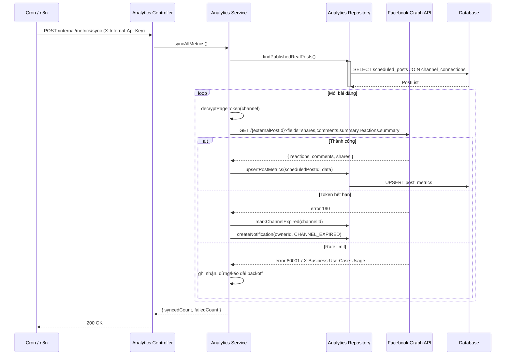
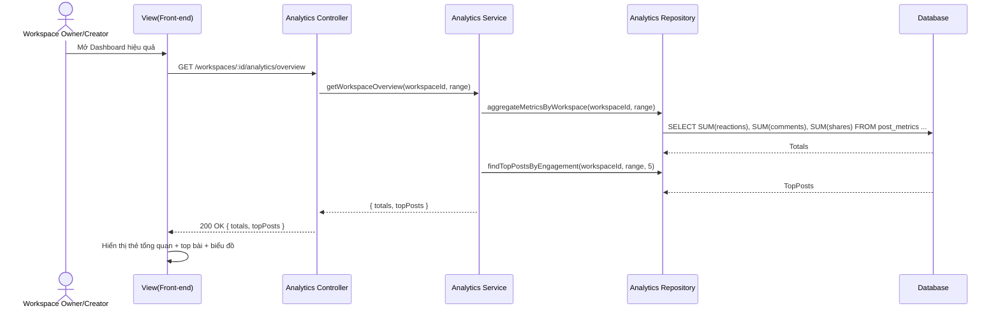

# Phân hệ 8: Thống kê hiệu quả bài đăng (Post Analytics)

> [Quay lại Mục lục chính](file:///f:/DATN/marka-capstone/docs/specs/README.md)

---

## 8.0. Tổng quan & mục tiêu

**Mô tả**: Sau khi bài viết được đăng thành công lên Facebook Page (kênh thật), hệ thống định kỳ thu thập các chỉ số tương tác của bài đăng — **lượt thích (reactions), bình luận (comments), chia sẻ (shares)** — và hiển thị trên Dashboard của Workspace cũng như trong chi tiết từng bài.

**Vì sao có phân hệ này (định vị sản phẩm)**:
Đây là phân hệ khép kín vòng lặp **"viết → duyệt → đăng → đo hiệu quả"**. ChatGPT có thể viết nội dung nhưng **không biết bài đăng đó có hiệu quả hay không**. Post Analytics là điểm khác biệt cốt lõi trả lời câu hỏi *"Dự án này khác gì việc dùng ChatGPT để đăng bài?"* — vì Marka là nền tảng **vận hành và đo lường**, không chỉ là công cụ sinh chữ.

**Phạm vi**:
- **Trong phạm vi**: Thu thập reactions/comments/shares cho bài đã đăng lên Facebook Page; tổng hợp theo Workspace; hiển thị Dashboard & chi tiết bài; đồng bộ tự động định kỳ + làm mới thủ công.
- **Ngoài phạm vi**: Reach/impressions/nhân khẩu học một cách bắt buộc (chỉ hiển thị khi Facebook trả về, xem mục 8.1); số liệu thật cho kênh giả lập (Instagram/TikTok/Zalo); phân tích bình luận theo cảm xúc; báo cáo xuất PDF/Excel (Could-have).

**Tác nhân (Actors)**:
- **UC42 (View Post Analytics)**: Content Creator, Workspace Owner
- **UC43 (View Workspace Performance Overview)**: Workspace Owner, Content Creator
- **Tiến trình nền (System)**: Worker / Cron / n8n đồng bộ chỉ số định kỳ.

---

## 8.1. Nguồn dữ liệu Facebook Graph API

Bài học quan trọng nhất của phân hệ này: **có 2 nhóm API khác nhau về bản chất và giới hạn**, tuyệt đối không gộp chung.

| | **Nhóm A — Post fields/edges** | **Nhóm B — Page/Post Insights** |
|---|---|---|
| Endpoint | `/{post-id}` và các edge `comments`, `reactions` | `/{page-id}/insights`, `/{post-id}/insights` |
| Cung cấp | **reactions, comments, shares** | reach, impressions, follower, nhân khẩu học… |
| Yêu cầu ≥ 100 like? | **KHÔNG** | **CÓ** ("Page Insights data is only available on Pages with 100 or more likes") |
| Độ trễ | Gần như tức thời | Phần lớn cập nhật ~24 giờ/lần |
| Nguy cơ deprecate | Thấp (field ổn định) | Cao (nhiều metric bị khai tử từ 15/06/2026; `post_impressions`, `post_impressions_unique` deprecated từ Graph API v25) |
| Vai trò trong phân hệ | **Nguồn chính — bắt buộc** | Tùy chọn — chỉ hiển thị khi có |

### 8.1.1. Endpoint cụ thể (dùng cho đồng bộ)

```http
# (A) Share + permalink
GET /v23.0/{post-id}?fields=shares,permalink_url&access_token={PAGE_ACCESS_TOKEN}

# (A) Tổng số comment
GET /v23.0/{post-id}/comments?summary=true&limit=0&access_token={PAGE_ACCESS_TOKEN}

# (A) Tổng số reaction (like, love, haha, wow, sad, anger)
GET /v23.0/{post-id}/reactions?summary=true&limit=0&access_token={PAGE_ACCESS_TOKEN}

# (B - tùy chọn) Chi tiết reaction theo loại
GET /v23.0/{post-id}/insights?metric=post_reactions_by_type_total&access_token={PAGE_ACCESS_TOKEN}

# (B - tùy chọn) Chỉ số cấp Page cho Dashboard tổng
GET /v23.0/{page-id}/insights?metric=page_post_engagements,page_impressions,page_fans&period=day&access_token={PAGE_ACCESS_TOKEN}
```

Ví dụ phản hồi nhóm A:
```json
{
  "shares": { "count": 3 },
  "comments": { "summary": { "total_count": 12 } },
  "reactions": { "summary": { "total_count": 47 } },
  "id": "123456789_987654321"
}
```

### 8.1.2. Quyền cần thiết (Permissions)

| Quyền | Dùng cho |
|---|---|
| `pages_read_engagement` | Đọc reactions/comments/shares (nhóm A) |
| `read_insights` | Đọc reach/impressions (nhóm B — tùy chọn) |
| `pages_manage_posts` | Đăng bài (phân hệ 4 — đã có) |

> **Ghi chú về App Review**: Vì mỗi người dùng tự tạo Facebook App và là admin của chính app đó, dùng cho Page của chính họ, hệ thống chạy được ở **Development Mode** và **không cần App Review / Business Verification**. Đây là lý do mô hình "người dùng tự connect key" khả thi (xem thêm `04-social-publishing.md` mục 4.1).

### 8.1.3. Nguyên tắc hiển thị (bắt buộc)

1. **Reactions/Comments/Shares**: luôn hiển thị — áp dụng cho mọi Page, kể cả Page mới dưới 100 like.
2. **Reach/Impressions**: **chỉ hiển thị khi Facebook trả về dữ liệu**. Nếu Page chưa đủ điều kiện (dưới 100 like) hoặc metric rỗng → **ẩn khối này** kèm ghi chú *"Chỉ số tiếp cận chỉ khả dụng với Page đủ điều kiện và cập nhật mỗi 24 giờ"*. Tuyệt đối không hiển thị `0` gây hiểu lầm.
3. **Kênh giả lập**: không có số liệu thật → hiển thị nhãn *"Chế độ giả lập — không có số liệu tương tác thật"*, không hiển thị số.

---

## 8.2. Mô hình dữ liệu

### 8.2.1. Bảng `post_metrics` (giá trị mới nhất — **đã có trong schema**, D5)

Lưu bản ghi tương tác **mới nhất** cho mỗi `ScheduledPost`. Liên kết với bài đăng qua `scheduled_posts.externalPostId` (đã có sẵn trong schema).

| Tên cột | Kiểu dữ liệu | Ràng buộc | Mô tả |
| :--- | :--- | :--- | :--- |
| `id` | VARCHAR(36) | PK, Default: UUID | ID bản ghi |
| `scheduledPostId` | VARCHAR(36) | FK -> `scheduled_posts.id`, Cascade, **Unique** | Lịch đăng bài tương ứng (1-1) |
| `reactions` | INTEGER | Default: 0, NOT NULL | Tổng lượt reaction |
| `reactionsDetail` | JSON | Nullable | Chi tiết `{ like, love, haha, wow, sad, anger }` (tùy chọn) |
| `comments` | INTEGER | Default: 0, NOT NULL | Tổng lượt bình luận |
| `shares` | INTEGER | Default: 0, NOT NULL | Tổng lượt chia sẻ |
| `reach` | INTEGER | Nullable | Người tiếp cận (chỉ khi Page đủ điều kiện) |
| `impressions` | INTEGER | Nullable | Lượt hiển thị (chỉ khi Page đủ điều kiện) |
| `permalinkUrl` | VARCHAR(255) | Nullable | Link bài đăng thật trên Facebook |
| `syncError` | VARCHAR(255) | Nullable | Lỗi gần nhất khi đồng bộ (nếu có) |
| `fetchedAt` | TIMESTAMP | Nullable | Thời điểm đồng bộ thành công gần nhất |
| `createdAt` | TIMESTAMP | Default: NOW(), NOT NULL | Thời điểm tạo bản ghi |
| `updatedAt` | TIMESTAMP | NOT NULL | Thời điểm cập nhật |

* **Index**: Unique trên `scheduledPostId`.

### 8.2.2. Prisma schema (đã có sẵn trong `backend/prisma/schema.prisma`)

Model `PostMetric` dưới đây **đã được thêm vào schema** (D5) — tài liệu chỉ ghi lại để tham chiếu, không cần tạo mới:

```prisma
model PostMetric {
  id              String    @id @default(uuid()) @db.VarChar(36)
  scheduledPostId String    @unique @db.VarChar(36)
  reactions       Int       @default(0)
  reactionsDetail Json?
  comments        Int       @default(0)
  shares          Int       @default(0)
  reach           Int?
  impressions     Int?
  permalinkUrl    String?   @db.VarChar(255)
  syncError       String?   @db.VarChar(255)
  fetchedAt       DateTime?
  createdAt       DateTime  @default(now())
  updatedAt       DateTime  @updatedAt

  scheduledPost ScheduledPost @relation(fields: [scheduledPostId], references: [id], onDelete: Cascade)

  @@map("post_metrics")
}
```

Quan hệ ngược đã có trong model `ScheduledPost` của schema hiện tại:
```prisma
model ScheduledPost {
  // ... các trường hiện có ...
  metric PostMetric?
}
```

### 8.2.3. Bảng `post_metric_snapshots` (tùy chọn — Could-have, **không bắt buộc** ở MVP)

Nếu muốn vẽ biểu đồ **xu hướng theo thời gian** (số liệu tăng dần sau khi đăng), thêm bảng snapshot ghi lại mỗi lần đồng bộ: `(id, scheduledPostId, reactions, comments, shares, capturedAt)`. **MVP không yêu cầu bảng này** (D5) — chỉ cần giá trị mới nhất trong `post_metrics`.

---

## 8.3. Luồng nghiệp vụ

### 8.3.1. Ghi nhận liên kết bài đăng (`externalPostId`)

Trong luồng publish (`04-social-publishing.md` mục 4.3), sau khi Facebook trả về ID bài đăng, worker **bắt buộc** cập nhật:
- `scheduled_posts.status = PUBLISHED`
- `scheduled_posts.externalPostId = <id trả về từ Facebook>`

> Không có `externalPostId` thì không thể lấy số liệu. Đây là điều kiện tiên quyết của toàn bộ phân hệ.

### 8.3.2. Đồng bộ chỉ số định kỳ (Sync)

1. Một tiến trình nền (Cron / BullMQ repeatable job / n8n Cron) chạy **mỗi 1–6 giờ**.
2. Truy vấn các `ScheduledPost` thỏa: `status = PUBLISHED`, `channel.platform = FACEBOOK`, `channel.type = REAL`, `externalPostId != null`.
3. Với mỗi bài: gọi Graph API nhóm A (mục 8.1.1) để lấy reactions/comments/shares.
4. `upsert` kết quả vào `post_metrics` (tạo mới hoặc cập nhật theo `scheduledPostId`).
5. Ghi `fetchedAt`; nếu lỗi, ghi `syncError` và **giữ nguyên** số liệu cũ (không xóa).
6. Không ghi Audit Log cho mỗi lần sync (tránh phình bảng) — chỉ ghi khi có lỗi token/rate limit.

**Cửa sổ đồng bộ (tối ưu chi phí API)**:
- Bài đăng < 48 giờ: đồng bộ dày (mỗi 1–2 giờ) vì tương tác tăng nhanh.
- Bài đăng > 48 giờ: giảm tần suất (mỗi 12–24 giờ) hoặc chỉ đồng bộ khi người dùng bấm "Làm mới".

### 8.3.3. Làm mới thủ công (Manual refresh)

Trong chi tiết bài viết, người dùng bấm **"Làm mới số liệu"** → gọi endpoint làm mới cho 1 bài. Áp dụng rate-limit (ví dụ tối đa 1 lần/30 giây/bài) để tránh lạm dụng API.

---

## 8.4. Tích hợp n8n

Có 2 cách triển khai. **Chọn 1, không trộn lẫn** (xem cảnh báo ở mục 8.13).

### 8.4.1. Pattern A — n8n là scheduler, Backend gọi Facebook (KHUYẾN NGHỊ)

Ưu điểm: **Page Access Token không bao giờ rời khỏi backend** (an toàn nhất); dễ debug; backend vẫn là nguồn sự thật.

```
n8n (Cron mỗi 2 giờ)
   └── HTTP POST {BACKEND}/internal/metrics/sync     (Header: X-Internal-Api-Key)
          └── Backend: query posts → decrypt token → gọi Graph API → upsert post_metrics
          └── Backend trả về { syncedCount, failedCount }
```

### 8.4.2. Pattern B — n8n gọi trực tiếp Facebook Graph API

Dùng n8n **Facebook Graph API node** / **HTTP Request node**. Phù hợp nếu muốn trình diễn năng lực tích hợp n8n.

```
n8n (Cron)
   ├── HTTP GET {BACKEND}/internal/metrics/pending   (Header: X-Internal-Api-Key)
   │      └── trả về [{ scheduledPostId, externalPostId }]
   ├── HTTP GET https://graph.facebook.com/v23.0/{externalPostId}
   │      ?fields=shares,comments.summary(true),reactions.summary(true)
   │      &access_token={token}
   └── HTTP POST {BACKEND}/internal/metrics/{scheduledPostId}
          body: { reactions, comments, shares, permalinkUrl }
```

**Cảnh báo bảo mật của Pattern B**: token phải được truyền sang n8n. Chỉ chấp nhận khi:
- n8n chạy trong **cùng mạng nội bộ / private network** với backend, không public Internet.
- Endpoint nội bộ bảo vệ bằng **API key riêng** (`X-Internal-Api-Key`), chỉ nhận từ IP n8n.
- **Không** log token ra output của n8n.

### 8.4.3. Payload webhook qua lại (dùng chung 2 pattern)

```json
// Backend -> n8n (danh sách cần sync)
{
  "posts": [
    { "scheduledPostId": "uuid", "externalPostId": "123_456", "publishedAt": "2026-05-01T10:00:00Z" }
  ]
}

// n8n -> Backend (kết quả 1 bài)
POST /internal/metrics/:scheduledPostId
{
  "reactions": 47,
  "comments": 12,
  "shares": 3,
  "permalinkUrl": "https://www.facebook.com/..."
}
```

### 8.4.4. Lưu ý phối hợp

- **n8n chỉ dùng cho đồng bộ metrics** (D21) — **không** dùng n8n để đăng bài. Việc đăng bài do **BullMQ + Redis** (Phân hệ 4) đảm nhiệm và luôn trả `externalPostId` về backend; nếu không có `externalPostId` thì metrics không chạy.

> **Quyết định của Marka (tránh mâu thuẫn tài liệu):** **BullMQ + Redis cho việc đăng bài (Phân hệ 4)** và **n8n (Pattern A) cho đồng bộ metrics (Phân hệ 8)**. n8n **không tham gia** luồng đăng bài; hai công cụ phụ trách hai tác vụ **khác nhau, không chồng lấn**.

---

## 8.5. API Endpoints

### UC42 — View Post Analytics (Xem chỉ số 1 bài đăng)

| Thuộc tính | Giá trị |
|---|---|
| **Method** | `GET` |
| **Path** | `/posts/:id/metrics` |
| **Controller** | Post Controller |
| **Service** | Analytics Service |
| **Actors** | Content Creator, Workspace Owner |

#### Đầu vào
- **Path param**: `id` — ID bài viết.

#### Xử lý nội bộ
1. `findPostById(postId)` — Lấy bài viết, kiểm tra thuộc workspace của actor.
2. `findScheduledPostsByPost(postId)` — Lấy các lịch đăng kèm `post_metrics` (JOIN).
3. Với kênh `type = SIMULATED`: đánh dấu `metricsAvailable: false`.

#### Kết quả trả về
| Trường hợp | HTTP Status | Body |
|---|---|---|
| ✅ Thành công | `200 OK` | `{ schedules: [{ scheduledPostId, platform, type, metricsAvailable, reactions, comments, shares, reach, impressions, fetchedAt }] }` |
| ❌ Không có quyền / không thuộc workspace | `403 Forbidden` | `{ message: "Forbidden" }` |

---

### UC42b — Refresh Post Metrics (Làm mới số liệu thủ công)

| Thuộc tính | Giá trị |
|---|---|
| **Method** | `POST` |
| **Path** | `/scheduled-posts/:id/metrics/refresh` |
| **Controller** | Analytics Controller |
| **Service** | Analytics Service |
| **Actors** | Content Creator, Workspace Owner |

#### Xử lý nội dung
1. Kiểm tra `scheduledPostId` hợp lệ, `status = PUBLISHED`, `type = REAL`.
2. Áp dụng rate-limit (1 lần/30 giây/bài) → nếu vượt, trả `429 Too Many Requests`.
3. Gọi Graph API nhóm A, `upsert` vào `post_metrics`.

#### Kết quả trả về
| Trường hợp | HTTP Status | Body |
|---|---|---|
| ✅ Làm mới thành công | `200 OK` | `{ reactions, comments, shares, fetchedAt }` |
| ❌ Bài chưa đăng / kênh giả lập | `400 Bad Request` | `{ message: "Metrics not available for this post" }` |
| ❌ Vượt rate-limit | `429 Too Many Requests` | `{ message: "Too many refresh requests" }` |
| ❌ Token hết hạn | `409 Conflict` | `{ message: "Facebook connection expired. Please reconnect." }` |

---

### UC43 — View Workspace Performance Overview (Tổng hợp hiệu quả Workspace)

| Thuộc tính | Giá trị |
|---|---|
| **Method** | `GET` |
| **Path** | `/workspaces/:id/analytics/overview` |
| **Controller** | Analytics Controller |
| **Service** | Analytics Service |
| **Actors** | Workspace Owner, Content Creator |

#### Đầu vào (Query Params)
| Param | Kiểu | Mô tả |
|---|---|---|
| `from` / `to` | ISO8601 | Khoảng thời gian (mặc định 30 ngày gần nhất) |
| `channelId` | `string` | Lọc theo kênh (tùy chọn) |

#### Xử lý nội bộ
1. `aggregateMetricsByWorkspace(workspaceId, range)` — Tổng hợp từ `post_metrics` JOIN `scheduled_posts`:
   - Tổng reactions/comments/shares; tổng số bài đã đăng; trung bình tương tác/bài.
2. `findTopPostsByEngagement(workspaceId, range, limit=5)` — Top bài tương tác cao nhất.
3. (Tùy chọn) `getPageLevelMetrics(pageId, range)` — reach/impressions cấp Page (chỉ khi khả dụng).

#### Kết quả trả về
| Trường hợp | HTTP Status | Body |
|---|---|---|
| ✅ Thành công | `200 OK` | `{ totals: { posts, reactions, comments, shares }, topPosts: [...], pageLevel?: { reach, impressions } }` |

---

### Endpoint nội bộ (dành cho n8n / Cron)

| Method | Path | Mô tả | Bảo vệ |
|---|---|---|---|
| `POST` | `/internal/metrics/sync` | Kích hoạt đồng bộ toàn bộ (Pattern A) | `X-Internal-Api-Key` |
| `GET` | `/internal/metrics/pending` | Trả danh sách post cần sync (Pattern B) | `X-Internal-Api-Key` |
| `POST` | `/internal/metrics/:scheduledPostId` | Nhận kết quả metrics từ n8n (Pattern B) | `X-Internal-Api-Key` |

> Các endpoint `/internal/*` **không** đi qua xác thực JWT người dùng; thay vào đó dùng API key tĩnh trong `.env` và giới hạn theo IP nội bộ.

---

## 8.6. Sequence Diagram

### 8.6.1. Đồng bộ chỉ số định kỳ (Pattern A)



### 8.6.2. Xem Dashboard hiệu quả



---

## 8.7. Service & Repository Functions

**Analytics Service**
| Hàm | Mô tả |
|---|---|
| `syncAllMetrics()` | Quét toàn bộ bài PUBLISHED thật và đồng bộ chỉ số |
| `syncMetricsForScheduledPost(id)` | Đồng bộ 1 bài (dùng cho refresh thủ công) |
| `getPostMetrics(postId)` | Lấy chỉ số theo bài viết |
| `getWorkspaceOverview(workspaceId, range)` | Tổng hợp cho Dashboard |
| `handleTokenExpired(channelId)` | Đánh dấu kênh EXPIRED + thông báo Owner |

**Analytics Repository**
| Hàm | Mô tả |
|---|---|
| `findPublishedRealPosts(workspaceId?, range?)` | Lấy danh sách bài cần sync |
| `upsertPostMetrics(scheduledPostId, data, tx?)` | Ghi/cập nhật chỉ số (upsert theo unique key) |
| `aggregateMetricsByWorkspace(workspaceId, range)` | SUM/GROUP BY cho Dashboard |
| `findTopPostsByEngagement(workspaceId, range, limit)` | Top bài theo tổng tương tác |

---

## 8.8. Giao diện đề xuất (UI/UX)

### 8.8.1. Workspace Performance Dashboard
- **Thẻ tổng quan**: Tổng bài đã đăng · Tổng reactions · Tổng comments · Tổng shares · Tương tác trung bình/bài.
- **Biểu đồ**: cột/đường theo ngày trong khoảng `from–to`.
- **Top 5 bài tương tác cao nhất**: tiêu đề + kênh + số liệu + link `permalink_url`.
- **Khối reach/impressions**: chỉ render khi có dữ liệu; kèm chú thích *"cập nhật mỗi 24 giờ · chỉ khả dụng với Page đủ điều kiện"*.

### 8.8.2. Post Detail — tab "Hiệu quả"
- Hiển thị theo từng kênh đã đăng: nền tảng, trạng thái, reactions/comments/shares, thời điểm đồng bộ gần nhất (`fetchedAt`), nút **Làm mới số liệu**.
- Với kênh `SIMULATED`: nhãn rõ **"Chế độ giả lập — không có số liệu tương tác thật"**.

### 8.8.3. Trạng thái & khoảng trống
- Khi bài chưa đăng hoặc chưa có dữ liệu: hiển thị empty state *"Chưa có số liệu — sẽ cập nhật sau lần đồng bộ kế tiếp"*.
- Khi sync lỗi: hiển thị cảnh báo nhỏ kèm lý do (token hết hạn → nút "Kết nối lại").

---

## 8.9. Edge Cases & Xử lý lỗi

| Tình huống | Xử lý |
|---|---|
| **Page < 100 like** | Reactions/comments/shares **vẫn hoạt động**. Insights có thể rỗng → **ẩn** khối reach/impressions, không hiển thị 0. |
| **Token hết hạn (error 190)** | Đánh dấu `channel_connections.status = EXPIRED`, gửi thông báo Owner, hiển thị modal "Kết nối lại". Giữ nguyên số liệu cũ. |
| **Rate limit (error 80001 / `X-Business-Use-Case-Usage`)** | Đọc header, tạm dừng sync trên kênh đó theo khoảng thời gian chỉ định, retry với exponential backoff. |
| **Facebook deprecate metric** | Bọc mọi lời gọi Insights trong try/catch, coi như tùy chọn — lỗi không làm hỏng Dashboard. |
| **Bài đăng bị xóa trên Facebook** | Error → ghi `syncError`, đánh dấu chỉ số là "không còn khả dụng", không retry vô hạn. |
| **`externalPostId` rỗng** | Bỏ qua bài đó; ghi log cảnh báo (lỗi ở luồng publish cần sửa). |
| **Kênh giả lập** | Không gọi API, `metricsAvailable = false`, UI hiển thị nhãn giả lập. |
| **Sync trùng lặp (n8n retry / cron chồng)** | Dùng `upsert` theo `scheduledPostId` (unique) → idempotent, không tạo bản ghi trùng. |

---

## 8.10. Bảo mật

- **Page Access Token** giải mã **chỉ trong bộ nhớ** tại thời điểm gọi API (AES-256, xem `database_spec.md` mục 3.2); **không log** token/App Secret.
- Endpoint `/internal/*` dùng **API key riêng** (`X-Internal-Api-Key` trong `.env`) + giới hạn IP n8n; **không** expose ra Internet công khai.
- Toàn bộ endpoint người dùng yêu cầu xác thực JWT (`requireAuth`) + kiểm tra quyền theo Workspace (`requireWorkspaceRole`).
- Không trả token ra DTO; DTO chỉ chứa số liệu tổng hợp.

---

## 8.11. Kiểm thử (Test Cases ưu tiên)

1. **Sync thành công**: bài PUBLISHED → upsert đúng reactions/comments/shares, `fetchedAt` được cập nhật.
2. **Idempotency**: chạy sync 2 lần liên tiếp → chỉ 1 bản ghi `post_metrics`, không nhân đôi.
3. **Token hết hạn**: mock Facebook trả error 190 → kênh chuyển EXPIRED, có notification, số liệu cũ giữ nguyên.
4. **Page < 100 like**: Facebook không trả insights → reactions/comments/shares vẫn hiển thị, reach/impressions bị ẩn (không hiển thị 0).
5. **Rate limit**: mock error 80001 → dừng/kéo dài backoff, không spam request.
6. **Kênh giả lập**: không gọi API, `metricsAvailable = false`.
7. **Phân quyền**: user ngoài workspace gọi `/posts/:id/metrics` → 403.

---

## 8.12. Vị trí trong Roadmap

| Hạng mục | Ghi chú |
|---|---|
| **Độ ưu tiên** | Should-have → **Should/Must** nếu dùng làm điểm khác biệt chính khi bảo vệ |
| **Phase đề xuất** | Phase 4 (sau khi publish Facebook thật hoạt động) hoặc Phase 5 |
| **Ước lượng** | ~1–1.5 tuần cho 1 người (schema + sync + 2 endpoint + Dashboard cơ bản) |
| **Phụ thuộc** | Phân hệ 4 (publish Facebook thật + `externalPostId`), kết nối kênh Facebook thật |

---

## 8.13. Ghi chú bảo vệ (Defense Notes)

Câu hỏi thường gặp: *"Dự án khác gì việc dùng ChatGPT để đăng bài?"*

Trả lời gắn với phân hệ này:
> *"ChatGPT dừng lại ở việc sinh nội dung. Marka quản lý toàn bộ vòng đời nội dung và **đo lường được kết quả sau khi đăng**: hệ thống kết nối Facebook, đăng bài thật, rồi tự động thu thập reactions/comments/shares về dashboard. Đây là thứ ChatGPT không làm được vì nó không có kênh phân phối, không có RBAC/phê duyệt, và không có vòng phản hồi dữ liệu."*

**Lưu ý tránh bị bắt lỗi**:
- Nói rõ **reactions/comments/shares** lấy qua **post edges** (không cần 100 like), còn **reach/impressions** mới phụ thuộc Page Insights và có độ trễ 24h — thể hiện hiểu biết đúng về API.
- Nhất quán với tài liệu phân hệ 4: đăng bài đi qua **BullMQ + Redis**, còn **n8n chỉ đồng bộ metrics**; luôn đảm bảo `externalPostId` được trả về backend (nếu không, metrics không chạy).
- **Không trộn** BullMQ và n8n cho cùng một tác vụ — BullMQ cho publish, n8n cho metrics, ghi rõ trong báo cáo.
